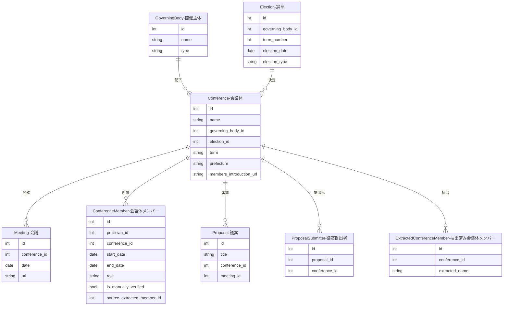
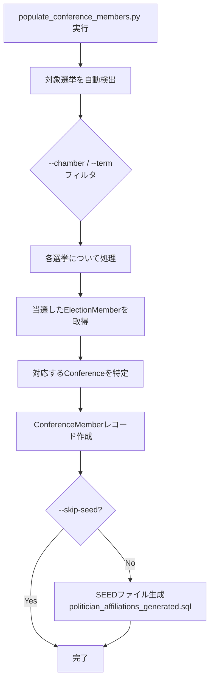

---
tags:
  - 手動作成
  - シードデータ作成済み
---

# 会議体データの作り方

Streamlit管理画面の「会議体管理」ページから手動で作成します。

会議体は、議会や委員会など、会議が開催される組織単位を表すデータです。開催主体（GoverningBody）に紐付き、会議（Meeting）の親にあたります。

## 入力プロパティ

| フィールド | 必須 | 説明 |
|------------|------|------|
| 会議体名 | はい | 会議体の名称（例: 議会、予算委員会） |
| 開催主体 | はい | 紐付ける開催主体を選択 |
| 都道府県 | いいえ | 所在都道府県。国会の場合は「全国」を選択 |
| 期/会期/年度 | いいえ | 期間情報（例: 第220回国会、令和5年度、第21期） |
| 選挙 | いいえ | 紐付ける選挙を選択（この会議体がどの選挙で決まった期かを示す） |
| 議員紹介URL | いいえ | 議員一覧ページのURL |

## 他オブジェクトとのリレーション



### リレーションの説明

| 関連テーブル | 関係 | 説明 |
|-------------|------|------|
| **GoverningBody（開催主体）** | 会議体 has one 開催主体 | この会議体を運営する自治体です |
| **Election（選挙）** | 会議体 has one 選挙（任意） | この会議体がどの選挙で決まった期かを示します。選挙と紐付けることで「第n期」の根拠が明確になります |
| **Meeting（会議）** | 会議体 has many 会議 | この会議体で実際に開催された個々の会議です |
| **ConferenceMember（会議体メンバー）** | 会議体 has many 会議体メンバー | 政治家がこの会議体にいつからいつまで所属しているかを期間付きで記録します。`source_extracted_member_id`で抽出元との紐付けを保持します |
| **Proposal（議案）** | 会議体 has many 議案 | この会議体で審議される議案です |
| **ProposalSubmitter（議案提出者）** | 会議体 has many 議案提出者 | 議案の提出元が委員会や会議体自体である場合に参照されます |
| **ExtractedConferenceMember（抽出済み会議体メンバー）** | 会議体 has many 抽出済み会議体メンバー | 外部Webページから抽出された会議体メンバー情報です。政治家との自動マッチングに使用されます |

## 会議体メンバー（ConferenceMember）の自動生成

国会の会議体メンバーは、選挙データ（ElectionMember）から自動生成できます。`populate_conference_members.py` スクリプトが、各選挙の当選者を対応する会議体のメンバーとして登録します。

!!! note "テーブル名について"
    ConferenceMemberエンティティのデータベーステーブル名は `politician_affiliations` です（`conference_members` へのリネームが予定されています）。

### 処理フロー



### 実行方法

```bash
# 衆議院の全選挙を処理
docker compose -f docker/docker-compose.yml exec sagebase \
    uv run python scripts/populate_conference_members.py --chamber 衆議院

# 特定の回次のみ処理
docker compose -f docker/docker-compose.yml exec sagebase \
    uv run python scripts/populate_conference_members.py --chamber 衆議院 --term 49 50

# 参議院を処理
docker compose -f docker/docker-compose.yml exec sagebase \
    uv run python scripts/populate_conference_members.py --chamber 参議院

# ドライラン
docker compose -f docker/docker-compose.yml exec sagebase \
    uv run python scripts/populate_conference_members.py --chamber 衆議院 --dry-run

# SEED生成をスキップ
docker compose -f docker/docker-compose.yml exec sagebase \
    uv run python scripts/populate_conference_members.py --chamber 衆議院 --skip-seed
```

### コマンドライン引数

| 引数 | 必須 | 説明 | デフォルト |
|------|------|------|-----------|
| `--chamber` | いいえ | 対象院（衆議院/参議院） | 衆議院 |
| `--term` | いいえ | 対象回次（複数指定可） | 全回次 |
| `--conference-name` | いいえ | 対象会議体名 | 院に基づき自動決定 |
| `--dry-run` | いいえ | DB書き込みなし | - |
| `--skip-seed` | いいえ | SEED生成をスキップ | - |

### SEED生成

実行後、`database/seed_politician_affiliations_generated.sql` にSEEDファイルが生成されます。`WHERE NOT EXISTS` を使用した冪等なINSERT文で、複数回実行しても重複レコードは作成されません。
