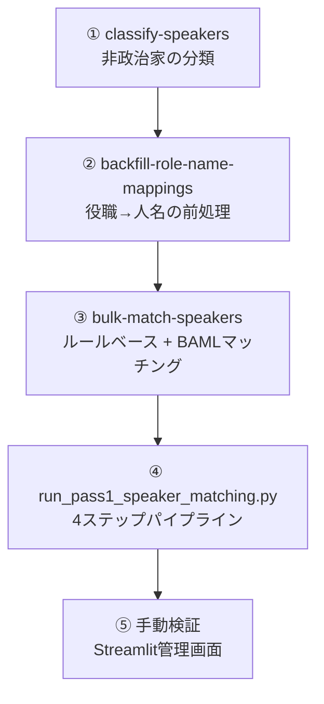
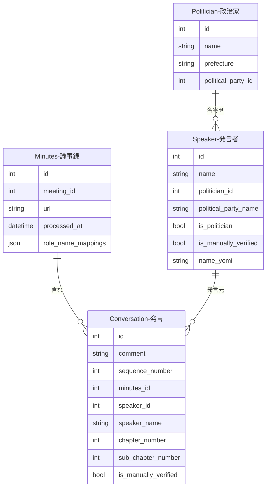

---
tags:
  - 自動生成
  - 外部データインポート
---

# 発言データの作り方

発言データは、以下の2つの方法で作成されます。

1. **国会会議録APIからのインポート**（メインの方法）: `sagebase kokkai import` コマンドで国会APIから発言データを一括取得
2. **議事録解析パイプライン**: 会議録のスクレイピング→分割処理で自動生成

## 国会APIからのインポート

### 事前調査

インポート前に、対象となる会期の会議数・発言数を確認できます。

```bash
# 全会期の会議数・発言数を調査
docker compose -f docker/docker-compose.yml exec sagebase \
    sagebase kokkai survey

# 特定の会期範囲を調査
docker compose -f docker/docker-compose.yml exec sagebase \
    sagebase kokkai survey --session-from 200 --session-to 210

# 院を指定して調査
docker compose -f docker/docker-compose.yml exec sagebase \
    sagebase kokkai survey --name-of-house 衆議院
```

#### コマンドライン引数

| 引数 | 説明 | デフォルト |
|------|------|-----------|
| `--session-from` | 開始会期番号 | 1 |
| `--session-to` | 終了会期番号 | 自動検出 |
| `--name-of-house` | 院名（衆議院/参議院） | 全院 |
| `--sleep` | API呼び出し間隔（秒） | 1.0 |

### インポート実行

```bash
# 特定の会期範囲をインポート
docker compose -f docker/docker-compose.yml exec sagebase \
    sagebase kokkai import --session-from 200 --session-to 210

# 院を指定してインポート
docker compose -f docker/docker-compose.yml exec sagebase \
    sagebase kokkai import --session-from 200 --name-of-house 参議院

# ドライラン（対象会議一覧を表示するのみ）
docker compose -f docker/docker-compose.yml exec sagebase \
    sagebase kokkai import --session-from 200 --session-to 210 --dry-run
```

#### コマンドライン引数

| 引数 | 説明 | デフォルト |
|------|------|-----------|
| `--session-from` | 開始会期番号 | - |
| `--session-to` | 終了会期番号 | - |
| `--name-of-house` | 院名（衆議院/参議院） | 全院 |
| `--name-of-meeting` | 会議名 | 全会議 |
| `--sleep` | API呼び出し間隔（秒） | 2.0 |
| `--dry-run` | 対象会議一覧のみ表示 | - |

#### 出力サマリ

| 項目 | 説明 |
|------|------|
| total_meetings_found | 発見した会議数 |
| total_meetings_processed | 処理した会議数 |
| total_meetings_skipped | スキップした会議数 |
| total_speeches_imported | インポートした発言数 |
| total_speakers_created | 新規作成したSpeaker数 |

### 統計確認

インポート後のSpeaker-Politicianマッチング状況を確認できます。

```bash
docker compose -f docker/docker-compose.yml exec sagebase \
    sagebase kokkai stats

# 未マッチSpeaker一覧の表示件数を変更
docker compose -f docker/docker-compose.yml exec sagebase \
    sagebase kokkai stats --limit 50
```

出力内容:

- `total_speakers`: 全Speaker数
- `linked_speakers`: Politician紐付け済み数
- `unlinked_speakers`: 未紐付け数
- `match_rate`: マッチ率
- 未紐付けSpeaker一覧（political_party_name付き）

## 議事録解析パイプライン（従来方式）

### 作成の流れ

1. 会議管理ページから会議録のスクレイピングを実行し、議事録（Minutes）を取得する
2. 議事録の分割処理が実行され、発言者名・発言内容・発言順序・章番号を持つ発言データが一括生成される
3. 発言者名から既存の Speaker レコードを名前で検索し、自動的に紐付ける

## Speaker-Politician マッチングパイプライン

発言データ作成後、発言者（Speaker）と政治家（Politician）の紐付けを実行します。以下のパイプラインで段階的にマッチングを進めます。



### ① Speaker分類（classify-speakers）

全Speakerの `is_politician` フラグを設定し、非政治家（参考人・証人・政府委員等）を除外します。

```bash
docker compose -f docker/docker-compose.yml exec sagebase \
    sagebase classify-speakers
```

以下の名前パターンに一致するSpeakerは `is_politician = false` に設定されます：

| カテゴリ | 例 |
|---------|-----|
| 議会運営の役職（特定不能） | 委員長、副委員長、議長、副議長、仮議長 |
| 事務局職員 | 事務局長、事務局次長、書記、速記者 |
| 参考人・証人 | 参考人、証人、公述人 |
| 政府出席者（非議員） | 説明員、政府委員、政府参考人 |
| その他 | 幹事、会議録情報 |

### ② 役職→人名マッピングの前処理（backfill-role-name-mappings）

議事録中で役職名のみで呼ばれるSpeaker（例: 「議長」「委員長」）を実際の人名に解決するための前処理です。

```bash
# 全議事録を処理
docker compose -f docker/docker-compose.yml exec sagebase \
    sagebase backfill-role-name-mappings

# 特定の会議のみ
docker compose -f docker/docker-compose.yml exec sagebase \
    sagebase backfill-role-name-mappings --meeting-id 12345

# 既存マッピングを上書き
docker compose -f docker/docker-compose.yml exec sagebase \
    sagebase backfill-role-name-mappings --force-reprocess
```

#### コマンドライン引数

| 引数 | 説明 | デフォルト |
|------|------|-----------|
| `--meeting-id` | 特定の会議のみ処理 | 全会議 |
| `--force-reprocess` | 既存マッピングを上書き | false |
| `--limit` | 処理する議事録の最大数 | 制限なし |
| `--skip-existing` / `--no-skip-existing` | 既存マッピングをスキップ | スキップする |

処理内容:

1. 対象議事録のGCSテキストを取得
2. 出席者セクションの境界を検出
3. 役職→人名のマッピングを抽出
4. Minutesレコードの `role_name_mappings` フィールドに保存

### ③ バルクSpeakerマッチング（bulk-match-speakers）

期間・院を指定して、対象会議のSpeakerを一括マッチングします。

```bash
# 衆議院の特定期間をマッチング
docker compose -f docker/docker-compose.yml exec sagebase \
    sagebase kokkai bulk-match-speakers \
    --chamber 衆議院 \
    --date-from 2020-01-01 \
    --date-to 2024-12-31

# 信頼度閾値を変更
docker compose -f docker/docker-compose.yml exec sagebase \
    sagebase kokkai bulk-match-speakers \
    --chamber 参議院 \
    --date-from 2020-01-01 \
    --date-to 2024-12-31 \
    --confidence-threshold 0.7

# ドライラン
docker compose -f docker/docker-compose.yml exec sagebase \
    sagebase kokkai bulk-match-speakers \
    --chamber 衆議院 \
    --date-from 2020-01-01 \
    --date-to 2024-12-31 \
    --dry-run
```

#### コマンドライン引数

| 引数 | 必須 | 説明 | デフォルト |
|------|------|------|-----------|
| `--chamber` | はい | 院名（衆議院/参議院） | - |
| `--date-from` | はい | 開始日（YYYY-MM-DD） | - |
| `--date-to` | はい | 終了日（YYYY-MM-DD） | - |
| `--confidence-threshold` | いいえ | マッチング信頼度閾値 | 0.8 |
| `--dry-run` | いいえ | 対象会議一覧のみ表示 | - |

#### マッチング戦略

マッチングは2段階で行われます：

1. **ルールベース（高速パス）**: 名前正規化→類似度計算。信頼度 ≥ 0.8 で即時マッチ
2. **BAMLフォールバック（LLM）**: ルールベースで確定できない場合、Gemini 2 Flashで候補を評価。旧字体の揺れ（斉藤 vs 齊藤）なども考慮

信頼度のスコアリング:

| 信頼度 | 条件 |
|--------|------|
| 0.9+ | 氏名完全一致 + 政党一致 |
| 0.7-0.9 | 氏名一致、政党不明/部分一致 |
| 0.5-0.7 | 名前のバリエーションだが政党一致 |
| 0.5未満 | マッチなし |

### ④ 4ステップパイプライン（run_pass1_speaker_matching.py）

ベースライン測定→分類→マッチング→レポートの4ステップを一括実行します。

```bash
# 全ステップ実行
docker compose -f docker/docker-compose.yml exec sagebase \
    uv run python scripts/run_pass1_speaker_matching.py

# 特定ステップのみ実行
docker compose -f docker/docker-compose.yml exec sagebase \
    uv run python scripts/run_pass1_speaker_matching.py --mode baseline
```

#### モード

| モード | 内容 |
|--------|------|
| `full` | 4ステップすべて実行（デフォルト） |
| `baseline` | ベースライン測定のみ |
| `classify` | is_politician分類のみ |
| `match` | ルールベースマッチングのみ（LLMなし） |
| `report` | 結果レポートのみ |

#### 4ステップの内容

1. **Baseline測定**: total_speakers, linked_speakers, match_rate等を計測
2. **Classification**: `classify-speakers` と同じis_politician分類を実行
3. **Rule-based Matching**: LLMなしのルールベースマッチングを実行
4. **Report**: Before/After比較、未マッチSpeaker上位20件、結果JSONを出力

結果は `tmp/pass1_matching_result.json` に保存されます。

### 手動検証

発言管理ページの「発言マッチング」タブから、LLMを使って発言者（Speaker）と政治家（Politician）の名寄せを実行できます。手動で「手動検証済み」としてマークすると、以降のAI抽出処理による上書きから保護されます。

## データプロパティ

| フィールド | 説明 |
|------------|------|
| comment | 発言内容 |
| sequence_number | 議事録内での発言順序 |
| minutes_id | 紐付く議事録 |
| speaker_id | 紐付く発言者 |
| speaker_name | 発言者名（非正規化） |
| chapter_number | 議事録内の章番号 |
| sub_chapter_number | 議事録内の節番号 |
| is_manually_verified | 手動検証済みフラグ |

## Speaker モデル

| フィールド | 説明 |
|------------|------|
| name | 発言者名 |
| type | 発言者タイプ |
| political_party_name | 政党名（国会APIから取得される非正規化フィールド） |
| position | 役職 |
| is_politician | 政治家フラグ（`classify-speakers` で設定） |
| politician_id | 紐付けられた政治家のID |
| matched_by_user_id | マッチングを実施したユーザーID |
| is_manually_verified | 手動検証済みフラグ（trueの場合、AIによる上書きから保護） |
| name_yomi | 読み仮名 |

## 他オブジェクトとのリレーション



### リレーションの説明

| 関連テーブル | 関係 | 説明 |
|-------------|------|------|
| **Minutes（議事録）** | 発言 has one 議事録 | この発言が含まれる議事録です。議事録は会議（Meeting）に紐付きます |
| **Speaker（発言者）** | 発言 has one 発言者 | この発言を行った発言者です。発言者は政治家（Politician）と名寄せされます |
| **Politician（政治家）** | 発言者 has one 政治家（任意） | Speaker-Politicianマッチングパイプラインで紐付けられた政治家です |
