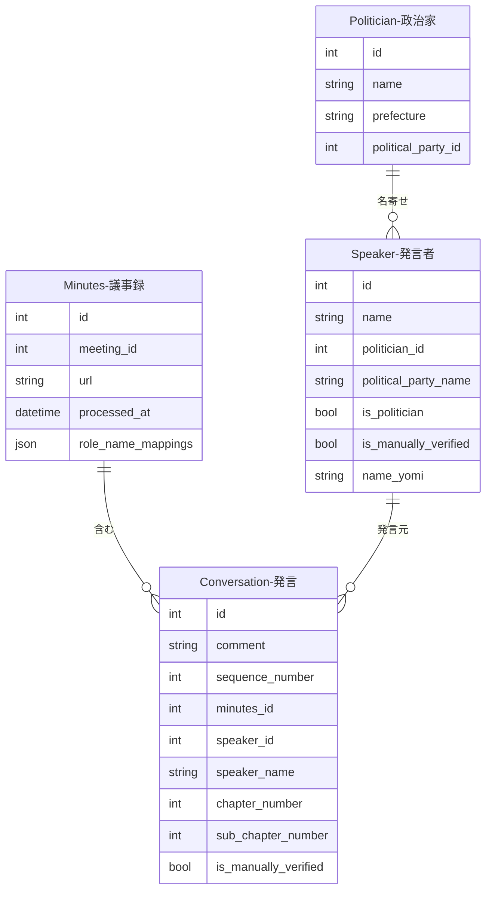

---
tags:
  - 自動生成
  - 外部データインポート
---

# 発言データの作り方

発言データは、以下の2つの方法で作成されます。

1. **国会会議録APIからのインポート**（メインの方法）: `sagebase kokkai import` コマンドで国会APIから発言データを一括取得
2. **議事録解析パイプライン**: 会議録のスクレイピング→分割処理で自動生成

## 国会APIからのインポート

### 事前調査

インポート前に、対象となる会期の会議数・発言数を確認できます。

```bash
# 全会期の会議数・発言数を調査
docker compose -f docker/docker-compose.yml exec sagebase \
    sagebase kokkai survey

# 特定の会期範囲を調査
docker compose -f docker/docker-compose.yml exec sagebase \
    sagebase kokkai survey --session-from 200 --session-to 210

# 院を指定して調査
docker compose -f docker/docker-compose.yml exec sagebase \
    sagebase kokkai survey --name-of-house 衆議院
```

#### コマンドライン引数

| 引数 | 説明 | デフォルト |
|------|------|-----------|
| `--session-from` | 開始会期番号 | 1 |
| `--session-to` | 終了会期番号 | 自動検出 |
| `--name-of-house` | 院名（衆議院/参議院） | 全院 |
| `--sleep` | API呼び出し間隔（秒） | 1.0 |

### インポート実行

```bash
# 特定の会期範囲をインポート
docker compose -f docker/docker-compose.yml exec sagebase \
    sagebase kokkai import --session-from 200 --session-to 210

# 院を指定してインポート
docker compose -f docker/docker-compose.yml exec sagebase \
    sagebase kokkai import --session-from 200 --name-of-house 参議院

# ドライラン（対象会議一覧を表示するのみ）
docker compose -f docker/docker-compose.yml exec sagebase \
    sagebase kokkai import --session-from 200 --session-to 210 --dry-run
```

#### コマンドライン引数

| 引数 | 説明 | デフォルト |
|------|------|-----------|
| `--session-from` | 開始会期番号 | - |
| `--session-to` | 終了会期番号 | - |
| `--name-of-house` | 院名（衆議院/参議院） | 全院 |
| `--name-of-meeting` | 会議名 | 全会議 |
| `--sleep` | API呼び出し間隔（秒） | 2.0 |
| `--dry-run` | 対象会議一覧のみ表示 | - |

#### 出力サマリ

| 項目 | 説明 |
|------|------|
| total_meetings_found | 発見した会議数 |
| total_meetings_processed | 処理した会議数 |
| total_meetings_skipped | スキップした会議数 |
| total_speeches_imported | インポートした発言数 |
| total_speakers_created | 新規作成したSpeaker数 |

### 統計確認

インポート後のSpeaker-Politicianマッチング状況を確認できます。

```bash
docker compose -f docker/docker-compose.yml exec sagebase \
    sagebase kokkai stats

# 未マッチSpeaker一覧の表示件数を変更
docker compose -f docker/docker-compose.yml exec sagebase \
    sagebase kokkai stats --limit 50
```

出力内容:

- `total_speakers`: 全Speaker数
- `linked_speakers`: Politician紐付け済み数
- `unlinked_speakers`: 未紐付け数
- `match_rate`: マッチ率
- 未紐付けSpeaker一覧（political_party_name付き）

## 議事録解析パイプライン（従来方式）

### 作成の流れ

1. 会議管理ページから会議録のスクレイピングを実行し、議事録（Minutes）を取得する
2. 議事録の分割処理が実行され、発言者名・発言内容・発言順序・章番号を持つ発言データが一括生成される
3. 発言者名から既存の Speaker レコードを名前で検索し、自動的に紐付ける

!!! tip "Speaker-Politician マッチングパイプライン"
    発言データ作成後の発言者（Speaker）と政治家（Politician）の紐付けパイプライン（5段階: 分類→役職マッピング→バルクマッチング→4ステップパイプライン→手動検証）については、[発言者-政治家紐付け](relations/speaker-politician.md)を参照してください。

## データプロパティ

| フィールド | 説明 |
|------------|------|
| comment | 発言内容 |
| sequence_number | 議事録内での発言順序 |
| minutes_id | 紐付く議事録 |
| speaker_id | 紐付く発言者 |
| speaker_name | 発言者名（非正規化） |
| chapter_number | 議事録内の章番号 |
| sub_chapter_number | 議事録内の節番号 |
| is_manually_verified | 手動検証済みフラグ |

## Speaker モデル

| フィールド | 説明 |
|------------|------|
| name | 発言者名 |
| type | 発言者タイプ |
| political_party_name | 政党名（国会APIから取得される非正規化フィールド） |
| position | 役職 |
| is_politician | 政治家フラグ（`classify-speakers` で設定） |
| politician_id | 紐付けられた政治家のID |
| matched_by_user_id | マッチングを実施したユーザーID |
| is_manually_verified | 手動検証済みフラグ（trueの場合、AIによる上書きから保護） |
| name_yomi | 読み仮名 |

## 他オブジェクトとのリレーション



### リレーションの説明

| 関連テーブル | 関係 | 説明 |
|-------------|------|------|
| **Minutes（議事録）** | 発言 has one 議事録 | この発言が含まれる議事録です。議事録は会議（Meeting）に紐付きます |
| **Speaker（発言者）** | 発言 has one 発言者 | この発言を行った発言者です。発言者は政治家（Politician）と名寄せされます |
| **Politician（政治家）** | 発言者 has one 政治家（任意） | Speaker-Politicianマッチングパイプラインで紐付けられた政治家です |
