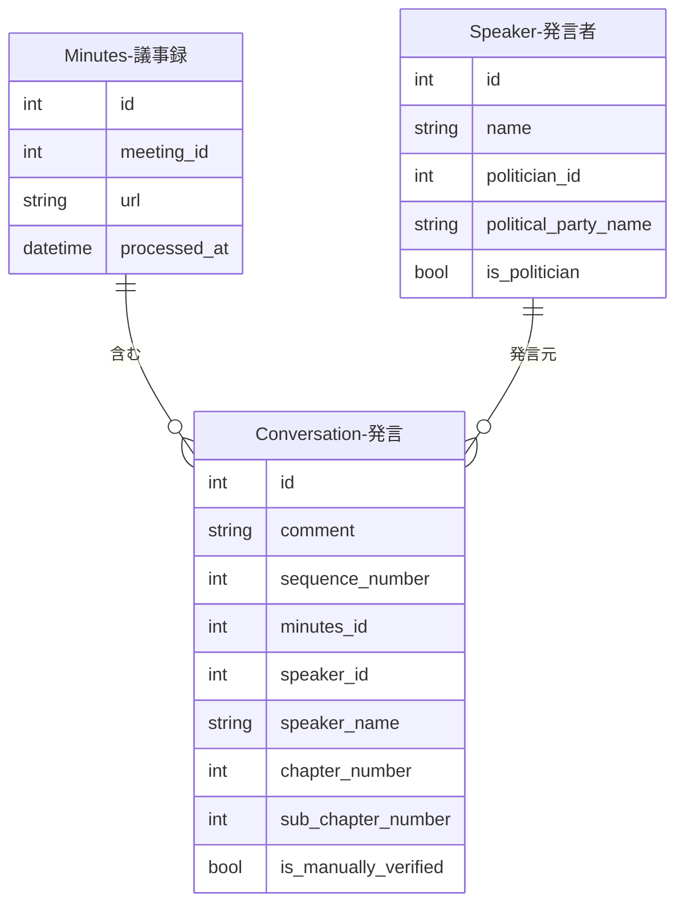

---
tags:
  - 自動生成
---

# 発言データの作り方

発言データは手動で作成するのではなく、会議録の処理パイプラインによって自動生成されます。

会議（Meeting）に紐付く議事録を解析し、発言者ごとの個々の発言を `Conversation` として抽出・保存します。

### 作成の流れ

1. 会議管理ページから会議録のスクレイピングを実行し、議事録（Minutes）を取得する
2. 議事録の分割処理が実行され、発言者名・発言内容・発言順序・章番号を持つ発言データが一括生成される
3. 発言者名から既存の Speaker レコードを名前で検索し、自動的に紐付ける

### 生成後の運用

- **発言者マッチング**: 発言管理ページの「発言マッチング」タブから、LLMを使って発言者（Speaker）と政治家（Politician）の名寄せを実行できる
- **手動検証**: 発言一覧から個々の発言を「手動検証済み」としてマークすると、以降のAI抽出処理による上書きから保護される

## データプロパティ

| フィールド | 説明 |
|------------|------|
| comment | 発言内容 |
| sequence_number | 議事録内での発言順序 |
| minutes_id | 紐付く議事録 |
| speaker_id | 紐付く発言者 |
| speaker_name | 発言者名（非正規化） |
| chapter_number | 議事録内の章番号 |
| sub_chapter_number | 議事録内の節番号 |
| is_manually_verified | 手動検証済みフラグ |

## 他オブジェクトとのリレーション

### リレーションの説明

| 関連テーブル | 関係 | 説明 |
|-------------|------|------|
| **Minutes（議事録）** | 発言 has one 議事録 | この発言が含まれる議事録です。議事録は会議（Meeting）に紐付きます |
| **Speaker（発言者）** | 発言 has one 発言者 | この発言を行った発言者です。発言者は政治家（Politician）と名寄せされます |
