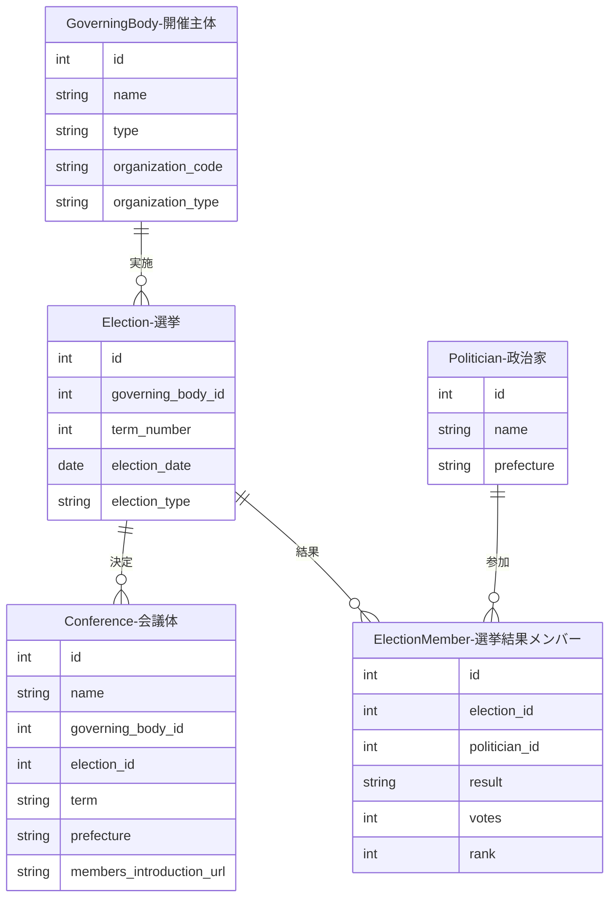

---
tags:
  - 手動作成
---

# 選挙データの作り方

Streamlit管理画面の「選挙管理」ページから手動で作成します。

選挙は、地方議会の「第n期」を決定する選挙を表すデータです。開催主体（GoverningBody）に紐付き、会議体（Conference）がどの選挙で決まった期かを明確にします。

## 入力プロパティ

| フィールド | 必須 | 説明 |
|------------|------|------|
| 開催主体 | はい | 紐付ける開催主体を選択 |
| 期番号 | はい | 期番号（例: 21） |
| 選挙実施日 | はい | 選挙が行われた日付 |
| 選挙種別 | いいえ | 選挙の分類（統一地方選挙、通常選挙、補欠選挙など） |

## 他オブジェクトとのリレーション

### リレーションの説明

| 関連テーブル | 関係 | 説明 |
|-------------|------|------|
| **GoverningBody（開催主体）** | 選挙 has one 開催主体 | この選挙を実施した自治体です |
| **Conference（会議体）** | 選挙 has many 会議体 | この選挙によって決まった期に属する会議体です |
| **ElectionMember（選挙結果メンバー）** | 選挙 has many 選挙結果メンバー | この選挙に参加した政治家と結果（当選/落選等）を記録します |

## 選挙結果メンバー（ElectionMember）

選挙に参加した政治家とその結果を記録するテーブルです。

### 入力プロパティ

| フィールド | 必須 | 説明 |
|------------|------|------|
| 選挙 | はい | 紐付ける選挙を選択 |
| 政治家 | はい | 参加した政治家を選択 |
| 結果 | はい | 当選、落選、次点、繰上当選、無投票当選のいずれか |
| 得票数 | いいえ | 獲得した票数 |
| 順位 | いいえ | 得票順位 |

### 結果の種類

| 結果 | 説明 |
|------|------|
| 当選 | 選挙で当選した |
| 落選 | 選挙で落選した |
| 次点 | 当選には届かなかったが次点だった |
| 繰上当選 | 欠員により繰り上げで当選した |
| 無投票当選 | 立候補者数が定数以下のため無投票で当選した |

## 用途

選挙データは以下の目的で使用されます：

- 会議体が「いつ行われた選挙で決まった期か」を明確にする
- 同じ期番号でも選挙日が異なる場合を区別する
- 統一地方選挙や補欠選挙など、選挙種別による分析を可能にする
