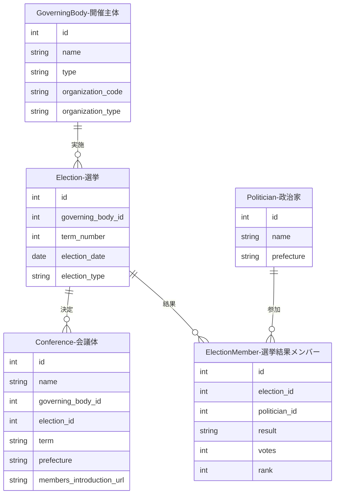
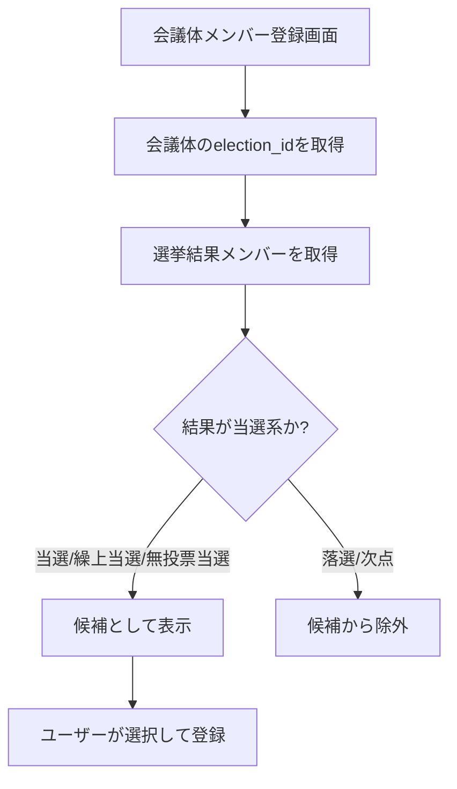
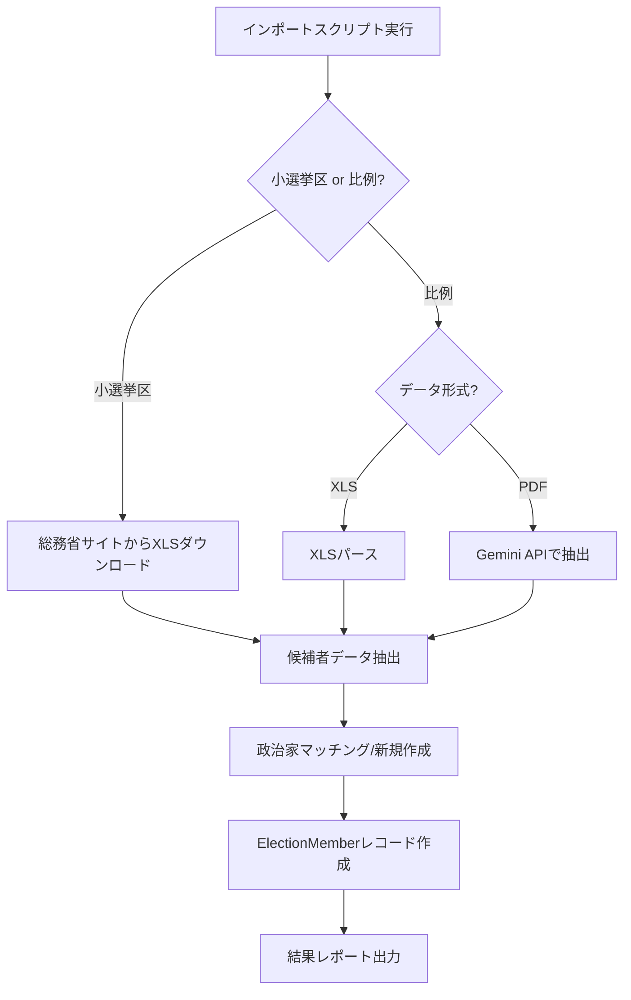
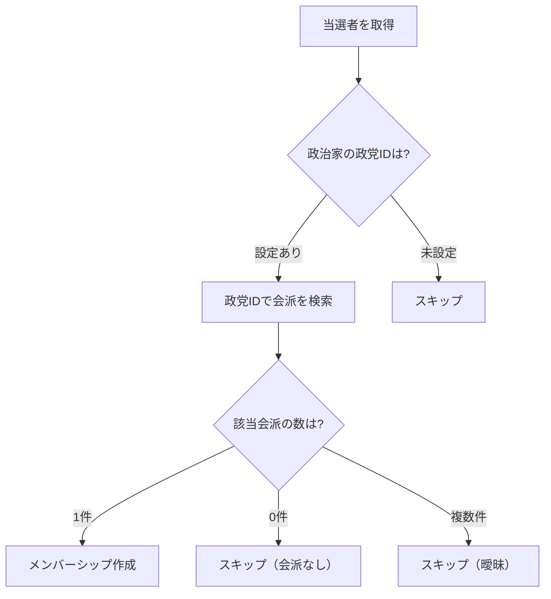

---
tags:
  - 手動作成
  - 外部データインポート
---

# 選挙データの作り方

選挙データは、Streamlit管理画面での手動作成、または外部データソースからのインポートで作成できます。

選挙は、地方議会の「第n期」を決定する選挙を表すデータです。開催主体（GoverningBody）に紐付き、会議体（Conference）がどの選挙で決まった期かを明確にします。

## 入力プロパティ

| フィールド | 必須 | 説明 |
|------------|------|------|
| 開催主体 | はい | 紐付ける開催主体を選択 |
| 期番号 | はい | 期番号（例: 21） |
| 選挙実施日 | はい | 選挙が行われた日付 |
| 選挙種別 | いいえ | 選挙の分類（統一地方選挙、通常選挙、補欠選挙など） |

## 他オブジェクトとのリレーション



### リレーションの説明

| 関連テーブル | 関係 | 説明 |
|-------------|------|------|
| **GoverningBody（開催主体）** | 選挙 has one 開催主体 | この選挙を実施した自治体です |
| **Conference（会議体）** | 選挙 has many 会議体 | この選挙によって決まった期に属する会議体です |
| **ElectionMember（選挙結果メンバー）** | 選挙 has many 選挙結果メンバー | この選挙に参加した政治家と結果（当選/落選等）を記録します |

## 選挙結果メンバー（ElectionMember）

選挙に参加した政治家とその結果を記録するテーブルです。

### 入力プロパティ

| フィールド | 必須 | 説明 |
|------------|------|------|
| 選挙 | はい | 紐付ける選挙を選択 |
| 政治家 | はい | 参加した政治家を選択 |
| 結果 | はい | 当選、落選、次点、繰上当選、無投票当選のいずれか |
| 得票数 | いいえ | 獲得した票数 |
| 順位 | いいえ | 得票順位 |

### 結果の種類

| 結果 | 説明 |
|------|------|
| 当選 | 選挙で当選した |
| 落選 | 選挙で落選した |
| 次点 | 当選には届かなかったが次点だった |
| 繰上当選 | 欠員により繰り上げで当選した |
| 無投票当選 | 立候補者数が定数以下のため無投票で当選した |

## 用途

選挙データは以下の目的で使用されます：

- 会議体が「いつ行われた選挙で決まった期か」を明確にする
- 同じ期番号でも選挙日が異なる場合を区別する
- 統一地方選挙や補欠選挙など、選挙種別による分析を可能にする
- **会議体メンバー登録時に当選者のみを候補として絞り込む**（後述）

## 選挙結果メンバー管理UI

Streamlit管理画面の「選挙結果メンバー管理」ページでは、3つのタブで選挙結果メンバーを管理できます。

### タブ1: 一覧表示

選挙に登録されたメンバーを一覧で確認できます。

1. 開催主体を選択（カスケード式）
2. 選挙（期）を選択
3. 登録済みメンバーが政治家名、結果、得票数、順位とともに表示される

### タブ2: 新規登録

選挙に新しいメンバーを登録します。

1. 開催主体を選択
2. 選挙（期）を選択
3. 政治家を選択（ドロップダウン）
4. フォームに入力：
   - 結果: 当選、落選、次点、繰上当選、無投票当選から選択
   - 得票数: 数値入力（任意）
   - 順位: 数値入力（任意）
5. 登録ボタンで保存

### タブ3: 編集・削除

既存のメンバー情報を編集または削除します。

- 左列: 編集フォーム（政治家、結果、得票数、順位を変更可能）
- 右列: 削除フォーム（確認ダイアログ付き）

## 会議体メンバー登録時の当選者絞り込み機能

会議体に`election_id`が設定されている場合、会議体メンバーを登録する際に**その選挙で当選した政治家のみ**を候補として表示する機能があります。

### 仕組み



### 当選と判定される結果

以下の結果が「当選」として扱われます：

| 結果 | 当選判定 |
|------|----------|
| 当選 | ✅ |
| 繰上当選 | ✅ |
| 無投票当選 | ✅ |
| 落選 | ❌ |
| 次点 | ❌ |

### メリット

- **データ品質向上**: 当選していない人を会議体メンバーとして登録することを防止
- **入力効率化**: 全政治家から探す必要がなく、当選者のみから選択できる
- **整合性確保**: 会議体と選挙の関連が明確になる

## 総務省選挙データインポーター

衆議院選挙の結果データを総務省の公開データからインポートできます。小選挙区と比例代表の2種類のインポーターがあります。

### 小選挙区データインポーター

総務省が公開している衆議院選挙の小選挙区候補者データをインポートします。

```bash
# 特定の選挙回次をインポート
docker compose -f docker/docker-compose.yml exec sagebase \
    uv run python scripts/import_soumu_election.py --election 50

# 全選挙（第45回〜第50回）をインポート
docker compose -f docker/docker-compose.yml exec sagebase \
    uv run python scripts/import_soumu_election.py --all

# ドライラン（DB書き込みなし）
docker compose -f docker/docker-compose.yml exec sagebase \
    uv run python scripts/import_soumu_election.py --election 50 --dry-run
```

#### コマンドライン引数

| 引数 | 説明 |
|------|------|
| `--election {45-50}` | 特定の選挙回次を指定 |
| `--all` | 全選挙を一括インポート（第45回〜第50回） |
| `--dry-run` | ドライラン（データベース書き込みなし） |

#### インポートされるデータ（小選挙区）

| フィールド | 説明 | 例 |
|------------|------|-----|
| name | 候補者氏名 | 山田太郎 |
| party_name | 政党名 | 自由民主党 |
| district_name | 選挙区名 | 北海道第１区 |
| prefecture | 都道府県名 | 北海道 |
| total_votes | 総得票数 | 98765 |
| rank | 得票順位 | 1 |
| is_elected | 当選フラグ | true |

### 比例代表データインポーター

衆議院選挙の比例代表当選者データをインポートします。

```bash
# 特定の選挙回次をインポート
docker compose -f docker/docker-compose.yml exec sagebase \
    uv run python scripts/import_soumu_proportional.py --election 50

# 全選挙（第45回〜第50回）をインポート
docker compose -f docker/docker-compose.yml exec sagebase \
    uv run python scripts/import_soumu_proportional.py --all

# ドライラン
docker compose -f docker/docker-compose.yml exec sagebase \
    uv run python scripts/import_soumu_proportional.py --election 50 --dry-run
```

#### データソース形式

| 選挙回次 | 形式 | 抽出方法 |
|----------|------|----------|
| 第48回（2017年） | XLS | 直接パース |
| 第45〜47、49〜50回 | PDF | Gemini APIで構造化抽出 |

!!! note "PDF抽出の前提条件"
    PDF形式のデータ抽出には `GOOGLE_API_KEY` 環境変数が必要です（Gemini APIアクセス用）。

#### インポートされるデータ（比例代表）

| フィールド | 説明 | 例 |
|------------|------|-----|
| name | 候補者氏名 | 山田 太郎 |
| party_name | 政党名 | 自由民主党 |
| block_name | 比例ブロック名 | 北海道 |
| list_order | 名簿順位 | 1 |
| smd_result | 小選挙区結果 | 当/落/空白 |
| loss_ratio | 惜敗率 | 92.714 |
| is_elected | 当選フラグ | true |

#### 比例ブロック（11ブロック）

北海道、東北、北関東、南関東、東京、北陸信越、東海、近畿、中国、四国、九州

### インポート処理フロー



### 出力統計

インポート完了後、以下の統計情報が出力されます：

| 項目 | 説明 |
|------|------|
| total_candidates | 総候補者数 |
| matched_politicians | 既存政治家とマッチした数 |
| created_politicians | 新規作成した政治家数 |
| created_parties | 新規作成した政党数 |
| skipped_ambiguous | 同姓同名でスキップした数 |
| election_members_created | 作成したElectionMember数 |

## 会派メンバーシップ自動紐付け

選挙結果をインポートした後、当選者を会派に自動紐付けできます。

```bash
# 単回実行（ドライラン）
docker compose -f docker/docker-compose.yml exec sagebase \
    uv run python scripts/link_parliamentary_groups.py --election 50 --dry-run

# 実際の投入
docker compose -f docker/docker-compose.yml exec sagebase \
    uv run python scripts/link_parliamentary_groups.py --election 50

# 一括実行（第45-50回）
docker compose -f docker/docker-compose.yml exec sagebase \
    uv run python scripts/link_parliamentary_groups_bulk.py
```

### 紐付けロジック



### 出力結果

| 項目 | 説明 |
|------|------|
| total_elected | 当選者総数 |
| linked_count | 新規紐付け数 |
| already_existed_count | 既存重複数 |
| skipped_no_party | 政党未設定スキップ数 |
| skipped_no_group | 会派なしスキップ数 |
| skipped_multiple_groups | 複数会派スキップ数 |
