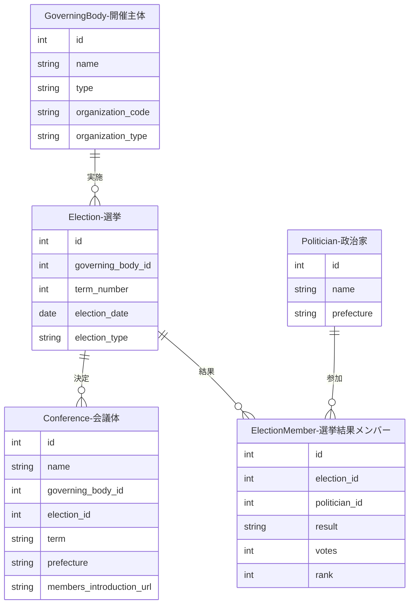
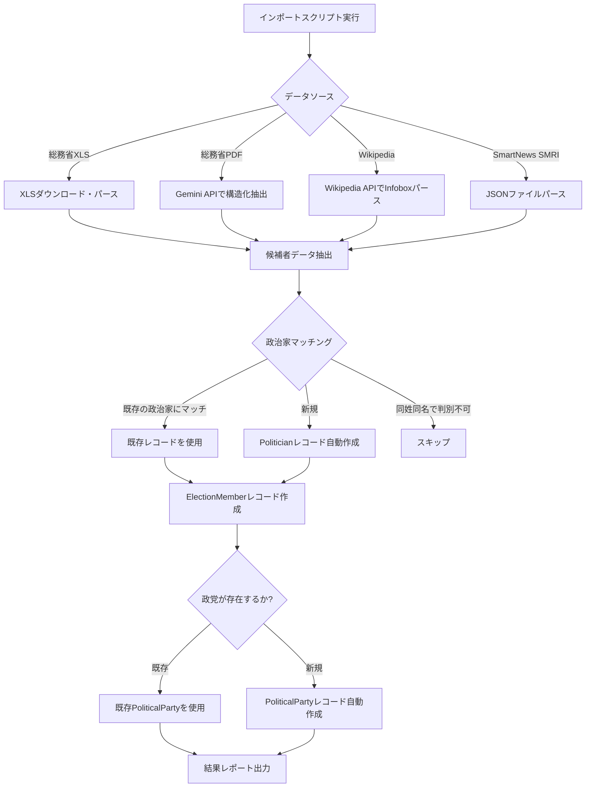

---
tags:
  - 手動作成
  - 外部データインポート
---

# 選挙データの作り方

選挙データは、Streamlit管理画面での手動作成、または外部データソースからのインポートで作成できます。

選挙は、地方議会の「第n期」を決定する選挙を表すデータです。開催主体（GoverningBody）に紐付き、会議体（Conference）がどの選挙で決まった期かを明確にします。

## インポーター一覧

国会の選挙データには6種類のインポーターがあります。

| インポーター | データソース | 対象 | 選挙回次 | election_type |
|-------------|-------------|------|----------|---------------|
| `import_soumu_election.py` | 総務省XLS | 衆議院小選挙区 | 第45-50回 | 衆議院議員総選挙 |
| `import_soumu_proportional.py` | 総務省XLS/PDF | 衆議院比例代表 | 第45-50回 | 衆議院議員総選挙 |
| `import_wikipedia_election.py` | Wikipedia API | 衆議院（歴史的データ） | 第1-44回 | 衆議院議員総選挙 |
| `import_soumu_sangiin_election.py` | 総務省XLS | 参議院選挙区 | 第21-27回 | 参議院議員通常選挙 |
| `import_soumu_sangiin_proportional.py` | 総務省XLS | 参議院比例代表 | 第21-27回 | 参議院議員通常選挙 |
| `import_sangiin_election.py` | SmartNews SMRI JSON | 参議院議員 | - | 参議院議員通常選挙 |

!!! note "election_type UNIQUE制約"
    衆議院と参議院で同じ `term_number` が存在するため（例: 第25回衆議院選挙と第25回参議院選挙）、UNIQUE制約は `(governing_body_id, term_number, election_type)` の3カラムで構成されています。`election_type` には `衆議院議員総選挙` または `参議院議員通常選挙` が設定されます。

## 入力プロパティ

| フィールド | 必須 | 説明 |
|------------|------|------|
| 開催主体 | はい | 紐付ける開催主体を選択 |
| 期番号 | はい | 期番号（例: 21） |
| 選挙実施日 | はい | 選挙が行われた日付 |
| 選挙種別 | いいえ | 選挙の分類（衆議院議員総選挙、参議院議員通常選挙、統一地方選挙、補欠選挙など） |

## 他オブジェクトとのリレーション



### リレーションの説明

| 関連テーブル | 関係 | 説明 |
|-------------|------|------|
| **GoverningBody（開催主体）** | 選挙 has one 開催主体 | この選挙を実施した自治体です |
| **Conference（会議体）** | 選挙 has many 会議体 | この選挙によって決まった期に属する会議体です |
| **ElectionMember（選挙結果メンバー）** | 選挙 has many 選挙結果メンバー | この選挙に参加した政治家と結果（当選/落選等）を記録します |

## 用途

選挙データは以下の目的で使用されます：

- 会議体が「いつ行われた選挙で決まった期か」を明確にする
- 同じ期番号でも選挙日が異なる場合を区別する
- 統一地方選挙や補欠選挙など、選挙種別による分析を可能にする
- **会議体メンバー登録時に当選者のみを候補として絞り込む**
- **ConferenceMember自動生成の入力データ**（[会議体データ](conference.md)参照）

!!! tip "リレーション"
    選挙結果メンバー（ElectionMember）の定義・管理UI・当選者絞り込み機能については、[選挙結果メンバー](relations/election-member.md)を参照してください。

## 総務省 衆議院選挙データインポーター

衆議院選挙の結果データを総務省の公開データからインポートできます。小選挙区と比例代表の2種類のインポーターがあります。

### 小選挙区データインポーター

総務省が公開している衆議院選挙の小選挙区候補者データをインポートします。

```bash
# 特定の選挙回次をインポート
docker compose -f docker/docker-compose.yml exec sagebase \
    uv run python scripts/import_soumu_election.py --election 50

# 全選挙（第45回〜第50回）をインポート
docker compose -f docker/docker-compose.yml exec sagebase \
    uv run python scripts/import_soumu_election.py --all

# ドライラン（DB書き込みなし）
docker compose -f docker/docker-compose.yml exec sagebase \
    uv run python scripts/import_soumu_election.py --election 50 --dry-run
```

#### コマンドライン引数

| 引数 | 説明 |
|------|------|
| `--election {45-50}` | 特定の選挙回次を指定 |
| `--all` | 全選挙を一括インポート（第45回〜第50回） |
| `--dry-run` | ドライラン（データベース書き込みなし） |

#### インポートされるデータ（小選挙区）

| フィールド | 説明 | 例 |
|------------|------|-----|
| name | 候補者氏名 | 山田太郎 |
| party_name | 政党名 | 自由民主党 |
| district_name | 選挙区名 | 北海道第１区 |
| prefecture | 都道府県名 | 北海道 |
| total_votes | 総得票数 | 98765 |
| rank | 得票順位 | 1 |
| is_elected | 当選フラグ | true |

### 比例代表データインポーター

衆議院選挙の比例代表当選者データをインポートします。

```bash
# 特定の選挙回次をインポート
docker compose -f docker/docker-compose.yml exec sagebase \
    uv run python scripts/import_soumu_proportional.py --election 50

# 全選挙（第45回〜第50回）をインポート
docker compose -f docker/docker-compose.yml exec sagebase \
    uv run python scripts/import_soumu_proportional.py --all

# ドライラン
docker compose -f docker/docker-compose.yml exec sagebase \
    uv run python scripts/import_soumu_proportional.py --election 50 --dry-run
```

#### データソース形式

| 選挙回次 | 形式 | 抽出方法 |
|----------|------|----------|
| 第48回（2017年） | XLS | 直接パース |
| 第45〜47、49〜50回 | PDF | Gemini APIで構造化抽出 |

!!! note "PDF抽出の前提条件"
    PDF形式のデータ抽出には `GOOGLE_API_KEY` 環境変数が必要です（Gemini APIアクセス用）。

#### インポートされるデータ（比例代表）

| フィールド | 説明 | 例 |
|------------|------|-----|
| name | 候補者氏名 | 山田 太郎 |
| party_name | 政党名 | 自由民主党 |
| block_name | 比例ブロック名 | 北海道 |
| list_order | 名簿順位 | 1 |
| smd_result | 小選挙区結果 | 当/落/空白 |
| loss_ratio | 惜敗率 | 92.714 |
| is_elected | 当選フラグ | true |

#### 比例ブロック（11ブロック）

北海道、東北、北関東、南関東、東京、北陸信越、東海、近畿、中国、四国、九州

#### 比例代表の結果分類

| 結果 | 条件 |
|------|------|
| 比例当選 | 小選挙区の結果が「当」以外で比例名簿から当選 |
| 比例復活 | 小選挙区で落選後、惜敗率をもとに比例で復活当選 |

## Wikipedia衆議院選挙データインポーター

第1回（1890年）〜第44回（2005年）の歴史的な衆議院選挙データをWikipediaからインポートします。

```bash
# 特定の選挙回次をインポート
docker compose -f docker/docker-compose.yml exec sagebase \
    uv run python scripts/import_wikipedia_election.py --election 40

# 全選挙（第1回〜第44回）をインポート
docker compose -f docker/docker-compose.yml exec sagebase \
    uv run python scripts/import_wikipedia_election.py --all

# ドライラン
docker compose -f docker/docker-compose.yml exec sagebase \
    uv run python scripts/import_wikipedia_election.py --election 40 --dry-run
```

### コマンドライン引数

| 引数 | 説明 |
|------|------|
| `--election {1-44}` | 特定の選挙回次を指定 |
| `--all` | 全選挙を一括インポート（第1回〜第44回） |
| `--dry-run` | ドライラン（データベース書き込みなし） |

### 選挙制度の変遷

| 選挙回次 | 制度 |
|----------|------|
| 第1-40回 | 中選挙区制（一部大選挙区制） |
| 第41-44回 | 小選挙区比例代表並立制 |

### データソース

Wikipedia APIからInfoboxテンプレートを取得し、当選者情報をパースします。

## 総務省 参議院選挙データインポーター

参議院選挙の結果データを総務省の公開データからインポートできます。選挙区と比例代表の2種類があります。

### 参議院選挙区データインポーター

```bash
# 特定の選挙回次をインポート
docker compose -f docker/docker-compose.yml exec sagebase \
    uv run python scripts/import_soumu_sangiin_election.py --election 25

# 全選挙（第21回〜第27回）をインポート
docker compose -f docker/docker-compose.yml exec sagebase \
    uv run python scripts/import_soumu_sangiin_election.py --all

# ドライラン
docker compose -f docker/docker-compose.yml exec sagebase \
    uv run python scripts/import_soumu_sangiin_election.py --election 25 --dry-run
```

#### コマンドライン引数

| 引数 | 説明 |
|------|------|
| `--election {21-27}` | 特定の選挙回次を指定 |
| `--all` | 全選挙を一括インポート（第21回〜第27回） |
| `--dry-run` | ドライラン（データベース書き込みなし） |

### 参議院比例代表データインポーター

```bash
# 特定の選挙回次をインポート
docker compose -f docker/docker-compose.yml exec sagebase \
    uv run python scripts/import_soumu_sangiin_proportional.py --election 25

# 全選挙（第21回〜第27回）をインポート
docker compose -f docker/docker-compose.yml exec sagebase \
    uv run python scripts/import_soumu_sangiin_proportional.py --all

# ドライラン
docker compose -f docker/docker-compose.yml exec sagebase \
    uv run python scripts/import_soumu_sangiin_proportional.py --election 25 --dry-run
```

## SmartNews SMRI 参議院議員データインポーター

SmartNews SMRI（スマートニュースメディア研究所）が公開している参議院議員データ（`giin.json`）をインポートします。

```bash
# インポート実行
docker compose -f docker/docker-compose.yml exec sagebase \
    uv run python scripts/import_sangiin_election.py data/giin.json

# ドライラン
docker compose -f docker/docker-compose.yml exec sagebase \
    uv run python scripts/import_sangiin_election.py data/giin.json --dry-run
```

### コマンドライン引数

| 引数 | 説明 |
|------|------|
| `file_path`（位置引数） | `giin.json` ファイルのパス |
| `--dry-run` | ドライラン（データベース書き込みなし） |

### データソース

[SmartNews SMRI house-of-councillors](https://github.com/smartnews-smri/house-of-councillors) リポジトリの `giin.json`。

## インポート処理フロー

全インポーターに共通する処理フローです。



!!! info "冪等性"
    全インポーターは冪等に設計されています。同じ選挙に対して再実行すると、既存のElectionMemberを削除してから再作成します。

## 出力統計

インポート完了後、以下の統計情報が出力されます：

| 項目 | 説明 |
|------|------|
| total_candidates | 総候補者数 |
| matched_politicians | 既存政治家とマッチした数 |
| created_politicians | 新規作成した政治家数 |
| created_parties | 新規作成した政党数 |
| skipped_ambiguous | 同姓同名でスキップした数 |
| skipped_duplicate | 重複でスキップした数 |
| election_members_created | 作成したElectionMember数 |

!!! tip "会派メンバーシップ自動紐付け"
    選挙結果をインポートした後、当選者を会派に自動紐付けできます。詳細は[会派メンバーシップ](relations/parliamentary-group-membership.md)を参照してください。
