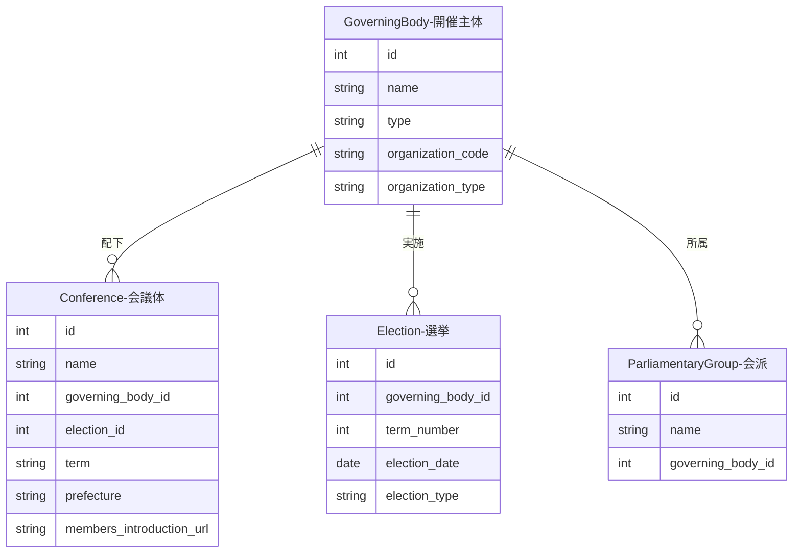

---
tags:
  - 手動作成
  - シードデータ作成済み
---

# 開催主体データの作り方

Streamlit管理画面の「開催主体管理」ページから手動で作成します。

開催主体は、議会を運営する国・都道府県・市区町村などの自治体を表すデータです。会議体（Conference）の親にあたり、最初に登録する必要があります。

## 入力プロパティ

| フィールド | 必須 | 説明 |
|------------|------|------|
| 開催主体名 | はい | 自治体名（例: 東京都、京都市） |
| 種別 | はい | 開催主体の分類（選択式） |
| 組織コード | いいえ | 自治体の組織コード |
| 組織タイプ | いいえ | 組織の種類 |

## 他オブジェクトとのリレーション

### リレーションの説明

| 関連テーブル | 関係 | 説明 |
|-------------|------|------|
| **Conference（会議体）** | 開催主体 has many 会議体 | 開催主体の配下にある議会や委員会です。1つの開催主体に複数の会議体が紐付きます |
| **Election（選挙）** | 開催主体 has many 選挙 | 開催主体で実施された選挙です。地方議会の「第n期」は選挙によって決まります |
| **ParliamentaryGroup（会派）** | 開催主体 has many 会派 | 開催主体に所属する会派（議員団）です。会派は特定の会議体ではなく開催主体レベルで存在します |
