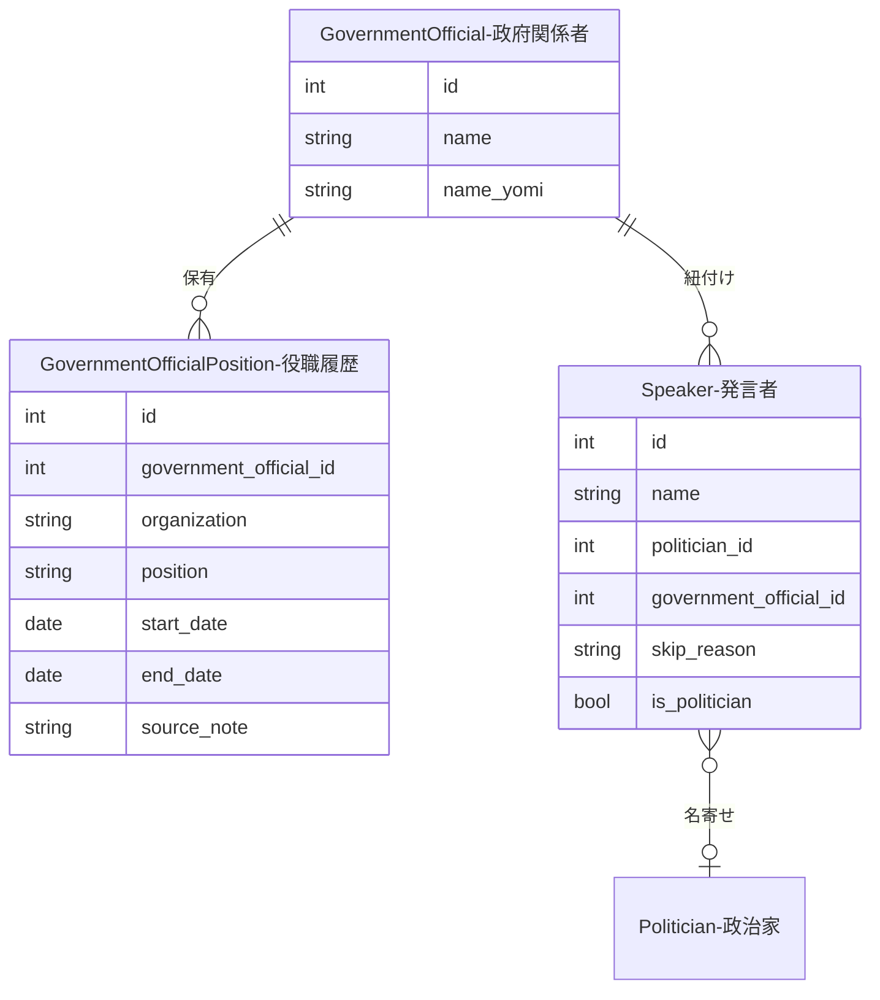

---
tags:
  - CSVインポート
  - 手動作成
---

# 政府関係者データの作り方

政府関係者（政府参考人・官僚）のマスターデータと役職履歴を管理します。Speaker（発言者）との紐付けにより、従来 `skip_reason='government_official'` でマークするだけだった政府関係者の省庁・役職情報を構造的に記録できます。

## 背景

未マッチSpeakerの分析で、200件中86件（43%）が政府関係者であることが判明しました。政治家ではないため `is_politician=false` としてスキップしていましたが、省庁・役職の情報が失われる問題がありました。`government_officials` / `government_official_positions` テーブルの新設により、この情報を永続化します。

## ER図



## 優先度ルール

Speaker の紐付けには以下の優先度ルールがあります：

| 条件 | 動作 |
|------|------|
| `politician_id` 設定済み | `government_official_id` を設定不可（政治家が優先） |
| `government_official_id` を設定する場合 | `is_politician=false`, `skip_reason='government_official'` を自動設定 |
| 政治家にリンクする場合 | `government_official_id` をクリア |

## 作成方法

### CSVインポート（一括登録）

Cowork分析などで作成した政府関係者リストをCSVで一括取込できます。

??? example "コマンド例と入力形式"

    ```bash
    docker compose -f docker/docker-compose.yml exec sagebase \
        uv run python scripts/import_government_officials.py /tmp/government_officials.csv

    # ドライラン
    docker compose -f docker/docker-compose.yml exec sagebase \
        uv run python scripts/import_government_officials.py /tmp/government_officials.csv --dry-run
    ```

    **CSV形式:**

    ```csv
    speaker_name,representative_speaker_id,category,skip_reason,confidence,notes
    法務省刑事局長,123,government_official,skip,0.9,法務省刑事局長
    ```

    | カラム | 説明 |
    |--------|------|
    | speaker_name | Speaker名 |
    | representative_speaker_id | 代表SpeakerのID |
    | category | `government_official` の行のみ対象 |
    | notes | 省庁+役職名（パースして organization/position に分割） |

    **notesのパースルール:**

    `notes` フィールドから省庁サフィックス（省・庁・院・府・局・委員会 等）で組織名と役職名を分離します。

    | notes | organization | position |
    |-------|-------------|----------|
    | 法務省刑事局長 | 法務省 | 刑事局長 |
    | 内閣府大臣官房審議官 | 内閣府 | 大臣官房審議官 |

**処理フロー（1行あたり）:**

1. `category == 'government_official'` の行のみ対象
2. `notes` から organization / position をパース
3. GovernmentOfficial を名前で find-or-create
4. GovernmentOfficialPosition を bulk_upsert（official_id + organization + position + start_date でユニーク判定）
5. 同名 Speaker を全件検索し、`politician_id` なしの Speaker に紐付け

**出力サマリ:**

| 項目 | 説明 |
|------|------|
| 作成した政府関係者 | 新規作成された GovernmentOfficial 数 |
| 作成した役職履歴 | 新規作成された GovernmentOfficialPosition 数 |
| 紐付けたSpeaker | `government_official_id` を設定した Speaker 数 |
| スキップ | organization/position が空の行数 |

## データプロパティ

### GovernmentOfficial

| フィールド | 必須 | 説明 |
|------------|------|------|
| name | はい | 政府関係者の氏名 |
| name_yomi | いいえ | 読み仮名 |

### GovernmentOfficialPosition

| フィールド | 必須 | 説明 |
|------------|------|------|
| government_official_id | はい | 親の政府関係者ID |
| organization | はい | 省庁名（例: 法務省） |
| position | はい | 役職名（例: 刑事局長） |
| start_date | いいえ | 就任日 |
| end_date | いいえ | 退任日（`end_date >= start_date` 制約あり） |
| source_note | いいえ | データソースや備考 |
