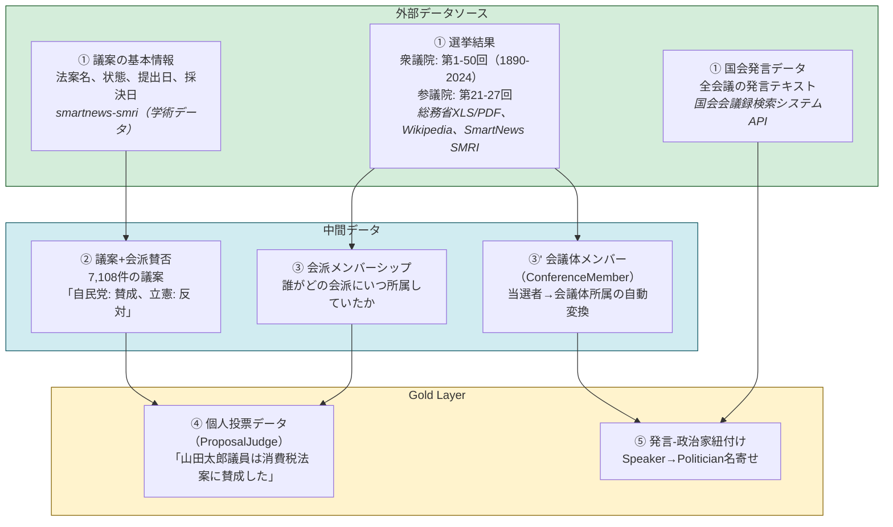

# 各種マスターデータの作り方

このセクションでは、Sagebaseの管理画面（Streamlit）およびデータインポートスクリプトを使った各種マスターデータの作成手順を説明します。

マスターデータ間を接続するリレーション（中間テーブル）の生成方法は、[リレーションの作り方](relations/index.md)を参照してください。

## 国会データの全体像

国会の議員個人の投票データ（ProposalJudge）および発言データ（Conversation）を作成するためには、複数のデータソースを組み合わせる必要があります。以下の図は、データの依存関係を示しています。

!!! info "現在の進捗"
    **Goal 0014（発言者-政治家全量紐付け）** 進行中。発言者のSpeaker→Politicianマッチングパイプラインを拡充中です。



### 生成ロジック

**④ 個人投票データ**は、以下のロジックで生成されます：

```
会派の賛否 × 所属議員 = 個人の賛否
```

つまり、ある議案に対して「自民党が賛成」という情報があり、「山田太郎議員がその時点で自民党に所属していた」という情報があれば、「山田太郎議員はその議案に賛成した」と推定できます。

**⑤ 発言-政治家紐付け**は、以下のパイプラインで実行されます：

1. 国会APIから発言データをインポート（Speaker レコード自動作成）
2. Speaker の `is_politician` 分類（参考人・証人等を除外）
3. ルールベース + BAML（LLM）でSpeaker→Politicianマッチング

### 各データの詳細

| 層 | データ | 件数/範囲 | データソース | 詳細ページ |
|----|--------|-----------|--------------|------------|
| Bronze | 議案の基本情報 | - | [smartnews-smri](https://github.com/smartnews-smri/house-of-representatives) | [議案データ](proposal.md) |
| Bronze | 選挙結果（衆議院） | 第1-50回 | 総務省XLS/PDF、Wikipedia | [選挙データ](election.md) |
| Bronze | 選挙結果（参議院） | 第21-27回 | 総務省XLS、SmartNews SMRI | [選挙データ](election.md) |
| Bronze | 国会発言データ | 全会期 | 国会会議録検索システムAPI | [発言データ](conversation.md) |
| Silver | 議案+会派賛否 | 7,108件 | smartnews-smriから生成 | [議案データ](proposal.md) |
| Silver | 会派メンバーシップ | - | 選挙結果から自動紐付け | [会派データ](parliamentary-group.md) |
| Silver | 会議体メンバー | - | 当選者から自動変換 | [会議体データ](conference.md) |
| Gold | 個人投票データ | - | ②③から展開 | [議案データ](proposal.md) |
| Gold | 発言-政治家紐付け | - | Speaker→Politicianマッチング | [発言データ](conversation.md) |

### マスターデータ作成スクリプト一覧

#### 選挙データインポート

| スクリプト | 用途 | 対象 |
|-----------|------|------|
| `import_soumu_election.py` | 衆議院小選挙区候補者のインポート | 第45-50回 |
| `import_soumu_proportional.py` | 衆議院比例代表当選者のインポート | 第45-50回 |
| `import_wikipedia_election.py` | Wikipedia衆議院選挙データのインポート | 第1-44回 |
| `import_soumu_sangiin_election.py` | 参議院選挙区候補者のインポート | 第21-27回 |
| `import_soumu_sangiin_proportional.py` | 参議院比例代表当選者のインポート | 第21-27回 |
| `import_sangiin_election.py` | 参議院議員データのインポート（SmartNews SMRI） | - |

#### 発言データインポート

| スクリプト/コマンド | 用途 |
|-------------------|------|
| `sagebase kokkai import` | 国会APIから発言データを一括インポート |
| `sagebase kokkai survey` | 国会APIの事前調査（会期・発言数の確認） |
| `sagebase kokkai stats` | Speaker-Politicianマッチング統計の表示 |

#### その他

| スクリプト | 用途 |
|-----------|------|
| `import_smartnews_smri.py` | 議案+会派賛否のインポート |

!!! tip "リレーション生成スクリプト"
    会議体メンバー・会派紐付け・Speakerマッチング・個人投票展開などのリレーション生成スクリプトについては、[リレーションの作り方](relations/index.md)を参照してください。

## 対象データ

| データ | 作成方法 | 概要 |
|--------|----------|------|
| [開催主体データ](governing-body.md) | Streamlit管理画面 | 議会を運営する自治体を登録 |
| [選挙データ](election.md) | 外部データインポート + Streamlit管理画面 | 総務省・Wikipedia・SmartNews SMRIからインポート |
| [会議体データ](conference.md) | Streamlit管理画面 + スクリプト自動生成 | 議会・委員会などの会議組織を登録 |
| [会議データ](meeting.md) | Streamlit管理画面 | 実際に開催された個々の会議を登録 |
| [会派（議員団）データ](parliamentary-group.md) | Streamlit管理画面 + スクリプト自動紐付け | 議会内の会派を登録 |
| [発言データ](conversation.md) | 国会APIインポート + 自動生成 | 国会会議録APIからインポート、議事録解析パイプラインで自動生成 |
| [政治家データ](politician.md) | 選挙インポート時の自動作成 + Streamlit管理画面 | 選挙インポートで自動作成、必要に応じて手動登録 |
| [政党データ](political-party.md) | 選挙インポート時の自動作成 + シードファイル + Streamlit管理画面 | 選挙インポートで自動作成、シードで初期投入 |
