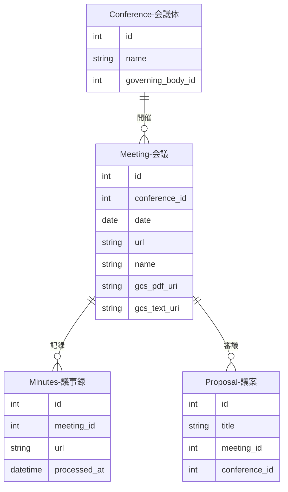

---
tags:
  - 手動作成
  - シードデータ作成済み
---

# 会議データの作り方

Streamlit管理画面の「会議管理」ページから手動で作成します。

会議は、会議体（Conference）で実際に開催された個々の会議を表すデータです。会議録のスクレイピングや発言抽出の起点となります。

## 入力プロパティ

| フィールド | 必須 | 説明 |
|------------|------|------|
| 開催主体 | はい | 開催主体を選択して会議体の候補を絞り込む（会議データ自体には保存されない） |
| 会議体 | はい | 紐付ける会議体を選択 |
| 開催日 | はい | 会議の開催日 |
| URL | はい | 会議録ページのURL |

## 他オブジェクトとのリレーション

### リレーションの説明

| 関連テーブル | 関係 | 説明 |
|-------------|------|------|
| **Conference（会議体）** | 会議 has one 会議体 | この会議が開催された会議体です |
| **Minutes（議事録）** | 会議 has many 議事録 | この会議の議事録です。スクレイピングで取得し、発言抽出の元データとなります |
| **Proposal（議案）** | 会議 has many 議案 | この会議で審議された議案です。議案は会議体にも紐付くため、会議体・会議の両方から参照されます。議案は会議体に対して提出されて、個別の会議でその意思決定を行います。 |
