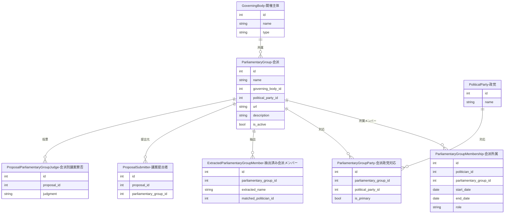
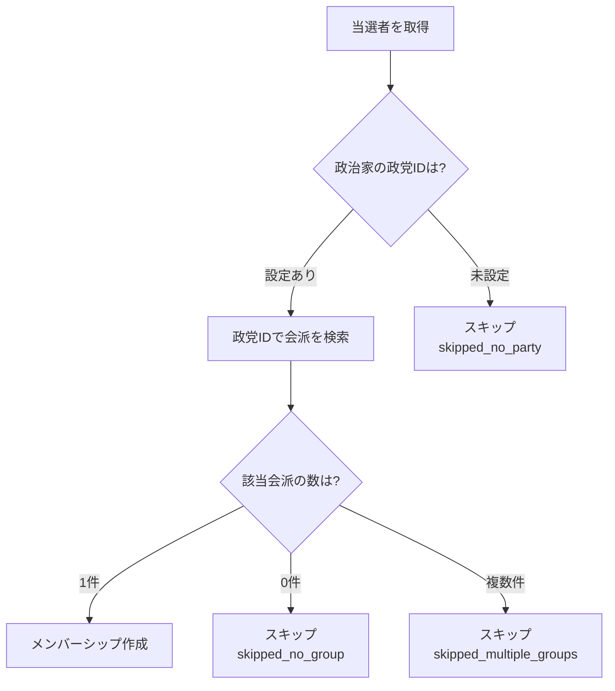

---
tags:
  - 手動作成
  - シードデータ作成済み
---

# 会派（議員団）データの作り方

Streamlit管理画面の「議員団管理」ページから手動で作成します。

会派（議員団）は、議会内で政治家が活動するためのグループです。開催主体（GoverningBody）に紐付きます。

### 会派と政党の関係について

日本の地方議会では、会派（議員団）と政党は必ずしも1対1ではありません。例えば「自民党・無所属の会」のように複数政党の議員が合同で会派を組むケースがあります。

会派と政党の対応関係は `parliamentary_group_parties` 中間テーブルで管理されます（詳細は[政党データの作り方](political-party.md)を参照）。`is_primary` フラグで主要政党を識別します。

従来の `political_party_id` による直接紐付けも引き続きサポートしていますが、複数政党が合同する会派の場合は中間テーブルを使用してください。

## 入力プロパティ

| フィールド | 必須 | 説明 |
|------------|------|------|
| 所属開催主体 | はい | 紐付ける開催主体を選択 |
| 議員団名 | はい | 会派の名称（例: 自民党市議団） |
| 議員団URL | いいえ | 会派の公式ページのURL |
| 説明 | いいえ | 会派の説明や特徴 |
| 活動中 | はい | 活動中かどうか（デフォルト: 活動中） |
| 政党 | いいえ | 紐付ける政党（会派自動紐付けに使用） |

## 他オブジェクトとのリレーション



### リレーションの説明

| 関連テーブル | 関係 | 説明 |
|-------------|------|------|
| **GoverningBody（開催主体）** | 会派 has one 開催主体 | この会派が所属する開催主体です(`自由民主党京都市会議員団`のように開催主体に対して会派が紐づきます。) |
| **ParliamentaryGroupMembership（会派所属）** | 会派 has many 会派所属 | この会派に所属する政治家の一覧です。期間・役割付きで記録されます |
| **ExtractedParliamentaryGroupMember（抽出済み会派メンバー）** | 会派 has many 抽出済み会派メンバー | 外部Webページから抽出された会派メンバー情報です。政治家との自動マッチングに使用されます |
| **ProposalSubmitter（議案提出者）** | 会派 has many 議案提出者 | この会派が提出元となっている議案です(議案は会派として提出するケースがあります。) |
| **ProposalParliamentaryGroupJudge（会派別議案賛否）** | 会派 has many 会派別議案賛否 | 会派単位での議案に対する賛否を記録します(議案は会派単位で賛否を表明するケースがあります。) |
| **ParliamentaryGroupParty（会派政党対応）** | 会派 has many 会派政党対応 | 会派と政党の多対多の対応関係です。`is_primary` で主要政党を識別します。SEEDファイル: `seed_parliamentary_group_parties_generated.sql` |
| **PoliticalParty（政党）** | 会派 has one 政党（任意、レガシー） | 単一政党との直接紐付けです。複数政党が合同する会派では `ParliamentaryGroupParty` を使用してください |

## 会派メンバーシップ（ParliamentaryGroupMembership）

政治家がどの会派にいつからいつまで所属していたかを記録します。

### データ構造

| フィールド | 必須 | 説明 |
|------------|------|------|
| politician_id | はい | 政治家ID |
| parliamentary_group_id | はい | 会派ID |
| start_date | はい | 所属開始日 |
| end_date | いいえ | 所属終了日（継続中はNULL） |
| role | いいえ | 役職（幹事長、団長など） |
| is_manually_verified | はい | 手動検証済みフラグ |

### 主要メソッド

| メソッド | 説明 |
|----------|------|
| `is_active(as_of_date)` | 指定日時点で有効かチェック |
| `can_be_updated_by_ai()` | AI更新可否（手動検証済みはFalse） |

## 会派自動紐付け機能

選挙結果メンバーをもとに、当選者を会派に自動紐付けします。

### 実行方法

```bash
# 単回実行（特定の選挙回次）
docker compose -f docker/docker-compose.yml exec sagebase \
    uv run python scripts/link_parliamentary_groups.py --election 50

# 一括実行（全選挙）
docker compose -f docker/docker-compose.yml exec sagebase \
    uv run python scripts/link_parliamentary_groups_bulk.py

# 院を指定して一括実行
docker compose -f docker/docker-compose.yml exec sagebase \
    uv run python scripts/link_parliamentary_groups_bulk.py --chamber 衆議院

# 特定回次を指定して一括実行
docker compose -f docker/docker-compose.yml exec sagebase \
    uv run python scripts/link_parliamentary_groups_bulk.py --term 45 46 47

# ドライラン
docker compose -f docker/docker-compose.yml exec sagebase \
    uv run python scripts/link_parliamentary_groups_bulk.py --dry-run
```

### バルク紐付けのコマンドライン引数

| 引数 | 説明 | デフォルト |
|------|------|-----------|
| `--chamber` | 対象院（all/衆議院/参議院） | all |
| `--term` | 対象回次（複数指定可） | 全回次 |
| `--dry-run` | DB書き込みなし | - |
| `--skip-seed` | SEED生成をスキップ | - |

### 紐付けロジック



### 出力結果

| 項目 | 説明 |
|------|------|
| total_elected | 当選者総数 |
| linked_count | 新規紐付け数 |
| already_existed_count | 既存重複数 |
| skipped_no_party | 政党未設定スキップ数 |
| skipped_no_group | 会派なしスキップ数 |
| skipped_multiple_groups | 複数会派スキップ数 |

## 会派メンバーシップSEED生成

データベースの会派メンバーシップをSEEDファイルとして出力できます。

```bash
# 一括実行＋SEED生成
docker compose -f docker/docker-compose.yml exec sagebase \
    uv run python scripts/link_parliamentary_groups_bulk.py --skip-seed false
```

### 出力ファイル

`database/seed_parliamentary_group_memberships_generated.sql`

### 生成されるSQL形式

```sql
-- 第45回 (2009-08-30)
INSERT INTO parliamentary_group_memberships (politician_id, parliamentary_group_id, start_date, end_date, role)
SELECT (SELECT id FROM politicians WHERE name = '山田 太郎'),
       (SELECT id FROM parliamentary_groups WHERE name = '自由民主党'
        AND governing_body_id = (SELECT id FROM governing_bodies WHERE name = '国会' AND type = '国')),
       '2009-08-30', NULL, NULL
WHERE NOT EXISTS (SELECT 1 FROM parliamentary_group_memberships
                  WHERE politician_id = (SELECT id FROM politicians WHERE name = '山田 太郎')
                  AND parliamentary_group_id = (SELECT id FROM parliamentary_groups WHERE name = '自由民主党' ...)
                  AND start_date = '2009-08-30');
```

!!! note "冪等性"
    `WHERE NOT EXISTS` を使用しているため、複数回実行しても重複レコードは作成されません。

## パイプライン品質検証

`verify_parliamentary_group_pipeline.py` で会派紐付けパイプラインの品質を検証できます。

```bash
# ベースライン測定のみ
docker compose -f docker/docker-compose.yml exec sagebase \
    uv run python scripts/verify_parliamentary_group_pipeline.py --mode baseline

# 検証のみ（要: 保存済みベースライン）
docker compose -f docker/docker-compose.yml exec sagebase \
    uv run python scripts/verify_parliamentary_group_pipeline.py --mode verify

# 測定→実行→検証の一括実行
docker compose -f docker/docker-compose.yml exec sagebase \
    uv run python scripts/verify_parliamentary_group_pipeline.py --mode full

# 院を指定
docker compose -f docker/docker-compose.yml exec sagebase \
    uv run python scripts/verify_parliamentary_group_pipeline.py --mode full --chamber 衆議院
```

### コマンドライン引数

| 引数 | 説明 | デフォルト |
|------|------|-----------|
| `--mode` | baseline/verify/full | - |
| `--chamber` | 衆議院/参議院/all | all |
| `--dry-run` | DB書き込みなし（mode=fullのみ） | - |

### 成功基準

| 基準 | 条件 |
|------|------|
| 衆議院カバー率 | 全選挙に少なくとも1件のメンバーシップが存在 |
| 参議院カバー率 | 全選挙に少なくとも1件のメンバーシップが存在 |
| スキップ率 | 政党未設定を除くスキップが10%以下 |

出力ファイル:

- `tmp/pipeline_baseline.json` — ベースライン計測値
- `tmp/pipeline_verification_results.json` — 詳細検証結果

## 会派-政党マッピング調査

`investigate_kaiha_mapping.py` で、SmartNews SMRIデータから会派名を抽出し、政党との対応関係を調査できます。

```bash
docker compose -f docker/docker-compose.yml exec sagebase \
    uv run python scripts/investigate_kaiha_mapping.py
```

### 出力ファイル

| ファイル | 内容 |
|---------|------|
| `tmp/kaiha_shuugiin_by_session.csv` | 衆議院の会派名一覧（会期別） |
| `tmp/kaiha_sangiin_current.csv` | 参議院の現在の会派名一覧 |
| `tmp/kaiha_mapping_proposal.json` | マッピング提案（信頼度付き） |
| `tmp/kaiha_unmapped_groups.csv` | 未マッピングの会派一覧 |

マッピングの信頼度:

| 信頼度 | 意味 |
|--------|------|
| `existing` | 既存の対応関係あり |
| `high` | 名前から高確度でマッチ |
| `medium` | 部分一致 |
| `unmapped` | 対応する政党が不明 |
