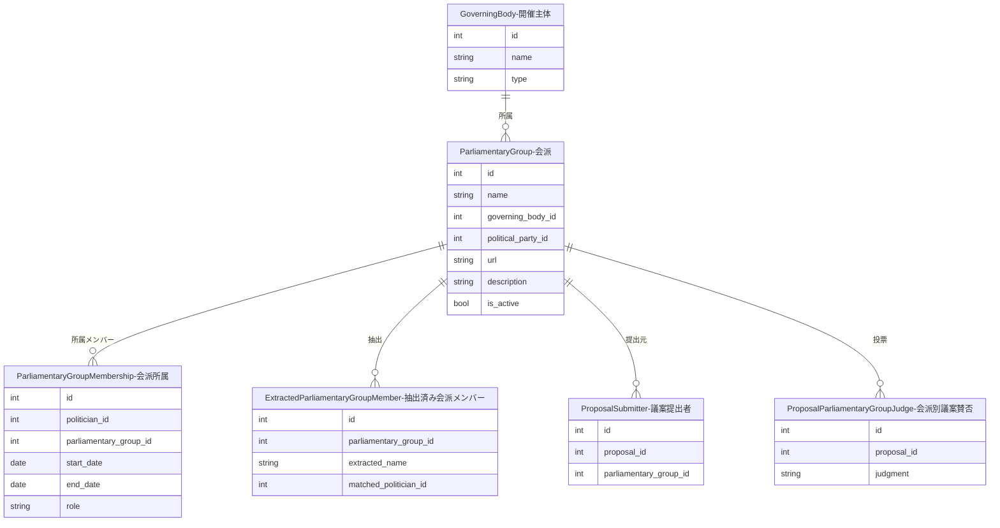

---
tags:
  - 手動作成
  - シードデータ作成済み
---

# 会派（議員団）データの作り方

Streamlit管理画面の「議員団管理」ページから手動で作成します。

会派（議員団）は、議会内で政治家が活動するためのグループです。開催主体（GoverningBody）に紐付きます。

### 会派と政党の関係について

日本の地方議会では、会派（議員団）と政党は必ずしも1対1ではありません。例えば「自民党・無所属の会」のように複数政党の議員が合同で会派を組むケースがあります。

ただし、国会の会派など1対1で対応するケースでは、`political_party_id` で政党と紐付けることができます。これにより、政党所属議員の会派自動紐付けが可能になります。

## 入力プロパティ

| フィールド | 必須 | 説明 |
|------------|------|------|
| 所属開催主体 | はい | 紐付ける開催主体を選択 |
| 議員団名 | はい | 会派の名称（例: 自民党市議団） |
| 議員団URL | いいえ | 会派の公式ページのURL |
| 説明 | いいえ | 会派の説明や特徴 |
| 活動中 | はい | 活動中かどうか（デフォルト: 活動中） |
| 政党 | いいえ | 紐付ける政党（会派自動紐付けに使用） |

## 他オブジェクトとのリレーション



### リレーションの説明

| 関連テーブル | 関係 | 説明 |
|-------------|------|------|
| **GoverningBody（開催主体）** | 会派 has one 開催主体 | この会派が所属する開催主体です(`自由民主党京都市会議員団`のように開催主体に対して会派が紐づきます。) |
| **ParliamentaryGroupMembership（会派所属）** | 会派 has many 会派所属 | この会派に所属する政治家の一覧です。期間・役割付きで記録されます |
| **ExtractedParliamentaryGroupMember（抽出済み会派メンバー）** | 会派 has many 抽出済み会派メンバー | 外部Webページから抽出された会派メンバー情報です。政治家との自動マッチングに使用されます |
| **ProposalSubmitter（議案提出者）** | 会派 has many 議案提出者 | この会派が提出元となっている議案です(議案は会派として提出するケースがあります。) |
| **ProposalParliamentaryGroupJudge（会派別議案賛否）** | 会派 has many 会派別議案賛否 | 会派単位での議案に対する賛否を記録します(議案は会派単位で賛否を表明するケースがあります。) |
| **PoliticalParty（政党）** | 会派 has one 政党（任意） | 会派と政党の紐付けです。会派自動紐付けに使用されます |

## 会派メンバーシップ（ParliamentaryGroupMembership）

政治家がどの会派にいつからいつまで所属していたかを記録します。

### データ構造

| フィールド | 必須 | 説明 |
|------------|------|------|
| politician_id | はい | 政治家ID |
| parliamentary_group_id | はい | 会派ID |
| start_date | はい | 所属開始日 |
| end_date | いいえ | 所属終了日（継続中はNULL） |
| role | いいえ | 役職（幹事長、団長など） |
| is_manually_verified | はい | 手動検証済みフラグ |

### 主要メソッド

| メソッド | 説明 |
|----------|------|
| `is_active(as_of_date)` | 指定日時点で有効かチェック |
| `can_be_updated_by_ai()` | AI更新可否（手動検証済みはFalse） |

## 会派自動紐付け機能

選挙結果メンバーをもとに、当選者を会派に自動紐付けします。

### 実行方法

```bash
# 単回実行
docker compose -f docker/docker-compose.yml exec sagebase \
    uv run python scripts/link_parliamentary_groups.py --election 50

# 一括実行（第45-50回）
docker compose -f docker/docker-compose.yml exec sagebase \
    uv run python scripts/link_parliamentary_groups_bulk.py
```

### 紐付けロジック


### 出力結果

| 項目 | 説明 |
|------|------|
| total_elected | 当選者総数 |
| linked_count | 新規紐付け数 |
| already_existed_count | 既存重複数 |
| skipped_no_party | 政党未設定スキップ数 |
| skipped_no_group | 会派なしスキップ数 |
| skipped_multiple_groups | 複数会派スキップ数 |

## 会派メンバーシップSEED生成

データベースの会派メンバーシップをSEEDファイルとして出力できます。

```bash
# 一括実行＋SEED生成
docker compose -f docker/docker-compose.yml exec sagebase \
    uv run python scripts/link_parliamentary_groups_bulk.py --skip-seed false
```

### 出力ファイル

`database/seed_parliamentary_group_memberships_generated.sql`

### 生成されるSQL形式

```sql
-- 第45回 (2009-08-30)
INSERT INTO parliamentary_group_memberships (politician_id, parliamentary_group_id, start_date, end_date, role)
SELECT (SELECT id FROM politicians WHERE name = '山田 太郎'),
       (SELECT id FROM parliamentary_groups WHERE name = '自由民主党'
        AND governing_body_id = (SELECT id FROM governing_bodies WHERE name = '国会' AND type = '国')),
       '2009-08-30', NULL, NULL
WHERE NOT EXISTS (SELECT 1 FROM parliamentary_group_memberships
                  WHERE politician_id = (SELECT id FROM politicians WHERE name = '山田 太郎')
                  AND parliamentary_group_id = (SELECT id FROM parliamentary_groups WHERE name = '自由民主党' ...)
                  AND start_date = '2009-08-30');
```

!!! note "冪等性"
    `WHERE NOT EXISTS` を使用しているため、複数回実行しても重複レコードは作成されません。
