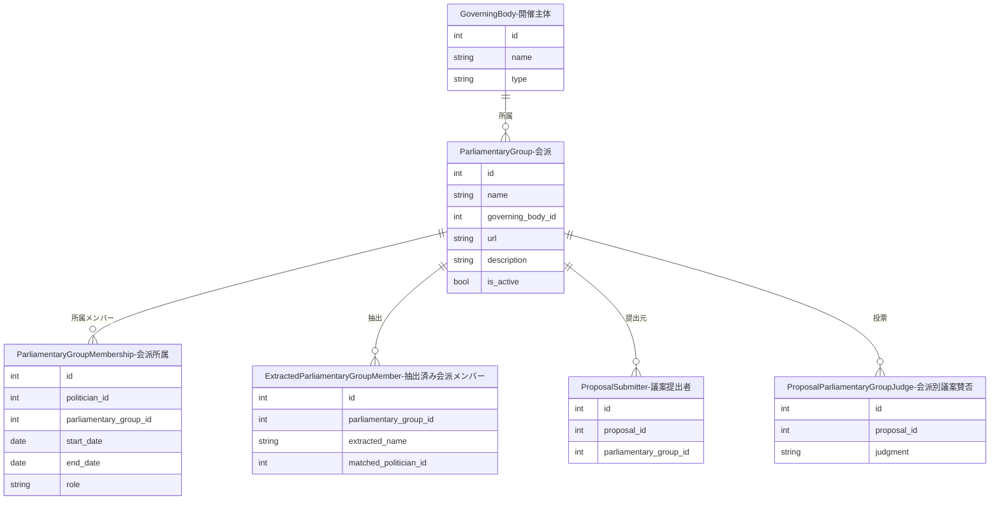

---
tags:
  - 手動作成
  - シードデータ作成済み
---

# 会派（議員団）データの作り方

Streamlit管理画面の「議員団管理」ページから手動で作成します。

会派（議員団）は、議会内で政治家が活動するためのグループです。開催主体（GoverningBody）に紐付きます。

### 会派と政党の関係について

日本の地方議会では、会派（議員団）と政党は必ずしも1対1ではありません。例えば「自民党・無所属の会」のように複数政党の議員が合同で会派を組むケースがあります。そのため、会派と政党の間に直接的な紐付けは設計されておらず、それぞれ独立したデータとして管理しています。

## 入力プロパティ

| フィールド | 必須 | 説明 |
|------------|------|------|
| 所属開催主体 | はい | 紐付ける開催主体を選択 |
| 議員団名 | はい | 会派の名称（例: 自民党市議団） |
| 議員団URL | いいえ | 会派の公式ページのURL |
| 説明 | いいえ | 会派の説明や特徴 |
| 活動中 | はい | 活動中かどうか（デフォルト: 活動中） |

## 他オブジェクトとのリレーション

### リレーションの説明

| 関連テーブル | 関係 | 説明 |
|-------------|------|------|
| **GoverningBody（開催主体）** | 会派 has one 開催主体 | この会派が所属する開催主体です(`自由民主党京都市会議員団`のように開催主体に対して会派が紐づきます。) |
| **ParliamentaryGroupMembership（会派所属）** | 会派 has many 会派所属 | この会派に所属する政治家の一覧です。期間・役割付きで記録されます |
| **ExtractedParliamentaryGroupMember（抽出済み会派メンバー）** | 会派 has many 抽出済み会派メンバー | 外部Webページから抽出された会派メンバー情報です。政治家との自動マッチングに使用されます |
| **ProposalSubmitter（議案提出者）** | 会派 has many 議案提出者 | この会派が提出元となっている議案です(議案は会派として提出するケースがあります。) |
| **ProposalParliamentaryGroupJudge（会派別議案賛否）** | 会派 has many 会派別議案賛否 | 会派単位での議案に対する賛否を記録します(議案は会派単位で賛否を表明するケースがあります。) |
