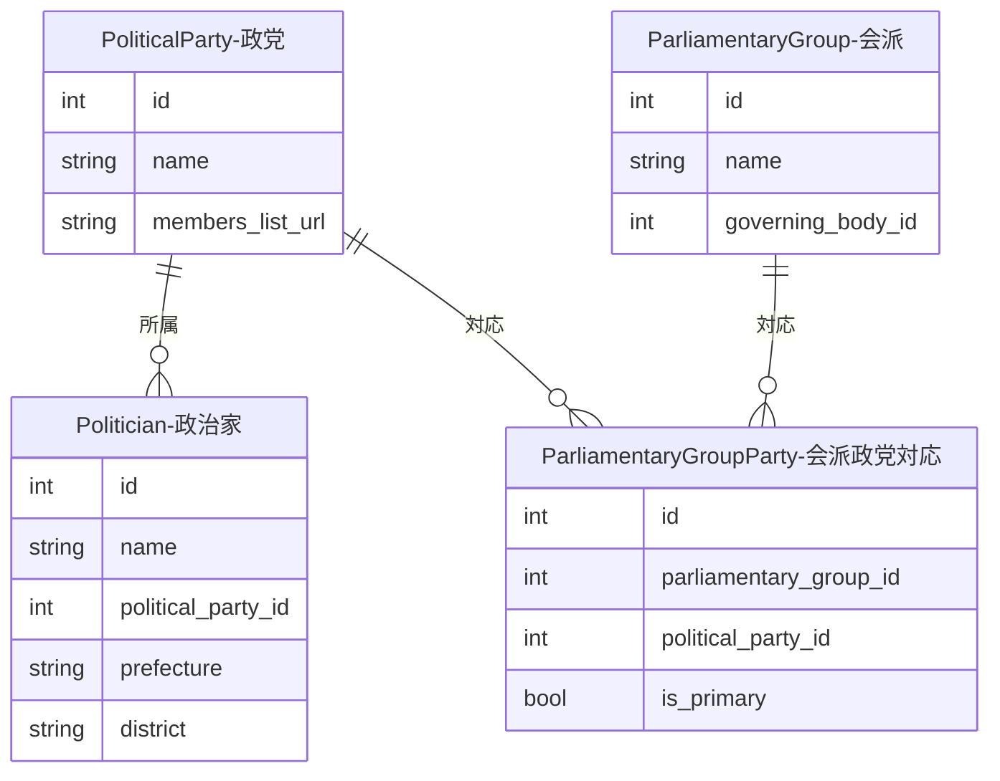

---
tags:
  - 自動作成
  - 手動作成
  - シードデータ作成済み
---

# 政党データの作り方

政党データは、選挙データインポート時の自動作成、またはStreamlit管理画面の「政党管理」ページから手動で作成します。

## 自動作成

各選挙データインポーター（`import_soumu_election.py`、`import_wikipedia_election.py` 等）の実行時に、候補者の政党名で既存の政党を検索し、未登録であれば新規PoliticalPartyレコードが自動作成されます。

自動作成されたデータは `database/seed_political_parties_generated.sql` としてSEEDファイルに出力されます。

## 入力プロパティ

| フィールド | 必須 | 説明 |
|------------|------|------|
| `name` | はい | 政党名。ユニーク制約あり |
| `members_list_url` | いいえ | 議員一覧ページのURL |

## 他オブジェクトとのリレーション

### リレーションの説明

| 関連テーブル | 関係 | 説明 |
|-------------|------|------|
| **Politician（政治家）** | 政党 has many 政治家 | この政党に現在所属している政治家です |
| **ParliamentaryGroupParty（会派政党対応）** | 政党 has many 会派政党対応 | この政党が所属する会派との対応関係です。`is_primary` フラグで主要政党かどうかを示します |

!!! tip "会派-政党対応テーブル"
    ParliamentaryGroupParty（会派と政党の多対多対応）の詳細は、[会派-政党対応](relations/parliamentary-group-party.md)を参照してください。
