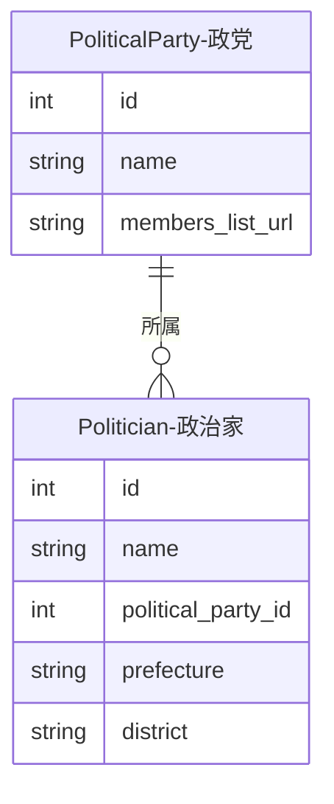

---
tags:
  - 手動作成
  - シードデータ作成済み
---

# 政党データの作り方

Streamlit管理画面の「政党管理」ページから手動で作成します。

## 入力プロパティ

| フィールド | 必須 | 説明 |
|------------|------|------|
| `name` | はい | 政党名。ユニーク制約あり |
| `members_list_url` | いいえ | 議員一覧ページのURL |

## 他オブジェクトとのリレーション

### リレーションの説明

| 関連テーブル | 関係 | 説明 |
|-------------|------|------|
| **Politician（政治家）** | 政党 has many 政治家 | この政党に現在所属している政治家です |
