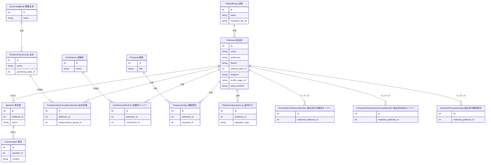

---
tags:
  - 自動作成
  - 手動作成
  - シードデータ作成済み
---

# 政治家データの作り方

政治家データは、選挙データインポート時の自動作成、Streamlit管理画面での手動作成、または紐付け処理中の都度作成で作成されます。

## 作成の流れ

政治家データの作成には、3つの経路があります。

### 1. 選挙データインポート時の自動作成（メイン）

各選挙データインポーター（`import_soumu_election.py`、`import_wikipedia_election.py`、`import_sangiin_election.py` 等）の実行時に、候補者情報から自動でPoliticianレコードが生成されます。

- 候補者名で既存の政治家を検索し、一致すれば既存レコードを使用
- 一致しなければ新規Politicianレコードを自動作成
- **同姓同名の場合**: 政党情報で判別を試み、解決不能時はスキップ（`skipped_ambiguous`）
- 政治家と同時に、未登録の政党（PoliticalParty）も自動作成される

詳細は[選挙データの作り方](election.md)を参照してください。

### 2. 政党の議員一覧ページから網羅的に作成する

各政党の公式サイトにある議員一覧ページを参照し、選挙区ごとに地方議員を含めて網羅的に登録します。

ただし、政党ページには市議会議員が掲載されていないケースがあります。その場合は、各市区町村レベルでその政党の議員団が存在するかを検索し、見つかった議員を追加で登録します。

### 3. 紐付け処理の中で都度作成する

発言者の名寄せや会派メンバーのマッチングなど、各オブジェクトとの紐付け処理を行う際に、紐付け先の政治家が存在しない場合があります。その場合は画面上に政治家の新規作成フォームが表示され、その場で作成して紐付けを完了できます。

## SEED生成

選挙インポーターで作成された政治家データは、`database/seed_politicians_generated.sql` としてSEEDファイルに出力されます。`WHERE NOT EXISTS` を使用した冪等なINSERT文です。

## 入力プロパティ

| フィールド | 必須 | 説明 |
|------------|------|------|
| 名前 | はい | 政治家の氏名 |
| 選挙区の都道府県 | はい | 47都道府県または「比例代表」から選択 |
| 政党 | いいえ | 「無所属」または登録済みの政党から選択 |
| 選挙区 | はい | 選挙区名（例: 東京1区） |
| プロフィールURL | いいえ | 政治家のプロフィールページのURL |

## 他オブジェクトとのリレーション

### リレーションの説明

| 関連テーブル | 関係 | 説明 |
|-------------|------|------|
| **PoliticalParty（政党）** | 政治家 has one 政党 | 政治家が所属する政党を表します。「無所属」の場合は未設定です |
| **Speaker（発言者）** | 政治家 has many 発言者 | 議事録から抽出された発言者を政治家と名寄せして紐付けます。自動マッチング（ルールベース / LLM）と手動紐付けの両方に対応しています |
| **Conversation（発言）** | 政治家 has many 発言（Speaker経由） | 議事録内の個々の発言です。発言者を経由して、どの政治家の発言かを間接的に辿れます |
| **ParliamentaryGroupMembership（会派所属）** | 政治家 has many 会派所属 | 政治家がどの会派（議員団）に所属しているかを期間・役割付きで記録します |
| **ConferenceMember（会議体メンバー）** | 政治家 has many 会議体メンバー | 政治家がどの会議体（議会・委員会）に所属しているかを期間・役割付きで記録します。選挙インポート後に `populate_conference_members.py` で自動生成されます |
| **ProposalJudge（議案賛否）** | 政治家 has many 議案賛否 | 政治家が議案に対してどう投票したか（賛成・反対・棄権・欠席）を記録します |
| **PoliticianOperationLog（操作ログ）** | 政治家 has many 操作ログ | 政治家レコードの作成・更新・削除の操作履歴を監査目的で記録します |
| **ExtractedConferenceMember（抽出済み会議体メンバー）** | 政治家 has many 抽出済み会議体メンバー | 外部Webページから抽出された会議体メンバー情報を政治家と自動マッチングした結果です。マッチング成功後に PoliticianAffiliation へ変換されます |
| **ExtractedParliamentaryGroupMember（抽出済み会派メンバー）** | 政治家 has many 抽出済み会派メンバー | 外部Webページから抽出された会派メンバー情報を政治家と自動マッチングした結果です。マッチング成功後に ParliamentaryGroupMembership へ変換されます |
| **ExtractedProposalJudge（抽出済み議案賛否）** | 政治家 has many 抽出済み議案賛否 | 外部Webページから抽出された議案賛否情報を政治家と自動マッチングした結果です。マッチング成功後に ProposalJudge へ変換されます |
