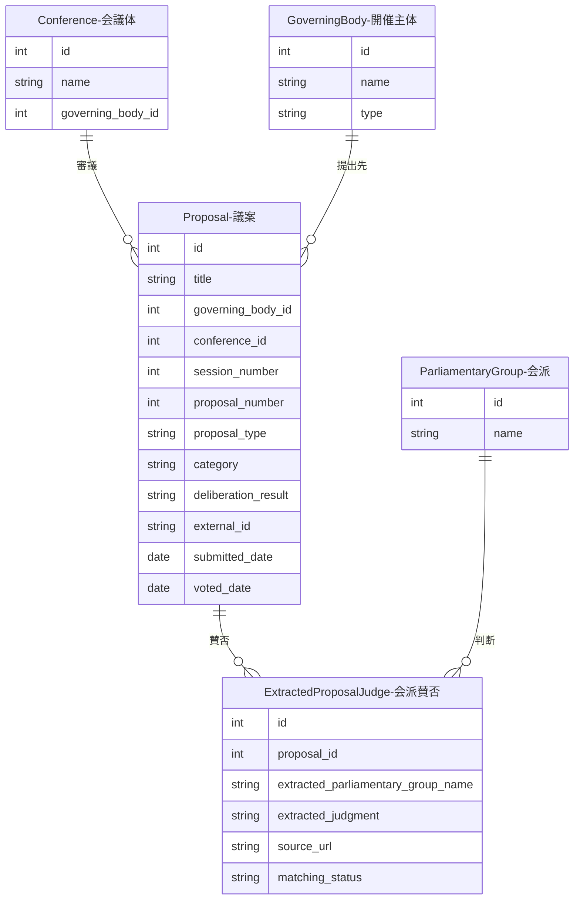

---
tags:
  - 外部データインポート
---

# 議案データの作り方

議案（Proposal）データは、外部データソースからのインポートまたは手動で作成できます。

## 概要

議案データは、国会や地方議会で審議される法案、予算案、条約などの情報を管理します。会議体（Conference）に紐付き、会派ごとの賛否情報も記録できます。

## データソース

### SmartNews-SMRIデータ

[SmartNews-SMRI](https://github.com/smartnews-smri/house-of-representatives)が提供する衆議院の議案情報をインポートできます。

??? example "インポートスクリプトの使用方法"

    ```bash
    # GitHubから自動ダウンロードしてインポート
    python scripts/import_smartnews_smri.py

    # ローカルファイルを指定してインポート
    python scripts/import_smartnews_smri.py /path/to/gian_summary.json

    # バッチサイズを指定（デフォルト: 100件）
    python scripts/import_smartnews_smri.py --batch-size 50
    ```

??? note "インポートされるデータ"

    | フィールド | 説明 | 例 |
    |------------|------|-----|
    | 提案種類 | 議案の分類 | 衆法、閣法、予算、条約など |
    | 国会回次 | 何回国会か | 213 |
    | 議案番号 | 議案の番号 | 15 |
    | 議案件名 | 議案のタイトル | 〇〇法案 |
    | 審議結果 | 審議の結果 | 成立、未了、撤回など |
    | 賛成会派 | 賛成した会派リスト | 自由民主党;公明党 |
    | 反対会派 | 反対した会派リスト | 立憲民主党;日本共産党 |

??? note "提案種類のカテゴリマッピング"

    インポート時に16種類の提案種類が9種類のカテゴリに正規化されます：

    | 元の提案種類 | カテゴリ |
    |-------------|---------|
    | 衆法、閣法、参法 | legislation（立法） |
    | 予算 | budget（予算） |
    | 条約 | treaty（条約） |
    | 承認、承諾 | approval（承認） |
    | 決算、国有財産、ＮＨＫ決算 | audit（監査） |
    | その他 | other |

??? note "審議結果のマッピング"

    27種類の審議結果が7種類に正規化されます：

    | 結果カテゴリ | 元の審議結果の例 |
    |-------------|-----------------|
    | passed（可決） | 成立、本院議了、両院承認 |
    | expired（失効） | 未了 |
    | withdrawn（撤回） | 撤回 |
    | pending（保留中） | 衆議院で閉会中審査、中間報告 |
    | rejected（否決） | 参議院回付案（不同意）、承諾なし |
    | other | その他 |

## 他オブジェクトとのリレーション



### リレーションの説明

| 関連テーブル | 関係 | 説明 |
|-------------|------|------|
| **GoverningBody（開催主体）** | 議案 has one 開催主体 | この議案が提出された議会（国会など） |
| **Conference（会議体）** | 議案 has one 会議体（任意） | 議案を審議した会議体 |
| **ExtractedProposalJudge（会派賛否）** | 議案 has many 会派賛否 | 各会派の賛成/反対情報 |

## 会派賛否データ（ExtractedProposalJudge）

議案ごとに各会派の賛否情報を記録します。

### データ構造

| フィールド | 説明 |
|------------|------|
| proposal_id | 議案ID（外部キー） |
| extracted_parliamentary_group_name | 会派名（抽出されたまま） |
| extracted_judgment | "賛成" または "反対" |
| source_url | データソースURL |
| matching_status | マッチング状態（pending/matched/unmatched） |

### マッチング処理

抽出された会派名は、システムに登録済みの会派（ParliamentaryGroup）との自動マッチング対象となります。マッチングが完了すると`matching_status`が`matched`に更新され、正式な会派IDと紐付けられます。

## 重複チェック

インポート時は以下の順序で重複チェックを行います：

1. **ビジネスキーチェック**: `governing_body_id` + `session_number` + `proposal_number` + `proposal_type` の組み合わせ
2. **External IDチェック**: 議案詳細URLによるチェック

重複が検出された場合はスキップされ、新規データのみが登録されます。

## 日付カラム

議案テーブルには以下の日付カラムがあります：

| カラム | 説明 |
|--------|------|
| submitted_date | 議案の提出日 |
| voted_date | 議案の採決日 |

これらの日付は、個人投票展開時に「投票日時点での会派所属」を特定するために使用されます。

## 議案と会議の多対多紐付け（ProposalDeliberation）

1つの議案が複数の会議で審議されるケースに対応するため、`ProposalDeliberation` テーブルで議案と会議の関係を管理します。

### データ構造

| フィールド | 必須 | 説明 |
|------------|------|------|
| proposal_id | はい | 議案ID |
| conference_id | はい | 会議体ID |
| meeting_id | いいえ | 会議ID |
| stage | いいえ | 審議段階（付託、採決など） |

### 投票日の特定順序

個人投票を展開する際、投票日は以下の優先順位で特定されます：

1. `proposal_deliberations` → `meeting.date`（会議日付）
2. `proposal.meeting_id` → `meeting.date`
3. `proposal.voted_date`

!!! tip "会派賛否マッピング・個人投票展開"
    - 会派賛否マッピング生成（`match_proposal_group_judges.py`）の詳細は[個人投票展開](relations/proposal-judge.md)を参照してください。
    - 個人投票データ（ProposalJudge）の構造・展開UI・記名投票上書き・造反検出の詳細は[個人投票展開](relations/proposal-judge.md)を参照してください。

## 用途

議案データは以下の目的で使用されます：

- 国会での審議状況の追跡
- 会派ごとの賛否傾向の分析
- 政治家や政党の政策スタンスの把握
- 法案成立までのプロセスの可視化
- **[個人投票データの生成と造反検出](relations/proposal-judge.md)**
