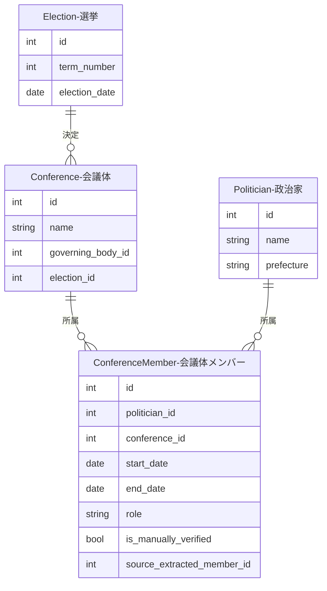
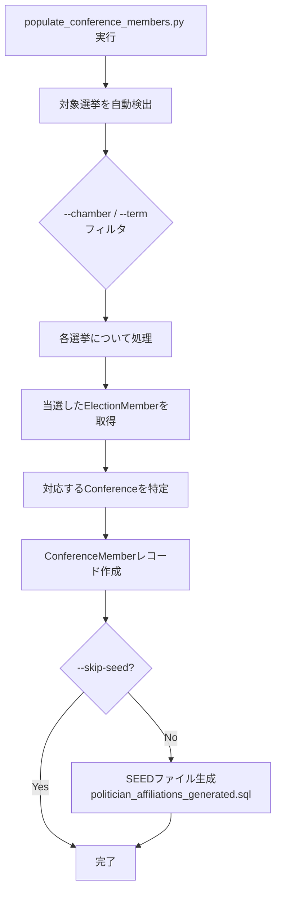

# 会議体メンバー（ConferenceMember）

会議体（Conference）と政治家（Politician）を接続するリレーションテーブルです。政治家がどの会議体にいつからいつまで所属しているかを期間付きで記録します。

国会の会議体メンバーは、選挙データ（ElectionMember）から `populate_conference_members.py` スクリプトで自動生成できます。

## ER図



!!! note "テーブル名について"
    ConferenceMemberエンティティのデータベーステーブル名は `politician_affiliations` です（`conference_members` へのリネームが予定されています）。

## 処理フロー



## 実行方法

??? example "コマンド例と引数"

    ```bash
    # 衆議院の全選挙を処理
    docker compose -f docker/docker-compose.yml exec sagebase \
        uv run python scripts/populate_conference_members.py --chamber 衆議院

    # 特定の回次のみ処理
    docker compose -f docker/docker-compose.yml exec sagebase \
        uv run python scripts/populate_conference_members.py --chamber 衆議院 --term 49 50

    # 参議院を処理
    docker compose -f docker/docker-compose.yml exec sagebase \
        uv run python scripts/populate_conference_members.py --chamber 参議院

    # ドライラン
    docker compose -f docker/docker-compose.yml exec sagebase \
        uv run python scripts/populate_conference_members.py --chamber 衆議院 --dry-run

    # SEED生成をスキップ
    docker compose -f docker/docker-compose.yml exec sagebase \
        uv run python scripts/populate_conference_members.py --chamber 衆議院 --skip-seed
    ```

    | 引数 | 必須 | 説明 | デフォルト |
    |------|------|------|-----------|
    | `--chamber` | いいえ | 対象院（衆議院/参議院） | 衆議院 |
    | `--term` | いいえ | 対象回次（複数指定可） | 全回次 |
    | `--conference-name` | いいえ | 対象会議体名 | 院に基づき自動決定 |
    | `--dry-run` | いいえ | DB書き込みなし | - |
    | `--skip-seed` | いいえ | SEED生成をスキップ | - |

## SEED生成

実行後、`database/seed_politician_affiliations_generated.sql` にSEEDファイルが生成されます。`WHERE NOT EXISTS` を使用した冪等なINSERT文で、複数回実行しても重複レコードは作成されません。
