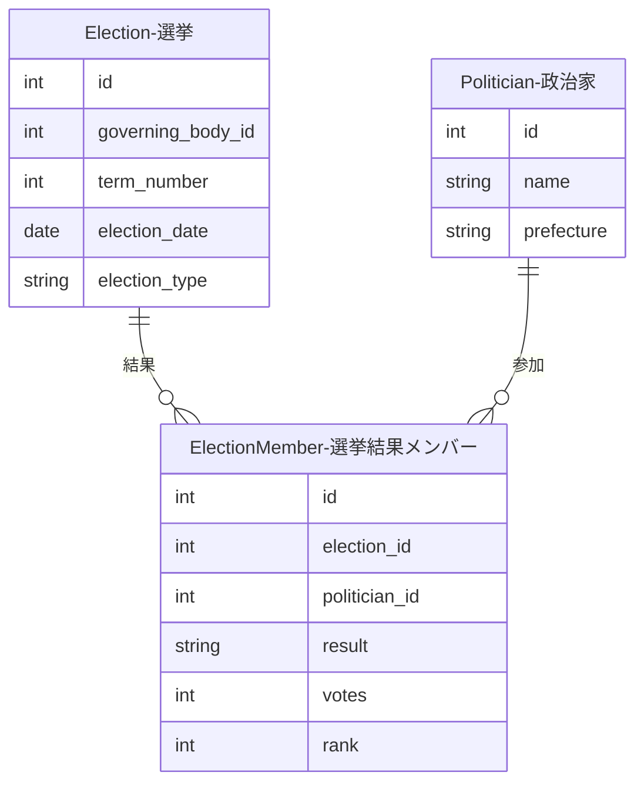
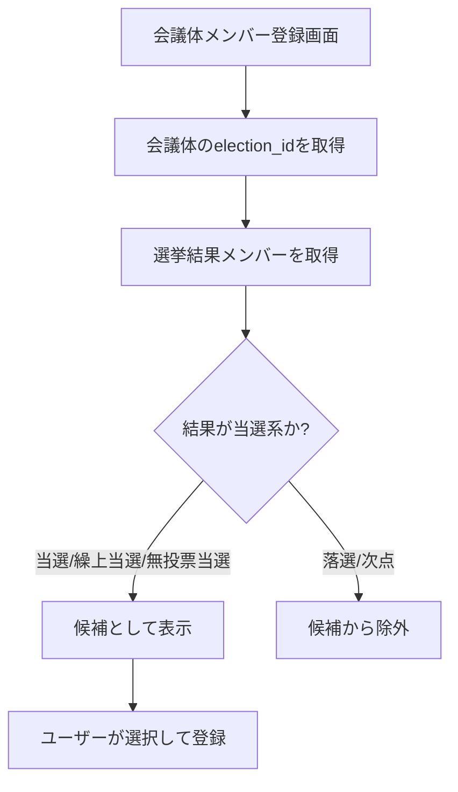

# 選挙結果メンバー（ElectionMember）

選挙に参加した政治家とその結果を記録するリレーションテーブルです。選挙（Election）と政治家（Politician）を接続します。

## ER図

## 入力プロパティ

| フィールド | 必須 | 説明 |
|------------|------|------|
| 選挙 | はい | 紐付ける選挙を選択 |
| 政治家 | はい | 参加した政治家を選択 |
| 結果 | はい | 当選、落選、次点、繰上当選、無投票当選のいずれか |
| 得票数 | いいえ | 獲得した票数 |
| 順位 | いいえ | 得票順位 |

## 結果の種類

| 結果 | 説明 |
|------|------|
| 当選 | 選挙で当選した |
| 落選 | 選挙で落選した |
| 次点 | 当選には届かなかったが次点だった |
| 繰上当選 | 欠員により繰り上げで当選した |
| 無投票当選 | 立候補者数が定数以下のため無投票で当選した |
| 比例当選 | 比例代表のみで当選（小選挙区での出馬なし、または小選挙区落選で比例復活なし） |
| 比例復活 | 小選挙区で落選後、比例代表で復活当選 |

## 選挙結果メンバー管理UI

Streamlit管理画面の「選挙結果メンバー管理」ページでは、3つのタブで選挙結果メンバーを管理できます。

### タブ1: 一覧表示

選挙に登録されたメンバーを一覧で確認できます。

1. 開催主体を選択（カスケード式）
2. 選挙（期）を選択
3. 登録済みメンバーが政治家名、結果、得票数、順位とともに表示される

### タブ2: 新規登録

選挙に新しいメンバーを登録します。

1. 開催主体を選択
2. 選挙（期）を選択
3. 政治家を選択（ドロップダウン）
4. フォームに入力：
   - 結果: 当選、落選、次点、繰上当選、無投票当選から選択
   - 得票数: 数値入力（任意）
   - 順位: 数値入力（任意）
5. 登録ボタンで保存

### タブ3: 編集・削除

既存のメンバー情報を編集または削除します。

- 左列: 編集フォーム（政治家、結果、得票数、順位を変更可能）
- 右列: 削除フォーム（確認ダイアログ付き）

## 会議体メンバー登録時の当選者絞り込み機能

会議体に`election_id`が設定されている場合、会議体メンバーを登録する際に**その選挙で当選した政治家のみ**を候補として表示する機能があります。

### 仕組み

### 当選と判定される結果

以下の結果が「当選」として扱われます：

| 結果 | 当選判定 |
|------|----------|
| 当選 | ✅ |
| 繰上当選 | ✅ |
| 無投票当選 | ✅ |
| 比例当選 | ✅ |
| 比例復活 | ✅ |
| 落選 | ❌ |
| 次点 | ❌ |

### メリット

- **データ品質向上**: 当選していない人を会議体メンバーとして登録することを防止
- **入力効率化**: 全政治家から探す必要がなく、当選者のみから選択できる
- **整合性確保**: 会議体と選挙の関連が明確になる
