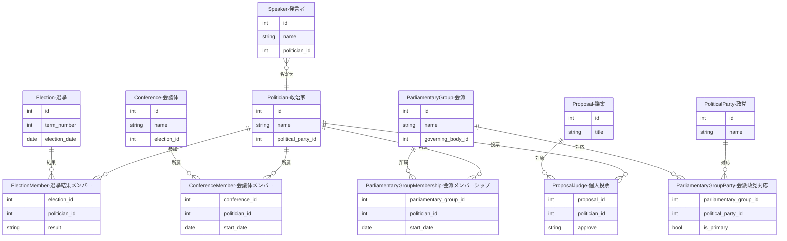

# リレーションの作り方

このセクションでは、Sagebaseのマスターデータ間を接続する中間テーブル（リレーション）の生成方法を説明します。

## 概要

マスターデータ（政治家、選挙、会議体、会派、議案など）は、中間テーブルを介して相互に関連付けられます。リレーションの生成は、スクリプトによる自動生成またはStreamlit管理画面からの手動操作で行います。

## 中間テーブル一覧

| テーブル名 | 接続元 → 接続先 | 生成方法 | 詳細 |
|-----------|----------------|----------|------|
| ElectionMember | Election → Politician | 外部データインポート + 管理画面 | [選挙結果メンバー](election-member.md) |
| ConferenceMember | Conference → Politician | スクリプト自動生成 | [会議体メンバー](conference-member.md) |
| ParliamentaryGroupMembership | ParliamentaryGroup → Politician | スクリプト自動紐付け | [会派メンバーシップ](parliamentary-group-membership.md) |
| ParliamentaryGroupParty | ParliamentaryGroup → PoliticalParty | スクリプト調査 + SEED | [会派-政党対応](parliamentary-group-party.md) |
| Speaker → Politician | Speaker → Politician | マッチングパイプライン | [発言者-政治家紐付け](speaker-politician.md) |
| ProposalJudge | Proposal → Politician | 会派賛否展開 + 記名投票 | [個人投票展開](proposal-judge.md) |

## 全体ER図（中間テーブル中心）

## 外部キーの設定パターン

Sagebaseでは、エンティティ間の関連を2つのパターンで管理しています。

### 直接外部キー

1対多の関係で、子テーブルに親テーブルのIDを直接持つパターンです。

- `Politician.political_party_id` → `PoliticalParty.id`
- `Conference.election_id` → `Election.id`
- `Speaker.politician_id` → `Politician.id`

### 中間テーブル

多対多の関係や、期間・メタデータを持つ関連を管理するパターンです。

- **ElectionMember**: Election ↔ Politician（得票数・順位付き）
- **ConferenceMember**: Conference ↔ Politician（期間・役割付き）
- **ParliamentaryGroupMembership**: ParliamentaryGroup ↔ Politician（期間・役割付き）
- **ParliamentaryGroupParty**: ParliamentaryGroup ↔ PoliticalParty（主要政党フラグ付き）
- **ProposalJudge**: Proposal ↔ Politician（賛否・造反フラグ付き）

## リレーション生成スクリプト一覧

| スクリプト/コマンド | 用途 | 詳細ページ |
|-------------------|------|-----------|
| `populate_conference_members.py` | 当選者→会議体メンバーの自動変換 | [会議体メンバー](conference-member.md) |
| `link_parliamentary_groups.py` | 会派メンバーシップ単回紐付け | [会派メンバーシップ](parliamentary-group-membership.md) |
| `link_parliamentary_groups_bulk.py` | 会派メンバーシップ一括紐付け + SEED生成 | [会派メンバーシップ](parliamentary-group-membership.md) |
| `verify_parliamentary_group_pipeline.py` | 会派紐付けパイプラインの品質検証 | [会派メンバーシップ](parliamentary-group-membership.md) |
| `investigate_kaiha_mapping.py` | 会派-政党マッピング調査 | [会派-政党対応](parliamentary-group-party.md) |
| `sagebase classify-speakers` | Speakerの is_politician 分類 | [発言者-政治家紐付け](speaker-politician.md) |
| `sagebase backfill-role-name-mappings` | 役職→人名マッピングの前処理 | [発言者-政治家紐付け](speaker-politician.md) |
| `sagebase kokkai bulk-match-speakers` | バルクSpeakerマッチング | [発言者-政治家紐付け](speaker-politician.md) |
| `run_pass1_speaker_matching.py` | 4ステップSpeakerマッチングパイプライン | [発言者-政治家紐付け](speaker-politician.md) |
| `match_proposal_group_judges.py` | 会派賛否の正規化 | [個人投票展開](proposal-judge.md) |
