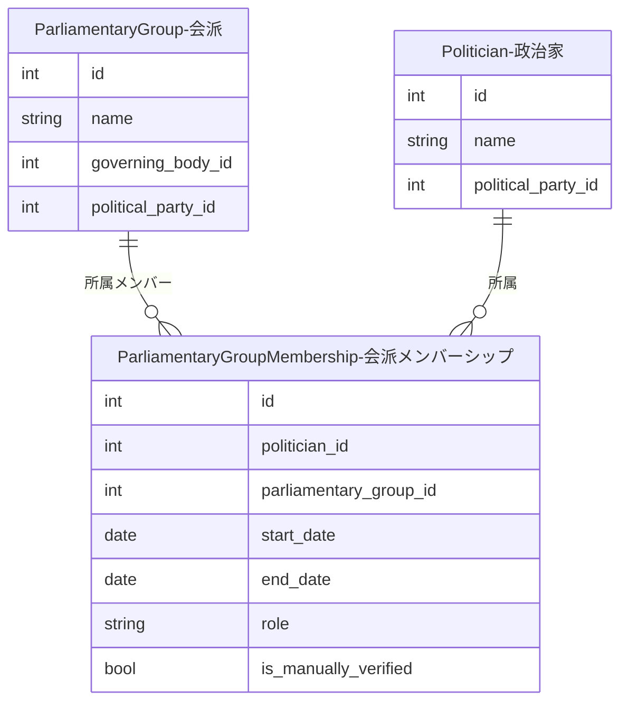
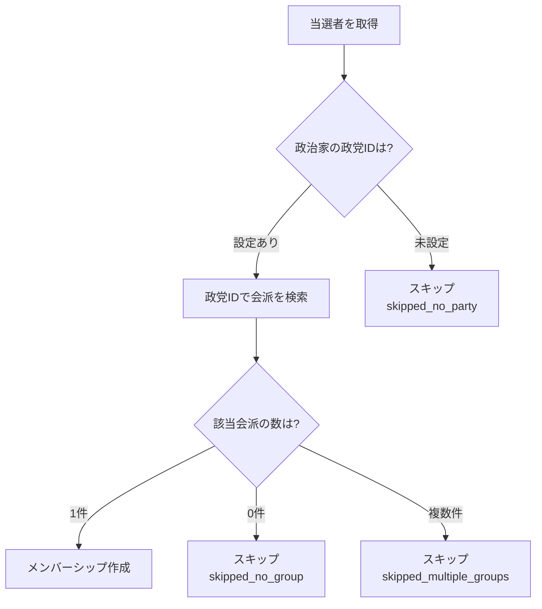

# 会派メンバーシップ（ParliamentaryGroupMembership）

会派（ParliamentaryGroup）と政治家（Politician）を接続するリレーションテーブルです。政治家がどの会派にいつからいつまで所属していたかを記録します。

## ER図



## データ構造

| フィールド | 必須 | 説明 |
|------------|------|------|
| politician_id | はい | 政治家ID |
| parliamentary_group_id | はい | 会派ID |
| start_date | はい | 所属開始日 |
| end_date | いいえ | 所属終了日（継続中はNULL） |
| role | いいえ | 役職（幹事長、団長など） |
| is_manually_verified | はい | 手動検証済みフラグ |

### 主要メソッド

| メソッド | 説明 |
|----------|------|
| `is_active(as_of_date)` | 指定日時点で有効かチェック |
| `can_be_updated_by_ai()` | AI更新可否（手動検証済みはFalse） |

## 会派自動紐付け機能

選挙結果メンバーをもとに、当選者を会派に自動紐付けします。

### 実行方法

??? example "コマンド例と引数"

    ```bash
    # 単回実行（特定の選挙回次）
    docker compose -f docker/docker-compose.yml exec sagebase \
        uv run python scripts/link_parliamentary_groups.py --election 50

    # 一括実行（全選挙）
    docker compose -f docker/docker-compose.yml exec sagebase \
        uv run python scripts/link_parliamentary_groups_bulk.py

    # 院を指定して一括実行
    docker compose -f docker/docker-compose.yml exec sagebase \
        uv run python scripts/link_parliamentary_groups_bulk.py --chamber 衆議院

    # 特定回次を指定して一括実行
    docker compose -f docker/docker-compose.yml exec sagebase \
        uv run python scripts/link_parliamentary_groups_bulk.py --term 45 46 47

    # ドライラン
    docker compose -f docker/docker-compose.yml exec sagebase \
        uv run python scripts/link_parliamentary_groups_bulk.py --dry-run
    ```

    | 引数 | 説明 | デフォルト |
    |------|------|-----------|
    | `--chamber` | 対象院（all/衆議院/参議院） | all |
    | `--term` | 対象回次（複数指定可） | 全回次 |
    | `--dry-run` | DB書き込みなし | - |
    | `--skip-seed` | SEED生成をスキップ | - |

### 紐付けロジック



??? info "出力結果"

    | 項目 | 説明 |
    |------|------|
    | total_elected | 当選者総数 |
    | linked_count | 新規紐付け数 |
    | already_existed_count | 既存重複数 |
    | skipped_no_party | 政党未設定スキップ数 |
    | skipped_no_group | 会派なしスキップ数 |
    | skipped_multiple_groups | 複数会派スキップ数 |

## SEED生成

データベースの会派メンバーシップをSEEDファイルとして出力できます。出力先: `database/seed_parliamentary_group_memberships_generated.sql`

??? example "SEED生成の詳細"

    ```bash
    # 一括実行＋SEED生成
    docker compose -f docker/docker-compose.yml exec sagebase \
        uv run python scripts/link_parliamentary_groups_bulk.py --skip-seed false
    ```

    生成されるSQL形式:

    ```sql
    -- 第45回 (2009-08-30)
    INSERT INTO parliamentary_group_memberships (politician_id, parliamentary_group_id, start_date, end_date, role)
    SELECT (SELECT id FROM politicians WHERE name = '山田 太郎'),
           (SELECT id FROM parliamentary_groups WHERE name = '自由民主党'
            AND governing_body_id = (SELECT id FROM governing_bodies WHERE name = '国会' AND type = '国')),
           '2009-08-30', NULL, NULL
    WHERE NOT EXISTS (SELECT 1 FROM parliamentary_group_memberships
                      WHERE politician_id = (SELECT id FROM politicians WHERE name = '山田 太郎')
                      AND parliamentary_group_id = (SELECT id FROM parliamentary_groups WHERE name = '自由民主党' ...)
                      AND start_date = '2009-08-30');
    ```

    `WHERE NOT EXISTS` を使用しているため、複数回実行しても重複レコードは作成されません。

## パイプライン品質検証

`verify_parliamentary_group_pipeline.py` で会派紐付けパイプラインの品質を検証できます。

??? example "コマンド例と検証基準"

    ```bash
    # ベースライン測定のみ
    docker compose -f docker/docker-compose.yml exec sagebase \
        uv run python scripts/verify_parliamentary_group_pipeline.py --mode baseline

    # 検証のみ（要: 保存済みベースライン）
    docker compose -f docker/docker-compose.yml exec sagebase \
        uv run python scripts/verify_parliamentary_group_pipeline.py --mode verify

    # 測定→実行→検証の一括実行
    docker compose -f docker/docker-compose.yml exec sagebase \
        uv run python scripts/verify_parliamentary_group_pipeline.py --mode full

    # 院を指定
    docker compose -f docker/docker-compose.yml exec sagebase \
        uv run python scripts/verify_parliamentary_group_pipeline.py --mode full --chamber 衆議院
    ```

    | 引数 | 説明 | デフォルト |
    |------|------|-----------|
    | `--mode` | baseline/verify/full | - |
    | `--chamber` | 衆議院/参議院/all | all |
    | `--dry-run` | DB書き込みなし（mode=fullのみ） | - |

    **成功基準:**

    | 基準 | 条件 |
    |------|------|
    | 衆議院カバー率 | 全選挙に少なくとも1件のメンバーシップが存在 |
    | 参議院カバー率 | 全選挙に少なくとも1件のメンバーシップが存在 |
    | スキップ率 | 政党未設定を除くスキップが10%以下 |

    出力ファイル:

    - `tmp/pipeline_baseline.json` — ベースライン計測値
    - `tmp/pipeline_verification_results.json` — 詳細検証結果
