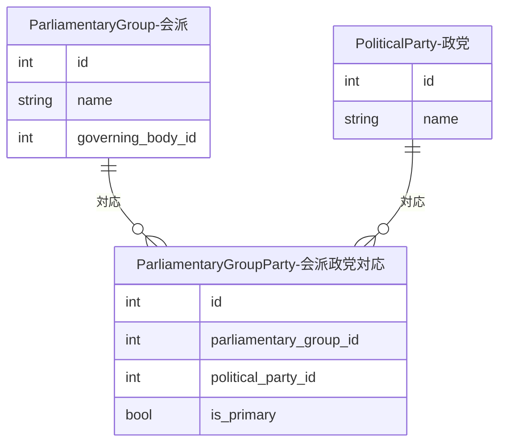

# 会派-政党対応（ParliamentaryGroupParty）

会派（ParliamentaryGroup）と政党（PoliticalParty）の多対多の対応関係を管理する中間テーブルです。

日本の国会では、複数の政党が合同で会派を組むケースがあるため（例: 「自由民主党・無所属の会」）、この中間テーブルで関係を管理します。

## ER図



## データ構造

| フィールド | 説明 |
|------------|------|
| `parliamentary_group_id` | 会派ID |
| `political_party_id` | 政党ID |
| `is_primary` | この政党が会派の主要政党かどうか |

SEEDファイル: `database/seed_parliamentary_group_parties_generated.sql`

## 会派-政党マッピング調査

`investigate_kaiha_mapping.py` で、SmartNews SMRIデータから会派名を抽出し、政党との対応関係を調査できます。

??? example "コマンド例と出力ファイル"

    ```bash
    docker compose -f docker/docker-compose.yml exec sagebase \
        uv run python scripts/investigate_kaiha_mapping.py
    ```

    | ファイル | 内容 |
    |---------|------|
    | `tmp/kaiha_shuugiin_by_session.csv` | 衆議院の会派名一覧（会期別） |
    | `tmp/kaiha_sangiin_current.csv` | 参議院の現在の会派名一覧 |
    | `tmp/kaiha_mapping_proposal.json` | マッピング提案（信頼度付き） |
    | `tmp/kaiha_unmapped_groups.csv` | 未マッピングの会派一覧 |

    **マッピングの信頼度:**

    | 信頼度 | 意味 |
    |--------|------|
    | `existing` | 既存の対応関係あり |
    | `high` | 名前から高確度でマッチ |
    | `medium` | 部分一致 |
    | `unmapped` | 対応する政党が不明 |
