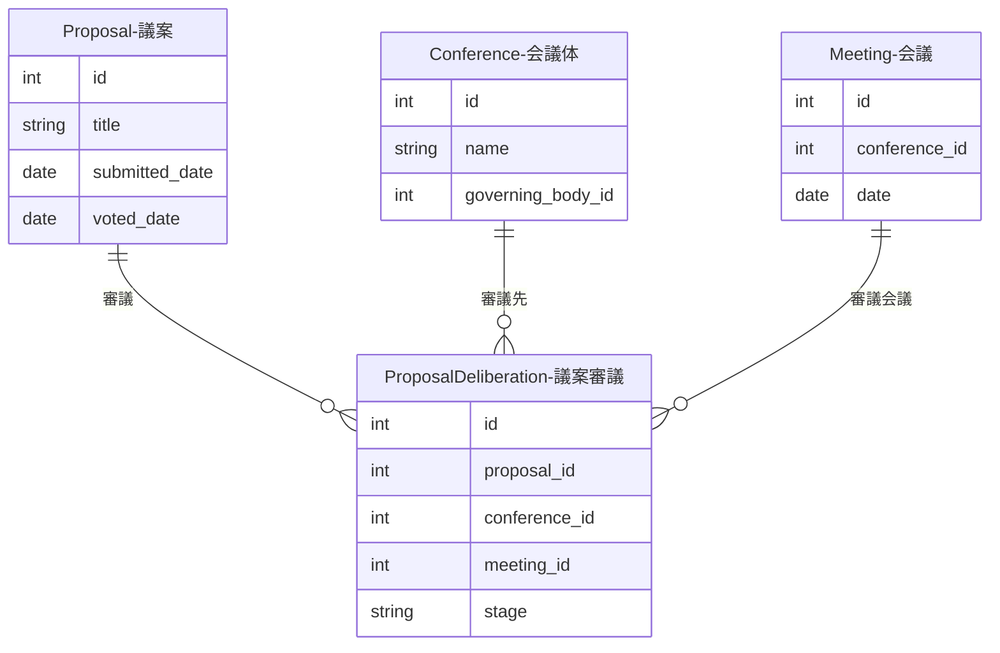

# 議案審議紐付け（ProposalDeliberation）

議案（Proposal）と会議体（Conference）・会議（Meeting）を接続するリレーションテーブルです。1つの議案が複数の会議で審議されるケースに対応します。

## ER図

## データ構造

| フィールド | 必須 | 説明 |
|------------|------|------|
| proposal_id | はい | 議案ID |
| conference_id | はい | 会議体ID |
| meeting_id | いいえ | 会議ID |
| stage | いいえ | 審議段階（付託、採決など） |

## 投票日の特定順序

個人投票を展開する際、投票日は以下の優先順位で特定されます：

1. `proposal_deliberations` → `meeting.date`（会議日付）
2. `proposal.meeting_id` → `meeting.date`
3. `proposal.voted_date`
