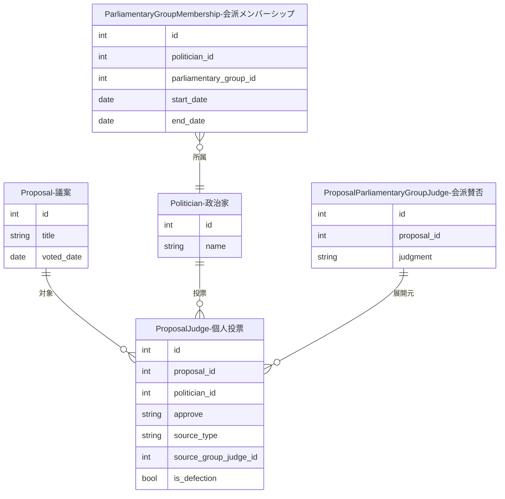

# 個人投票展開（ProposalJudge）

議案（Proposal）と政治家（Politician）を接続するリレーションテーブルです。議員個人の議案への賛否を記録します。会派賛否からの展開または記名投票で生成されます。

## ER図



## 会派賛否マッピング生成

Bronze層の `ExtractedProposalJudge`（抽出された会派賛否）を、Gold層の `ProposalParliamentaryGroupJudge`（正規化された会派賛否）に変換します。

??? example "コマンド例と処理フロー"

    ```bash
    # 標準実行
    docker compose -f docker/docker-compose.yml exec sagebase \
        uv run python scripts/match_proposal_group_judges.py

    # ドライラン
    docker compose -f docker/docker-compose.yml exec sagebase \
        uv run python scripts/match_proposal_group_judges.py --dry-run
    ```

    ```mermaid
    flowchart TD
        A[ExtractedProposalJudge<br/>抽出された会派名] --> B[会派名マッチング]
        B --> C{マッチ成功?}
        C -->|Yes| D[ProposalParliamentaryGroupJudge<br/>正規化された会派賛否]
        C -->|No| E[エラーレポート出力]
    ```

## データ構造

| フィールド | 説明 |
|------------|------|
| proposal_id | 議案ID |
| politician_id | 政治家ID |
| approve | 賛否（賛成/反対/棄権/欠席） |
| source_type | 生成元（GROUP_EXPANSION/ROLL_CALL） |
| source_group_judge_id | 展開元の会派賛否ID |
| is_defection | 造反フラグ |

### 生成元種別（source_type）

| 値 | 説明 |
|----|------|
| GROUP_EXPANSION | 会派賛否から展開された投票 |
| ROLL_CALL | 記名投票から直接入力された投票 |

## 個人投票展開UI

Streamlit管理画面の「議案管理」ページ → 「個人投票展開」タブで操作できます。

### 展開フロー


### 展開ロジック

```
会派の賛否 × 投票日時点での所属議員 = 個人の賛否
```

投票日時点での会派所属を確認し、その時点で会派に所属していた議員に対して個人投票レコードを作成します。

### 展開時の投票日特定

投票日は以下の優先順位で特定されます：

1. `proposal_deliberations` → `meeting.date`
2. `proposal.meeting_id` → `meeting.date`
3. `proposal.voted_date`

## 記名投票上書きUI

「記名投票上書き」タブで、実際の記名投票結果で個人投票データを上書きできます。

??? note "CSVフォーマットと造反検出"

    **CSVフォーマット:**

    ```csv
    政治家ID,賛否
    501,賛成
    502,反対
    503,棄権
    ```

    **造反検出:**

    上書き処理時に、会派賛否と個人投票の不一致（造反）を自動検出します。

    | 項目 | 説明 |
    |------|------|
    | politician_name | 政治家名 |
    | individual_vote | 個人投票 |
    | group_judgment | 会派方針 |
    | parliamentary_group_name | 所属会派名 |
