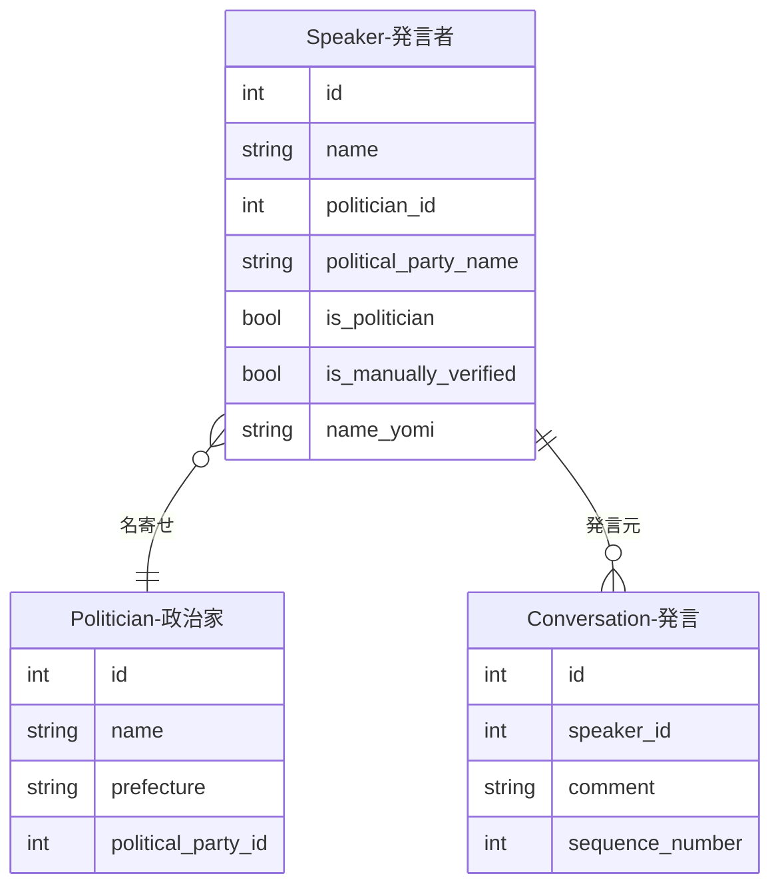
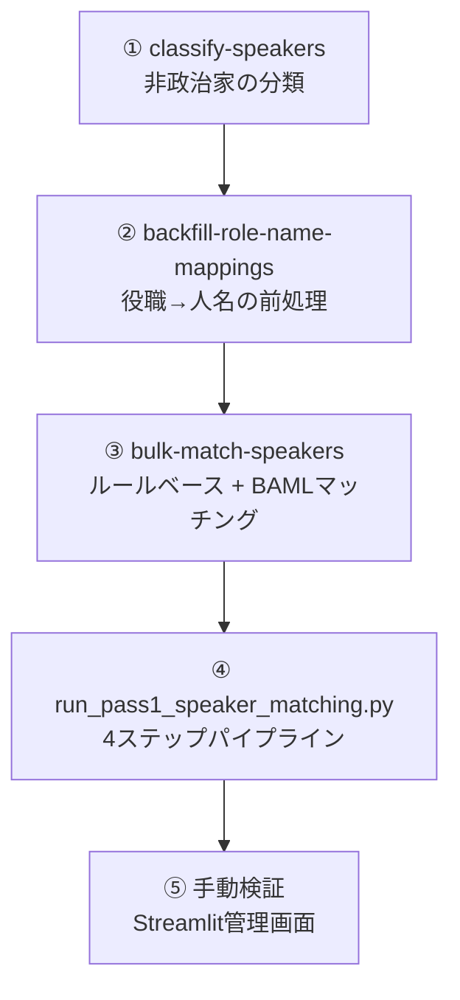

# 発言者-政治家紐付け（Speaker → Politician）

発言者（Speaker）と政治家（Politician）の名寄せを行うマッチングパイプラインです。SpeakerテーブルのFK（`politician_id`）を設定することで紐付けを実現します。

## ER図



## マッチングパイプライン全体フロー



## ① Speaker分類（classify-speakers）

全Speakerの `is_politician` フラグを設定し、非政治家（参考人・証人・政府委員等）を除外します。

??? example "コマンド例と分類カテゴリ"

    ```bash
    docker compose -f docker/docker-compose.yml exec sagebase \
        sagebase classify-speakers
    ```

    以下の名前パターンに一致するSpeakerは `is_politician = false` に設定されます：

    | カテゴリ | 例 |
    |---------|-----|
    | 議会運営の役職（特定不能） | 委員長、副委員長、議長、副議長、仮議長 |
    | 事務局職員 | 事務局長、事務局次長、書記、速記者 |
    | 参考人・証人 | 参考人、証人、公述人 |
    | 政府出席者（非議員） | 説明員、政府委員、政府参考人 |
    | その他 | 幹事、会議録情報 |

## ② 役職→人名マッピングの前処理（backfill-role-name-mappings）

議事録中で役職名のみで呼ばれるSpeaker（例: 「議長」「委員長」）を実際の人名に解決するための前処理です。

??? example "コマンド例と引数"

    ```bash
    # 全議事録を処理
    docker compose -f docker/docker-compose.yml exec sagebase \
        sagebase backfill-role-name-mappings

    # 特定の会議のみ
    docker compose -f docker/docker-compose.yml exec sagebase \
        sagebase backfill-role-name-mappings --meeting-id 12345

    # 既存マッピングを上書き
    docker compose -f docker/docker-compose.yml exec sagebase \
        sagebase backfill-role-name-mappings --force-reprocess
    ```

    | 引数 | 説明 | デフォルト |
    |------|------|-----------|
    | `--meeting-id` | 特定の会議のみ処理 | 全会議 |
    | `--force-reprocess` | 既存マッピングを上書き | false |
    | `--limit` | 処理する議事録の最大数 | 制限なし |
    | `--skip-existing` / `--no-skip-existing` | 既存マッピングをスキップ | スキップする |

処理内容:

1. 対象議事録のGCSテキストを取得
2. 出席者セクションの境界を検出
3. 役職→人名のマッピングを抽出
4. Minutesレコードの `role_name_mappings` フィールドに保存

## ③ バルクSpeakerマッチング（bulk-match-speakers）

期間・院を指定して、対象会議のSpeakerを一括マッチングします。

??? example "コマンド例と引数"

    ```bash
    # 衆議院の特定期間をマッチング
    docker compose -f docker/docker-compose.yml exec sagebase \
        sagebase kokkai bulk-match-speakers \
        --chamber 衆議院 \
        --date-from 2020-01-01 \
        --date-to 2024-12-31

    # 信頼度閾値を変更
    docker compose -f docker/docker-compose.yml exec sagebase \
        sagebase kokkai bulk-match-speakers \
        --chamber 参議院 \
        --date-from 2020-01-01 \
        --date-to 2024-12-31 \
        --confidence-threshold 0.7

    # ドライラン
    docker compose -f docker/docker-compose.yml exec sagebase \
        sagebase kokkai bulk-match-speakers \
        --chamber 衆議院 \
        --date-from 2020-01-01 \
        --date-to 2024-12-31 \
        --dry-run
    ```

    | 引数 | 必須 | 説明 | デフォルト |
    |------|------|------|-----------|
    | `--chamber` | はい | 院名（衆議院/参議院） | - |
    | `--date-from` | はい | 開始日（YYYY-MM-DD） | - |
    | `--date-to` | はい | 終了日（YYYY-MM-DD） | - |
    | `--confidence-threshold` | いいえ | マッチング信頼度閾値 | 0.8 |
    | `--dry-run` | いいえ | 対象会議一覧のみ表示 | - |

### マッチング戦略

マッチングは2段階で行われます：

1. **ルールベース（高速パス）**: 名前正規化→類似度計算。信頼度 ≥ 0.8 で即時マッチ
2. **BAMLフォールバック（LLM）**: ルールベースで確定できない場合、Gemini 2 Flashで候補を評価。旧字体の揺れ（斉藤 vs 齊藤）なども考慮

??? note "信頼度スコアリング"

    | 信頼度 | 条件 |
    |--------|------|
    | 0.9+ | 氏名完全一致 + 政党一致 |
    | 0.7-0.9 | 氏名一致、政党不明/部分一致 |
    | 0.5-0.7 | 名前のバリエーションだが政党一致 |
    | 0.5未満 | マッチなし |

## ④ 4ステップパイプライン（run_pass1_speaker_matching.py）

ベースライン測定→分類→マッチング→レポートの4ステップを一括実行します。

??? example "コマンド例とモード"

    ```bash
    # 全ステップ実行
    docker compose -f docker/docker-compose.yml exec sagebase \
        uv run python scripts/run_pass1_speaker_matching.py

    # 特定ステップのみ実行
    docker compose -f docker/docker-compose.yml exec sagebase \
        uv run python scripts/run_pass1_speaker_matching.py --mode baseline
    ```

    | モード | 内容 |
    |--------|------|
    | `full` | 4ステップすべて実行（デフォルト） |
    | `baseline` | ベースライン測定のみ |
    | `classify` | is_politician分類のみ |
    | `match` | ルールベースマッチングのみ（LLMなし） |
    | `report` | 結果レポートのみ |

    **4ステップの内容:**

    1. **Baseline測定**: total_speakers, linked_speakers, match_rate等を計測
    2. **Classification**: `classify-speakers` と同じis_politician分類を実行
    3. **Rule-based Matching**: LLMなしのルールベースマッチングを実行
    4. **Report**: Before/After比較、未マッチSpeaker上位20件、結果JSONを出力

    結果は `tmp/pass1_matching_result.json` に保存されます。

## ⑤ 手動検証

発言管理ページの「発言マッチング」タブから、LLMを使って発言者（Speaker）と政治家（Politician）の名寄せを実行できます。手動で「手動検証済み」としてマークすると、以降のAI抽出処理による上書きから保護されます。
