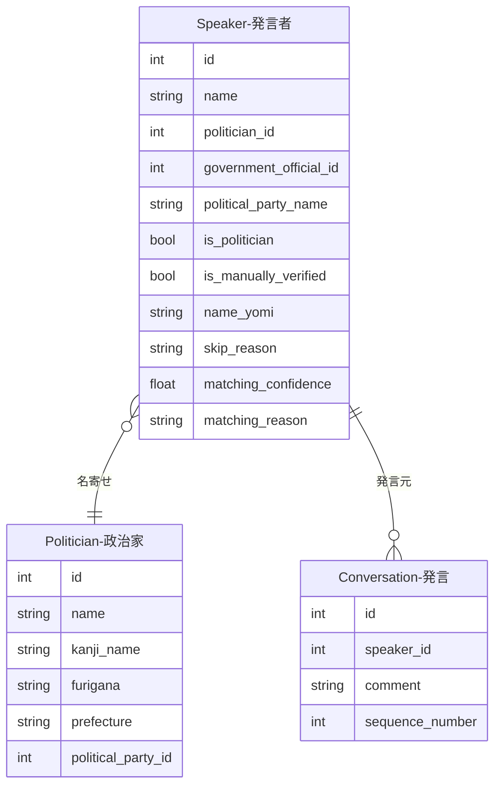
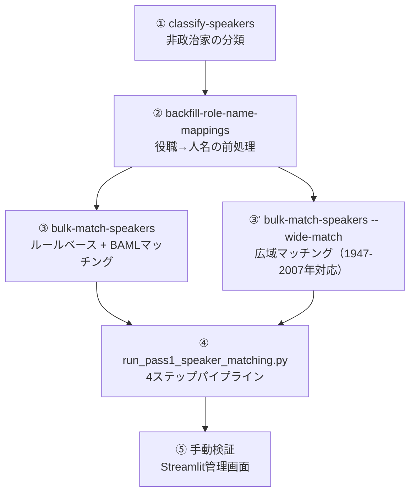
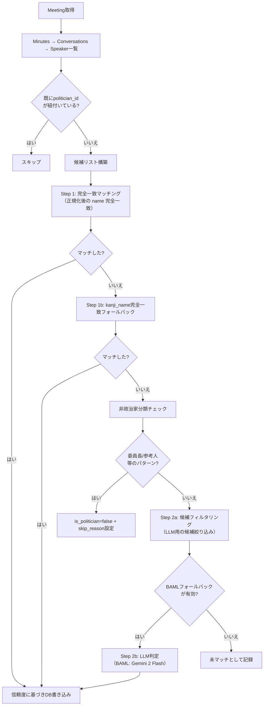

# 発言者-政治家紐付け（Speaker → Politician）

発言者（Speaker）と政治家（Politician）の名寄せを行うマッチングパイプラインです。SpeakerテーブルのFK（`politician_id`）を設定することで紐付けを実現します。

## ER図


```mermaid
erDiagram
    Speaker-発言者 }o--|| Politician-政治家 : "名寄せ"
    Speaker-発言者 ||--o{ Conversation-発言 : "発言元"

    Speaker-発言者 {
        int id
        string name
        int politician_id
        int government_official_id
        string political_party_name
        bool is_politician
        bool is_manually_verified
        string name_yomi
        string skip_reason
        float matching_confidence
        string matching_reason
    }

    Politician-政治家 {
        int id
        string name
        string kanji_name
        string furigana
        string prefecture
        int political_party_id
    }

    Conversation-発言 {
        int id
        int speaker_id
        string comment
        int sequence_number
    }
```

## マッチングパイプライン全体フロー


```mermaid
flowchart TD
    A[① classify-speakers<br/>非政治家の分類] --> B[② backfill-role-name-mappings<br/>役職→人名の前処理]
    B --> C[③ bulk-match-speakers<br/>ルールベース + BAMLマッチング]
    B --> C2[③' bulk-match-speakers --wide-match<br/>広域マッチング（1947-2007年対応）]
    C --> D[④ run_pass1_speaker_matching.py<br/>4ステップパイプライン]
    C2 --> D
    D --> E[⑤ 手動検証<br/>Streamlit管理画面]
```

## ① Speaker分類（classify-speakers）

全Speakerの `is_politician` フラグを設定し、非政治家（参考人・証人・政府委員等）を除外します。

??? example "コマンド例と分類カテゴリ"

    ```bash
    docker compose -f docker/docker-compose.yml exec sagebase \
        sagebase classify-speakers
    ```

    以下の名前パターンに一致するSpeakerは `is_politician = false` に設定されます。完全一致とプレフィックスマッチ（`政府参考人（山田太郎）` のような国会API形式）の両方に対応しています。

    | カテゴリ | 完全一致の例 | プレフィックスマッチの例 |
    |---------|------------|----------------------|
    | 議会運営の役職（特定不能） | 委員長、副委員長、議長、副議長、仮議長 | - |
    | 事務局職員 | 事務局長、事務局次長、書記、速記者、事務総長、法制局長、書記官長 | - |
    | 参考人・証人 | 参考人、証人、公述人 | `参考人（`、`証人（`、`公述人（` |
    | 政府出席者（非議員） | 説明員、政府委員、政府参考人 | `政府参考人（`、`政府委員（`、`説明員（` |
    | その他 | 幹事、会議録情報 | `事務局職員（`、`書記（` |

## ② 役職→人名マッピングの前処理（backfill-role-name-mappings）

議事録中で役職名のみで呼ばれるSpeaker（例: 「議長」「委員長」）を実際の人名に解決するための前処理です。

??? example "コマンド例と引数"

    ```bash
    # 全議事録を処理
    docker compose -f docker/docker-compose.yml exec sagebase \
        sagebase backfill-role-name-mappings

    # 特定の会議のみ
    docker compose -f docker/docker-compose.yml exec sagebase \
        sagebase backfill-role-name-mappings --meeting-id 12345

    # 既存マッピングを上書き
    docker compose -f docker/docker-compose.yml exec sagebase \
        sagebase backfill-role-name-mappings --force-reprocess
    ```

    | 引数 | 説明 | デフォルト |
    |------|------|-----------|
    | `--meeting-id` | 特定の会議のみ処理 | 全会議 |
    | `--force-reprocess` | 既存マッピングを上書き | false |
    | `--limit` | 処理する議事録の最大数 | 制限なし |
    | `--skip-existing` / `--no-skip-existing` | 既存マッピングをスキップ | スキップする |

処理内容:

1. 対象議事録のGCSテキストを取得
2. 出席者セクションの境界を検出
3. 役職→人名のマッピングを抽出
4. Minutesレコードの `role_name_mappings` フィールドに保存

## ③ バルクSpeakerマッチング（bulk-match-speakers）

期間・院を指定して、対象会議のSpeakerを一括マッチングします。通常モードと広域マッチングモードの2種類があります。

??? example "コマンド例と引数"

    ```bash
    # 衆議院の特定期間をマッチング（通常モード）
    docker compose -f docker/docker-compose.yml exec sagebase \
        sagebase kokkai bulk-match-speakers \
        --chamber 衆議院 \
        --date-from 2020-01-01 \
        --date-to 2024-12-31

    # 広域マッチングモード（ConferenceMemberデータがない1947-2007年向け）
    docker compose -f docker/docker-compose.yml exec sagebase \
        sagebase kokkai bulk-match-speakers \
        --chamber 衆議院 \
        --date-from 1947-01-01 \
        --date-to 2007-12-31 \
        --wide-match

    # BAMLフォールバック有効（完全一致しないケースにLLM判定を使用）
    docker compose -f docker/docker-compose.yml exec sagebase \
        sagebase kokkai bulk-match-speakers \
        --chamber 衆議院 \
        --date-from 2020-01-01 \
        --date-to 2024-12-31 \
        --enable-baml-fallback

    # ドライラン
    docker compose -f docker/docker-compose.yml exec sagebase \
        sagebase kokkai bulk-match-speakers \
        --chamber 衆議院 \
        --date-from 2020-01-01 \
        --date-to 2024-12-31 \
        --dry-run
    ```

    | 引数 | 必須 | 説明 | デフォルト |
    |------|------|------|-----------|
    | `--chamber` | はい | 院名（衆議院/参議院） | - |
    | `--date-from` | はい | 開始日（YYYY-MM-DD） | - |
    | `--date-to` | はい | 終了日（YYYY-MM-DD） | - |
    | `--confidence-threshold` | いいえ | マッチング信頼度閾値 | 0.8 |
    | `--wide-match` | いいえ | 広域マッチングモード（ElectionMemberベース） | 通常モード |
    | `--enable-baml-fallback` | いいえ | ルールベース未マッチ時にBAML（LLM）判定を有効化 | 無効 |
    | `--dry-run` | いいえ | 対象会議一覧のみ表示 | - |

### マッチングモード

| モード | 候補リスト構築方法 | 対象期間 |
|--------|------------------|---------|
| **通常モード**（デフォルト） | ConferenceMemberから取得 | ConferenceMemberデータがある期間 |
| **広域マッチング**（`--wide-match`） | ElectionMember（選挙当選者）から取得。候補なしの場合は全Politicianにフォールバック | 全期間（特に1947-2007年） |

広域マッチングでは、参議院の半数改選に対応するため直近2回の選挙当選者を合算して候補リストを構築します。

### マッチング戦略（3段階方式）

マッチングは **完全一致 → 候補フィルタ → LLM判定** の3段階で行われます。従来の中間ルール（ふりがな・漢字姓・姓のみマッチ）は廃止され、LLM判定に委譲されました。

広域マッチングは1会議ごとに以下のフローで処理されます:


```mermaid
flowchart TD
    A[Meeting取得] --> B[Minutes → Conversations → Speaker一覧]
    B --> C{既にpolitician_id<br/>が紐付いている?}
    C -->|はい| SKIP[スキップ]
    C -->|いいえ| D[候補リスト構築]
    D --> E["Step 1: 完全一致マッチング<br/>（正規化後の name 完全一致）"]
    E --> F{マッチした?}
    F -->|はい| G[信頼度に基づきDB書き込み]
    F -->|いいえ| H["Step 1b: kanji_name完全一致フォールバック"]
    H --> I{マッチした?}
    I -->|はい| G
    I -->|いいえ| J[非政治家分類チェック]
    J --> K{委員長/参考人<br/>等のパターン?}
    K -->|はい| L["is_politician=false + skip_reason設定"]
    K -->|いいえ| M["Step 2a: 候補フィルタリング<br/>（LLM用の候補絞り込み）"]
    M --> N{BAMLフォールバック<br/>が有効?}
    N -->|はい| O["Step 2b: LLM判定<br/>（BAML: Gemini 2 Flash）"]
    N -->|いいえ| P[未マッチとして記録]
    O --> G
```

**Step 1: 完全一致マッチング**

Speaker名を正規化（NFKC正規化、旧字体→新字体変換、スペース除去、敬称除去）した後、候補政治家の `name` および `kanji_name` と完全一致判定を行います。一致すれば `confidence=1.0, match_method=EXACT_NAME` で即確定します。

**Step 2a: 候補フィルタリング（`filter_candidates_for_llm`）**

完全一致しなかった場合、LLMに渡す前に候補を絞り込みます。以下の3基準のOR条件でフィルタリングします：

| 基準 | 内容 |
|------|------|
| 名前パート部分一致 | 候補名をスペース分割し、各パート（2文字以上）がSpeaker名に含まれるか |
| 漢字姓一致（双方向） | 候補側/Speaker側の漢字姓（2文字以上）が相手の名前に含まれるか |
| ふりがなプレフィックス一致 | 共通プレフィックス長3文字以上（姓部分の一致判定） |

**Step 2b: BAML LLM判定**

フィルタ済み候補をGemini 2 Flashに渡し、最終判定を行います。Speaker名の読み（`name_yomi`）もプロンプトに含め、ふりがな一致も考慮します。

### 名前正規化

ルールベースマッチングの前に、発言者名と候補政治家名の両方に正規化を適用します（`NameNormalizer`）:

1. **NFKC正規化**: 全角英数→半角、異体字統合
2. **旧字体→新字体変換**: 約120文字の変換テーブル（`齋→斎`、`澤→沢`、`櫻→桜`、`稻→稲`、`淺→浅` 等）
3. **スペース除去**: 全角・半角スペースを削除
4. **敬称除去**: 末尾の「君」「議員」「委員長」「副議長」等を除去

### ルールベースマッチ

正規化後の名前で**完全一致判定のみ**を行います。中間的なルール（姓のみ一致、ふりがな一致等）はLLM判定に委譲する設計です。

1. **`candidate.name` 完全一致**: 正規化後のSpeaker名とPolitician名を比較（confidence=1.0, method=`exact_name`）
2. **`candidate.kanji_name` 完全一致フォールバック**: name不一致時に、Politicianの `kanji_name`（旧字体・異体字の別名）と比較（confidence=1.0, method=`exact_kanji_name`）

??? note "`kanji_name` フォールバックについて"

    Politicianテーブルの `kanji_name` カラムには、Wikidata等から取得した漢字表記の別名が格納されています。国会会議録APIの発言者名は旧字体や異体字を含むことがあり、正規化だけでは吸収できない表記差を `kanji_name` でカバーします。

    例: Speaker名「齋藤隆夫」→ 正規化「斎藤隆夫」→ `candidate.name`「斎藤隆夫」と一致

### 信頼度に基づく処理

??? note "信頼度スコアリングと処理分岐"

    **通常モード（MatchMeetingSpeakersUseCase）:**

    | 信頼度 | 処理 |
    |--------|------|
    | 1.0 | 完全一致で自動マッチ |
    | >= 0.8（閾値） | BAML判定で自動マッチ |
    | < 0.8 | マッチなし |

    **広域マッチングモード（WideMatchSpeakersUseCase）:**

    | 信頼度 | 処理 |
    |--------|------|
    | >= 0.9 | 自動マッチ |
    | 0.8〜0.9 | 手動検証待ち |
    | < 0.8 | マッチなし |

    同姓候補が複数存在する場合は `skip_reason=HOMONYM` として記録しスキップします。

    現在のルールベースマッチでは完全一致（confidence=1.0）しか発生しないため、マッチしたものはすべて自動マッチになります。BAMLフォールバック有効時は中間的なconfidence値が返されることがあります。

## ④ 4ステップパイプライン（run_pass1_speaker_matching.py）

ベースライン測定→分類→マッチング→レポートの4ステップを一括実行します。

??? example "コマンド例とモード"

    ```bash
    # 全ステップ実行
    docker compose -f docker/docker-compose.yml exec sagebase \
        uv run python scripts/run_pass1_speaker_matching.py

    # 特定ステップのみ実行
    docker compose -f docker/docker-compose.yml exec sagebase \
        uv run python scripts/run_pass1_speaker_matching.py --mode baseline
    ```

    | モード | 内容 |
    |--------|------|
    | `full` | 4ステップすべて実行（デフォルト） |
    | `baseline` | ベースライン測定のみ |
    | `classify` | is_politician分類のみ |
    | `match` | ルールベースマッチングのみ（LLMなし） |
    | `report` | 結果レポートのみ |

    **4ステップの内容:**

    1. **Baseline測定**: total_speakers, linked_speakers, match_rate等を計測
    2. **Classification**: `classify-speakers` と同じis_politician分類を実行
    3. **Rule-based Matching**: LLMなしのルールベースマッチングを実行
    4. **Report**: Before/After比較、未マッチSpeaker上位20件、結果JSONを出力

    結果は `tmp/pass1_matching_result.json` に保存されます。

## ⑤ 手動検証

発言管理ページの「発言マッチング」タブから、LLMを使って発言者（Speaker）と政治家（Politician）の名寄せを実行できます。手動で「手動検証済み」としてマークすると、以降のAI抽出処理による上書きから保護されます。
