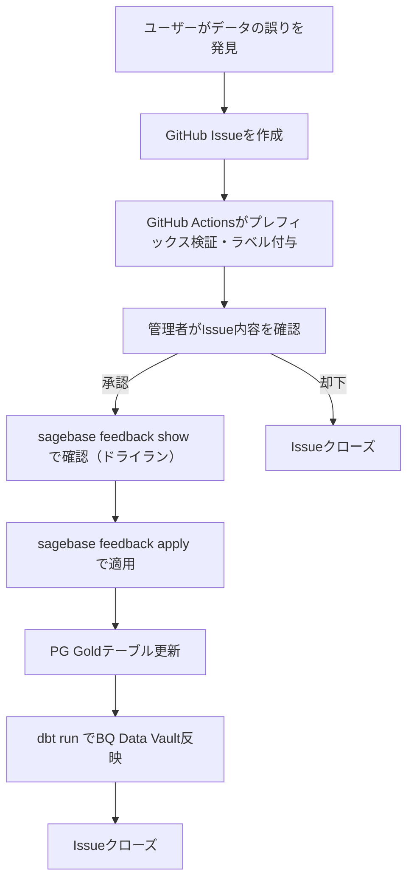

# データフィードバック運用フロー

sagebaseが提供するデータに誤りがあった場合、ユーザーからのフィードバックを受け付け、データを修正するフローです。

## フロー全体像



## 1. フィードバックの受付

### ユーザー向け入口

以下の場所からフィードバックを送信できます。

| 入口 | URL |
|------|-----|
| sage-base.com お問い合わせ | [sage-base.com/contact](https://sage-base.com/contact/) |
| GitHub Issue Form（直接） | [Issue作成](https://github.com/sage-base/sagebase/issues/new?template=feedback.yml) |
| BQ テーブル Description | 各テーブルのDescriptionにリンク記載 |

### Issue Formの入力項目

| 項目 | 必須 | 説明 |
|------|------|------|
| sagebase_id | はい | 対象レコードの一意ID（`プレフィックス_UUID`形式） |
| フィードバック種別 | はい | 属性の誤り / リレーションの誤り / データの誤り / データの欠落 |
| 現在の値 | いいえ | 現在表示されている誤った値 |
| 正しい値 | はい | 正しいと思われる値 |
| 情報ソー��・根拠URL | いいえ | 根拠となる情報源 |
| 自由記述 | いいえ | 補足情報 |

### 自動処理（GitHub Actions）

Issue作成時に以下が自動実行されます。

- **ラベル自動付与**: 種別に応じて `feedback:attribute` / `feedback:relation` / `feedback:data` / `feedback:missing` が付与される
- **プレフィックス検証**: sagebase_idのプレフィックスが無効な場合、警告コメントが投稿される

## 2. sagebase_id

全レコードに付与されたグローバル一意IDです。`プレフィックス_UUID` 形式で、プレフィックスからエンティティ種別を即座に判別できます。

### 主要なプレフィックス

| プレフィックス | エンティティ | テーブル |
|:---:|---|---|
| `pol` | 政治家 | politicians |
| `pty` | 政党 | political_parties |
| `elc` | 選挙 | elections |
| `gov` | 開催主体 | governing_bodies |
| `cnf` | 会議体 | conferences |
| `mtg` | 会議 | meetings |
| `mnt` | 議事録 | minutes |
| `cvs` | 発言 | conversations |
| `spk` | 発言者 | speakers |
| `prp` | 議案 | proposals |
| `pgr` | 議員団 | parliamentary_groups |
| `gof` | 政府関係者 | government_officials |

全23テーブルに対応しています。完全な一覧は `src/application/usecases/apply_feedback_usecase.py` の `PREFIX_TO_TABLE` を参照してください。

### 確認方法

- **BigQuery**: 各テーブルの `sagebase_id` カラム
- **sage-base.com**: 各データページ（将来対応予定）

## 3. フィードバックの確認（ドライラン）

管理者はCLIでIssue内容を確認できます。

```bash
docker compose -f docker/docker-compose.yml exec sagebase \
    uv run sagebase feedback show <issue_number>
```

出力例:

```
Issue: #42 [Feedback] 政治家名修正
状態: OPEN
ラベル: feedback, feedback:attribute
sagebase_id: pol_abc-def-123
対象テーブル: politicians
record_source: user_feedback:42

修正内容:
  name: 山田太郎
  prefecture: 東京都

修正理由: 公式サイトの情報と異なるため
```

## 4. フィードバックの適用

```bash
docker compose -f docker/docker-compose.yml exec sagebase \
    uv run sagebase feedback apply <issue_number>
```

実行すると確認プロンプトが表示され、承認後に以下が行われます。

- PG Goldテーブルの対象レコードが更新される
- `record_source` が `user_feedback:<issue_number>` に設定される
- `updated_at` が更新される

!!! warning "適用前の確認事項"
    - `feedback show` でドライランを必ず実施する
    - フィードバック内容が正しいか、根拠URLを確認する
    - 不明な点があればIssue上でフィードバック送信者に質問する

## 5. BQ Data Vault への反映

PG側の更新後、`dbt run` でBQ Data Vault Satelliteに自動反映されます。

```bash
cd dbt && dbt run
```

Data Vault Satellite の `record_source` カラムでデータの由来を判別できます。

| record_source | 由来 |
|---|---|
| `sagebase_source` | 通常のデータパイプライン |
| `user_feedback:<issue_number>` | ユーザーフィードバック |

## 6. Issue のクローズ

フィードバック適用・BQ反映後にIssueをクローズします。

```bash
gh issue close <issue_number> --comment "フィードバックを適用しました。ご報告ありがとうございました。"
```

## トラブルシューティング

### 不明なプレフィックス

```
エラー: 不明なsagebase_idプレフィックス: 'xxx'
```

sagebase_idが正しいか確認してください。プレフィックスはエンティティ種別を表します。

### 更新できないフィールド

```
エラー: テーブル 'politicians' では以下のフィールドは更新できません: id
```

`id`, `sagebase_id`, `created_at`, `updated_at` 等のシステムフィールドは更新対象外です。

### GitHub API レート制限

feedback CLIは GitHub REST API でIssue内容を取得します。認証なしの場合、レート制限（60回/時）があります。`GITHUB_TOKEN` 環境変数を設定すると5,000回/時に緩和されます。

```bash
export GITHUB_TOKEN=ghp_xxxxxxxxxxxx
```
