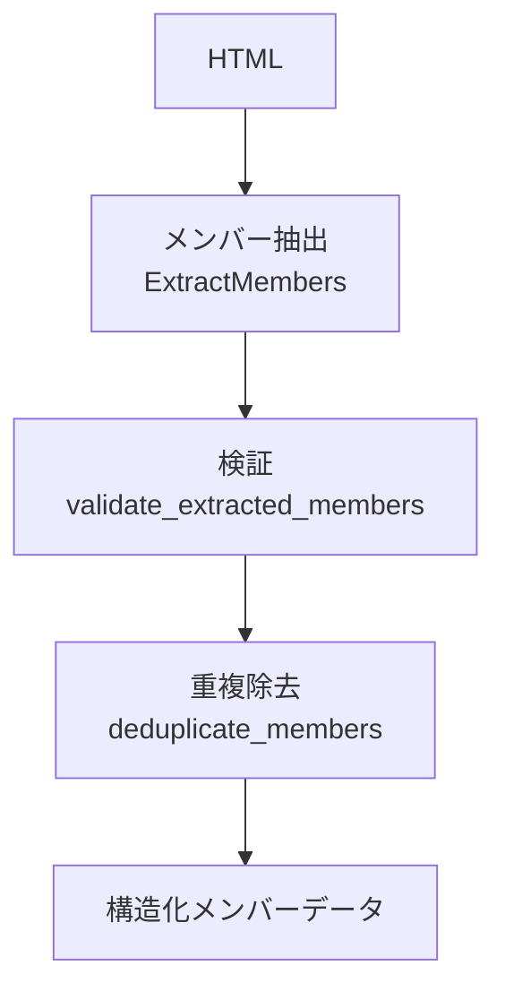

---
tags:
  - LLM処理
  - BAML
  - LangGraph
---

# 会議体メンバー抽出

会議体（議会・委員会など）のWebページのHTMLから、所属する議員のメンバー情報を抽出するLLM処理です。

## 概要

議会や委員会のWebサイトに掲載されたメンバー一覧ページから、議員名・役職・所属政党などの情報を構造化データとして抽出します。LangGraphエージェントによる3ステップの処理パイプラインで、抽出・検証・重複除去を行います。

## 処理フロー

## BAML関数

### ExtractMembers

| 項目 | 内容 |
|------|------|
| ファイル | `baml_src/member_extraction.baml` |
| モデル | Gemini 2.5 Flash |
| 入力 | HTML + 会議体名 |
| 出力 | `ExtractedMember[]` |

**入力パラメータ:**

| パラメータ | 型 | 説明 |
|-----------|-----|------|
| html | string | 会議体ページのHTML |
| conference_name | string | 対象の会議体名 |

**出力の型定義:**

| フィールド | 型 | 説明 |
|-----------|-----|------|
| name | string | 議員名（フルネーム） |
| role | string? | 役職（議長、副議長、委員長、委員など） |
| party_name | string? | 所属政党名 |
| additional_info | string? | その他の情報 |

## 処理の詳細

### 抽出ルール

- HTMLページに複数の委員会や議会の情報が含まれている場合、指定された会議体名に所属する議員のみを抽出
- 議員名は姓名を正確に抽出（敬称は除外）
- 役職がない場合は「委員」として設定
- 所属政党が明記されていない場合はnull

### 後処理（ルールベース）

LLM抽出後、以下のルールベース処理を順に適用します:

1. **検証**（`validate_extracted_members`）: 抽出されたメンバー情報の妥当性を検証
2. **重複除去**（`deduplicate_members`）: 同一人物の重複エントリを除去

## 実装ファイル

| ファイル | 役割 |
|--------|------|
| `baml_src/member_extraction.baml` | BAML関数定義 |
| `src/infrastructure/external/conference_member_extractor/baml_extractor.py` | BAML実装ラッパー |
| `src/infrastructure/external/langgraph_conference_member_extraction_agent.py` | LangGraphエージェント |
| `src/infrastructure/external/langgraph_tools/conference_member_extraction_tools.py` | ツール実装（3種） |
