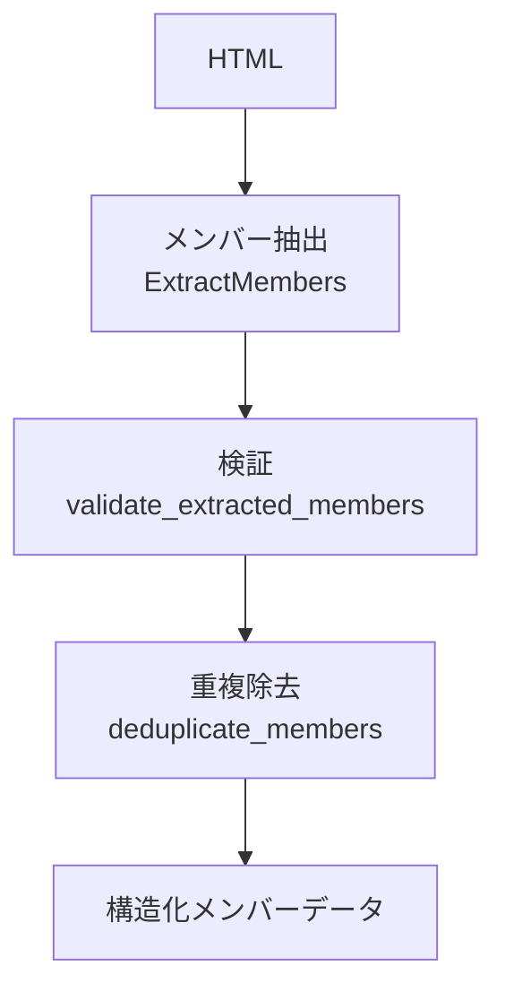
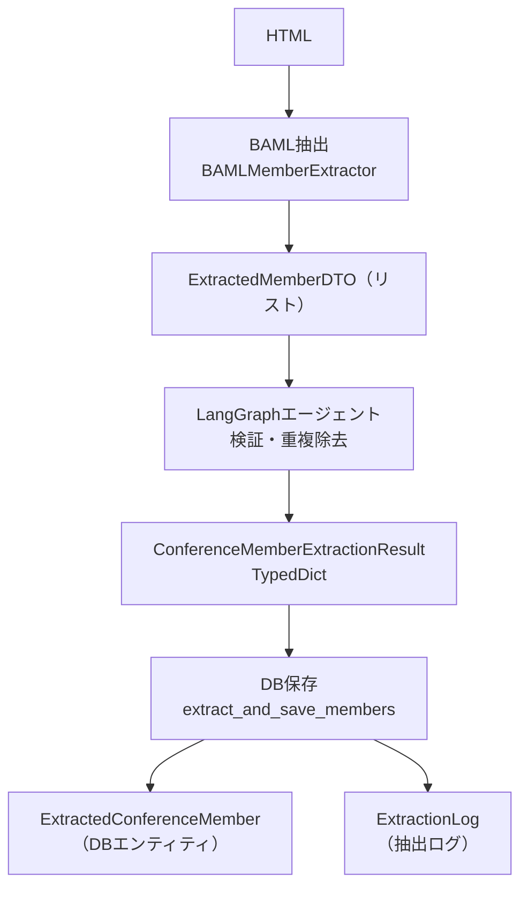
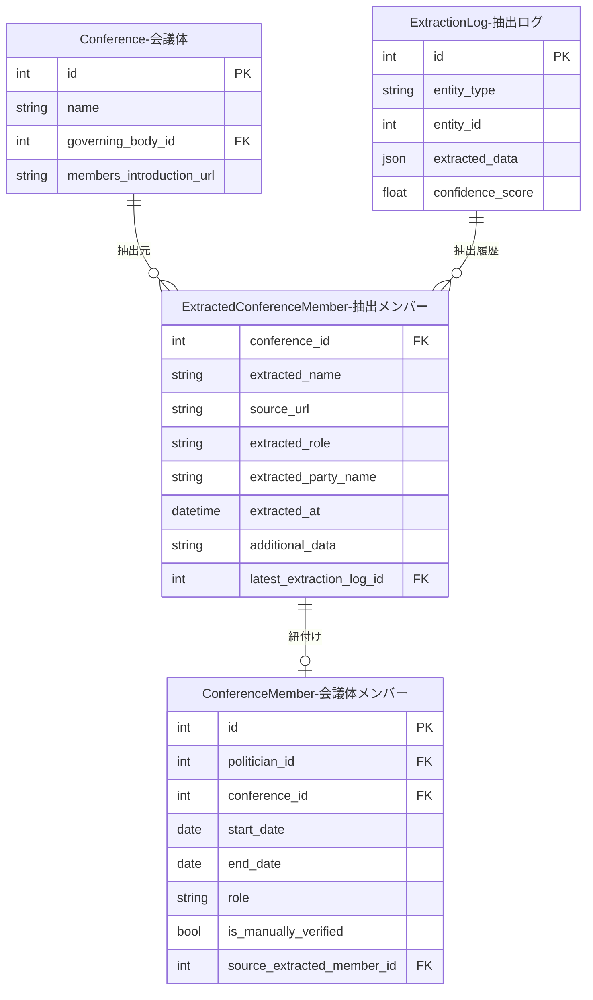

---
tags:
  - LLM処理
  - BAML
  - LangGraph
---

# 会議体メンバー抽出

会議体（議会・委員会など）のWebページのHTMLから、所属する議員のメンバー情報を抽出するLLM処理です。

## 概要

議会や委員会のWebサイトに掲載されたメンバー一覧ページから、議員名・役職・所属政党などの情報を構造化データとして抽出します。LangGraphエージェントによる3ステップの処理パイプラインで、抽出・検証・重複除去を行います。

## 処理フロー

## BAML関数

### ExtractMembers

| 項目 | 内容 |
|------|------|
| ファイル | `baml_src/member_extraction.baml` |
| モデル | Gemini 2.5 Flash |
| 入力 | HTML + 会議体名 |
| 出力 | `ExtractedMember[]` |

**入力パラメータ:**

| パラメータ | 型 | 説明 |
|-----------|-----|------|
| html | string | 会議体ページのHTML |
| conference_name | string | 対象の会議体名 |

**出力の型定義:**

| フィールド | 型 | 説明 |
|-----------|-----|------|
| name | string | 議員名（フルネーム） |
| role | string? | 役職（議長、副議長、委員長、委員など） |
| party_name | string? | 所属政党名 |
| additional_info | string? | その他の情報 |

## 処理フローと生成されるオブジェクト

会議体メンバー抽出は、LLM抽出 → 検証・重複除去 → DB保存の3段階で処理され、各段階で異なるオブジェクトが生成されます。

### 1. BAML抽出（LLM呼び出し）

`BAMLMemberExtractor.extract_members()` がHTMLを受け取り、BAML経由でLLMを呼び出し、以下のDTOのリストを返します。

**ExtractedMemberDTO**（`src/application/dtos/conference_member_extraction_dto.py`）:

| フィールド | 型 | 説明 |
|-----------|-----|------|
| name | str | 議員名 |
| role | str? | 役職（議長、副議長、委員長など） |
| party_name | str? | 所属政党名 |
| additional_info | str? | その他の情報 |

### 2. LangGraphエージェント（検証・重複除去）

`ConferenceMemberExtractionAgent.extract_members()` が3ステップ（抽出 → 検証 → 重複除去）を経て、以下を返します。

**ConferenceMemberExtractionResult**（TypedDict版、同ファイル）:

| フィールド | 型 | 説明 |
|-----------|-----|------|
| members | list[ExtractedMemberDTO] | 最終的なメンバーリスト |
| success | bool | 成功フラグ |
| validation_errors | list[str] | 検証エラー |
| error_message | str? | エラーメッセージ |

### 3. DB保存（最終成果物）

`ConferenceMemberExtractor.extract_and_save_members()` が各メンバーをドメインエンティティに変換してDBに保存します。

**ExtractedConferenceMember**（`src/domain/entities/extracted_conference_member.py`）:

| フィールド | 型 | 説明 |
|-----------|-----|------|
| conference_id | int | 会議体ID |
| extracted_name | str | 抽出された議員名 |
| source_url | str | 抽出元URL |
| extracted_role | str? | 役職 |
| extracted_party_name | str? | 所属政党名 |
| extracted_at | datetime | 抽出日時 |
| additional_data | str? | その他情報 |
| latest_extraction_log_id | int? | 抽出ログID |

最終的にDBに永続化されるのは `ExtractedConferenceMember` です。これはBronze Layer（抽出ログ層）のエンティティとして生データを保持します。政治家との紐付けはGold Layer（`ConferenceMember`）で管理されます。

さらに、抽出ログ（`ExtractionLog`）にもLLM抽出結果の履歴が記録されます。

### 関連エンティティとのリレーション

Bronze Layer（`ExtractedConferenceMember`）と Gold Layer（`ConferenceMember`）の責務分離により、抽出データと検証済みの所属データが明確に分かれています。`ConferenceMember.source_extracted_member_id` により、どの抽出メンバーから作成されたかのトレーサビリティが確保されています。

## 処理の詳細

### 抽出ルール

- HTMLページに複数の委員会や議会の情報が含まれている場合、指定された会議体名に所属する議員のみを抽出
- 議員名は姓名を正確に抽出（敬称は除外）
- 役職がない場合は「委員」として設定
- 所属政党が明記されていない場合はnull

### 後処理（ルールベース）

LLM抽出後、以下のルールベース処理を順に適用します:

1. **検証**（`validate_extracted_members`）: 抽出されたメンバー情報の妥当性を検証
2. **重複除去**（`deduplicate_members`）: 同一人物の重複エントリを除去

## 実装ファイル

| ファイル | 役割 |
|--------|------|
| `baml_src/member_extraction.baml` | BAML関数定義 |
| `src/infrastructure/external/conference_member_extractor/baml_extractor.py` | BAML実装ラッパー |
| `src/infrastructure/external/langgraph_conference_member_extraction_agent.py` | LangGraphエージェント |
| `src/infrastructure/external/langgraph_tools/conference_member_extraction_tools.py` | ツール実装（3種） |
