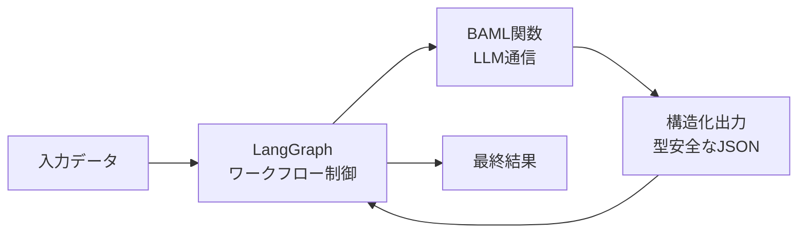

# LLM処理

このセクションでは、Sagebaseで使用しているLLM（大規模言語モデル）処理の全体像と、各処理の詳細を解説します。

## アーキテクチャ概要

SagebaseのLLM処理は、**2つのレイヤー**で構成されています。

| レイヤー | フレームワーク | 役割 |
|---------|-------------|------|
| **BAML（Boundary AI Markup Language）** | `baml_src/` + `baml_client/` | 構造化出力が必要なLLM呼び出し（メインの通信層） |
| **LangChain + LangGraph** | `src/services/`, `src/infrastructure/external/` | ワークフロー管理、エージェント処理 |

基本的な処理パターンは **LangGraph（ワークフロー制御）+ BAML（LLM通信）** の二層構造です。LangGraphがステートマシンとして処理の流れを管理し、各ステップでBAML関数を呼び出してLLMと通信します。

## 使用モデル

### メインモデル（BAML）

すべてのBAML関数は **Gemini 2.5 Flash**（`gemini-2.5-flash`）をメインモデルとして使用しています。

BAML設定ファイル（`baml_src/clients.baml`）で定義されているクライアント:

| クライアント名 | プロバイダ | モデル | 用途 |
|-------------|---------|------|------|
| Gemini2Flash | google-ai | `gemini-2.5-flash` | メインモデル（全BAML関数で使用） |
| CustomGPT5 | openai-responses | `gpt-5` | 予備 |
| CustomGPT5Mini | openai-responses | `gpt-5-mini` | 予備（ラウンドロビン用） |
| CustomOpus4 | anthropic | `claude-opus-4-1-20250805` | 予備 |
| CustomSonnet4 | anthropic | `claude-sonnet-4-20250514` | 予備 |
| CustomHaiku | anthropic | `claude-3-5-haiku-20241022` | 予備（ラウンドロビン用） |
| CustomFast | round-robin | GPT5Mini / Haiku の交互 | 高速処理用 |
| OpenaiFallback | fallback | GPT5Mini -> GPT5 | フォールバック用 |

### LangChain側のモデル

| 設定箇所 | デフォルトモデル |
|---------|--------------|
| `src/services/llm_service.py` | `gemini-2.5-flash` |
| `src/services/llm_factory.py` | `gemini-1.5-flash`（fast） / `gemini-2.0-flash-exp`（advanced） |
| `src/infrastructure/external/llm_service.py` | `gemini-2.0-flash` |
| `src/infrastructure/config/settings.py` | 環境変数 `LLM_MODEL`（デフォルト: `gemini-2.0-flash`） |

### APIキー

| プロバイダ | 環境変数 | 必須 |
|-----------|---------|------|
| Google AI | `GOOGLE_API_KEY` | 必須 |
| OpenAI | `OPENAI_API_KEY` | オプション |
| Anthropic | `ANTHROPIC_API_KEY` | オプション |
| LangChain | `LANGCHAIN_API_KEY` | オプション（トレーシング用） |

## プロンプト管理

プロンプトは2つの方式で管理されています。

### BAML プロンプト

各BAML関数内にプロンプトが直接記述されています。`#"..."#` 構文（raw string）でプロンプトを定義し、`{{ 変数名 }}` でテンプレート変数を埋め込みます。`{{ ctx.output_format }}` によりBAMLが自動的に出力フォーマット指示を追加します。

### YAML プロンプト（LangChain用）

`src/infrastructure/prompts/prompts.yaml` にLangChain用のプロンプトテンプレートを集約管理しています。`PromptLoader` クラス（`src/infrastructure/external/prompt_loader.py`）で読み込みます。

## LLM処理の一覧

| 処理 | 概要 | フレームワーク | 詳細 |
|------|------|-------------|------|
| [議事録分割処理](minutes-division.md) | 議事録テキストの境界検出・章分割・発言分割・発言者正規化 | BAML + LangGraph | 6つのBAML関数で構成される多段パイプライン |
| [会議体メンバー抽出](conference-member-extraction.md) | HTMLから会議体メンバー情報を抽出 | BAML + LangGraph | 抽出・検証・重複除去の3ステップ |
| [会派メンバー抽出](parliamentary-group-member-extraction.md) | HTMLから会派メンバー情報を抽出 | BAML + LangGraph | 抽出・検証・重複除去の3ステップ |
| [政治家マッチング](politician-matching.md) | 発言者名と政治家DBのマッチング | BAML + LangGraph（ReAct） | ルールベース + LLMのハイブリッド方式 |
| [役職名マッピング](role-name-mapping.md) | 議事録の出席者情報から役職-人名対応を抽出 | BAML | 出席者テキストの構造化 |
