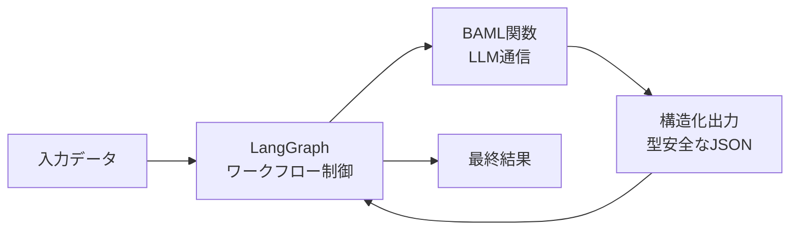
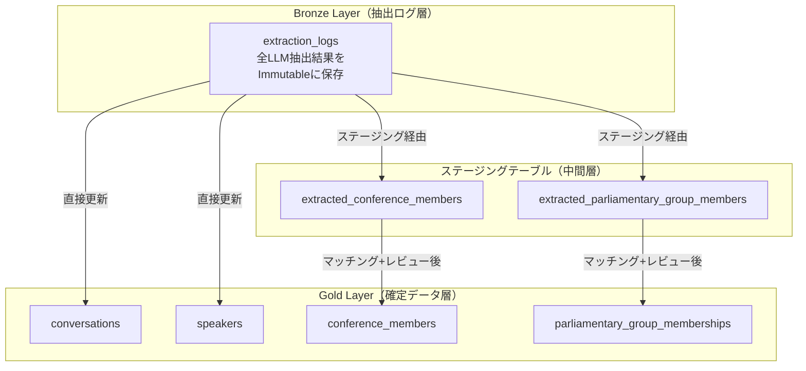

# LLM処理

このセクションでは、Sagebaseで使用しているLLM（大規模言語モデル）処理の全体像と、各処理の詳細を解説します。

## アーキテクチャ概要

SagebaseのLLM処理は、**2つのレイヤー**で構成されています。

| レイヤー | フレームワーク | 役割 |
|---------|-------------|------|
| **BAML（Boundary AI Markup Language）** | `baml_src/` + `baml_client/` | 構造化出力が必要なLLM呼び出し（メインの通信層） |
| **LangChain + LangGraph** | `src/services/`, `src/infrastructure/external/` | ワークフロー管理、エージェント処理 |

基本的な処理パターンは **LangGraph（ワークフロー制御）+ BAML（LLM通信）** の二層構造です。LangGraphがステートマシンとして処理の流れを管理し、各ステップでBAML関数を呼び出してLLMと通信します。



## 使用モデル

### メインモデル（BAML）

すべてのBAML関数は **Gemini 2.5 Flash**（`gemini-2.5-flash`）をメインモデルとして使用しています。

BAML設定ファイル（`baml_src/clients.baml`）で定義されているクライアント:

| クライアント名 | プロバイダ | モデル | 用途 |
|-------------|---------|------|------|
| Gemini2Flash | google-ai | `gemini-2.5-flash` | メインモデル（全BAML関数で使用） |
| CustomGPT5 | openai-responses | `gpt-5` | 予備 |
| CustomGPT5Mini | openai-responses | `gpt-5-mini` | 予備（ラウンドロビン用） |
| CustomOpus4 | anthropic | `claude-opus-4-1-20250805` | 予備 |
| CustomSonnet4 | anthropic | `claude-sonnet-4-20250514` | 予備 |
| CustomHaiku | anthropic | `claude-3-5-haiku-20241022` | 予備（ラウンドロビン用） |
| CustomFast | round-robin | GPT5Mini / Haiku の交互 | 高速処理用 |
| OpenaiFallback | fallback | GPT5Mini -> GPT5 | フォールバック用 |

### LangChain側のモデル

| 設定箇所 | デフォルトモデル |
|---------|--------------|
| `src/services/llm_service.py` | `gemini-2.5-flash` |
| `src/services/llm_factory.py` | `gemini-1.5-flash`（fast） / `gemini-2.0-flash-exp`（advanced） |
| `src/infrastructure/external/llm_service.py` | `gemini-2.0-flash` |
| `src/infrastructure/config/settings.py` | 環境変数 `LLM_MODEL`（デフォルト: `gemini-2.0-flash`） |

### APIキー

| プロバイダ | 環境変数 | 必須 |
|-----------|---------|------|
| Google AI | `GOOGLE_API_KEY` | 必須 |
| OpenAI | `OPENAI_API_KEY` | オプション |
| Anthropic | `ANTHROPIC_API_KEY` | オプション |
| LangChain | `LANGCHAIN_API_KEY` | オプション（トレーシング用） |

## プロンプト管理

プロンプトは2つの方式で管理されています。

### BAML プロンプト

各BAML関数内にプロンプトが直接記述されています。`#"..."#` 構文（raw string）でプロンプトを定義し、`{{ 変数名 }}` でテンプレート変数を埋め込みます。`{{ ctx.output_format }}` によりBAMLが自動的に出力フォーマット指示を追加します。

### YAML プロンプト（LangChain用）

`src/infrastructure/prompts/prompts.yaml` にLangChain用のプロンプトテンプレートを集約管理しています。`PromptLoader` クラス（`src/infrastructure/external/prompt_loader.py`）で読み込みます。

## データレイヤー設計（Bronze Layer / Gold Layer）

LLM抽出結果の永続化には、**Bronze Layer（抽出ログ層）** と **Gold Layer（確定データ層）** の2層アーキテクチャを採用しています。一部の処理ではステージングテーブル（中間層）を経由します。

### 設計の背景

この設計は [ADR-0005](https://github.com/sage-base/sagebase/blob/main/docs/ADR/0005-extraction-layer-gold-layer-separation.md) で意思決定が記録されています。従来の上書き型では以下の問題がありました:

- **人間の修正が消失する**: LLMの再実行で、レビュー済みデータが上書きされてしまう
- **抽出履歴が残らない**: 精度分析やデバッグに必要な履歴が失われる

これを解決するため、抽出結果をBronze Layerにイミュータブルに保存し、Gold Layer側では人間の修正を保護する仕組みを導入しています。

### 全体構成



### Bronze Layer（抽出ログ層）

`extraction_logs` テーブル1つで、全エンティティタイプのLLM抽出結果を管理します。

| 特徴 | 説明 |
|------|------|
| 追記専用（Immutable） | 作成後は更新・削除されない |
| 全結果保存 | 成功・失敗問わず全てのLLM抽出結果を記録 |
| メタデータ付与 | パイプラインバージョン、LLMモデル名、トークン数、処理時間 |

`entity_type` ENUMで対象を識別します:

| entity_type | 対象 |
|------------|------|
| `statement` | 発言 |
| `politician` | 政治家 |
| `speaker` | 話者 |
| `conference_member` | 会議体メンバー |
| `parliamentary_group_member` | 議員団メンバー |

**活用用途:**

- パイプラインバージョン別の精度比較
- 時系列での精度推移分析
- 新しいLLMパイプラインのA/Bテスト
- デバッグ・監査・トレーサビリティ

### ステージングテーブル（中間層）

会議体メンバー・議員団メンバーなど、マッチングと人間のレビューが必要な処理では、ステージングテーブルを中間層として使用します。

| テーブル | 用途 |
|--------|------|
| `extracted_conference_members` | 会議体メンバーの中間データ |
| `extracted_parliamentary_group_members` | 議員団メンバーの中間データ |

ステージングテーブルでは `matching_status` でマッチング状態を管理します:

| ステータス | 条件 | 意味 |
|-----------|------|------|
| `pending` | 初期状態 | マッチング未実施 |
| `matched` | 信頼度 >= 0.7 | マッチング成功 |
| `needs_review` | 0.5 <= 信頼度 < 0.7 | 人間のレビューが必要 |
| `no_match` | 信頼度 < 0.5 | マッチなし |

### Gold Layer（確定データ層）

アプリケーションが参照する最終的な正解データです。

| テーブル | 内容 |
|--------|------|
| `conversations` | 議事録の発言 |
| `speakers` | 議事録の話者 |
| `conference_members` | 政治家の会議体所属（旧テーブル名: `politician_affiliations`） |
| `parliamentary_group_memberships` | 議員団メンバーシップ |

### 手動検証による保護（VerifiableEntity）

全Goldエンティティおよびステージングエンティティは `VerifiableEntity` プロトコルを実装し、人間の修正をAI再抽出から保護します。

| フィールド | 説明 |
|-----------|------|
| `is_manually_verified` | 人間が検証済みかどうか |
| `latest_extraction_log_id` | 最新の抽出ログ（Bronze Layer）への参照 |

`is_manually_verified = true` のエンティティは、AI再抽出で上書きされません。更新処理は `UpdateEntityFromExtractionUseCase` 基底クラスで統一的に実装されています。

### データフローのパターン

**パターン1: 直接更新（発言・話者）**

```
LLM抽出 → ExtractionLog保存（Bronze） → Gold Entity更新（is_manually_verified=falseの場合のみ）
```

**パターン2: ステージング経由（会議体メンバー・議員団メンバー）**

```
LLM抽出 → ExtractionLog保存（Bronze）
        → ステージングテーブル保存（pending）
        → マッチング処理（matched/needs_review/no_match）
        → 人間のレビュー（Streamlit UI）
        → Gold Layer作成（matchedのレコードのみ）
```

## LLM処理の一覧

| 処理 | 概要 | フレームワーク | 詳細 |
|------|------|-------------|------|
| [議事録分割処理](minutes-division.md) | 議事録テキストの境界検出・章分割・発言分割・発言者正規化 | BAML + LangGraph | 6つのBAML関数で構成される多段パイプライン |
| [会議体メンバー抽出](conference-member-extraction.md) | HTMLから会議体メンバー情報を抽出 | BAML + LangGraph | 抽出・検証・重複除去の3ステップ |
| [会派メンバー抽出](parliamentary-group-member-extraction.md) | HTMLから会派メンバー情報を抽出 | BAML + LangGraph | 抽出・検証・重複除去の3ステップ |
| [政治家マッチング](politician-matching.md) | 発言者名と政治家DBのマッチング | BAML + LangGraph（ReAct） | ルールベース + LLMのハイブリッド方式 |
| [役職名マッピング](role-name-mapping.md) | 議事録の出席者情報から役職-人名対応を抽出 | BAML | 出席者テキストの構造化 |
