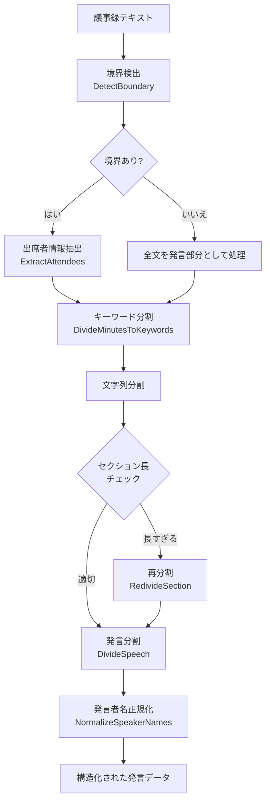
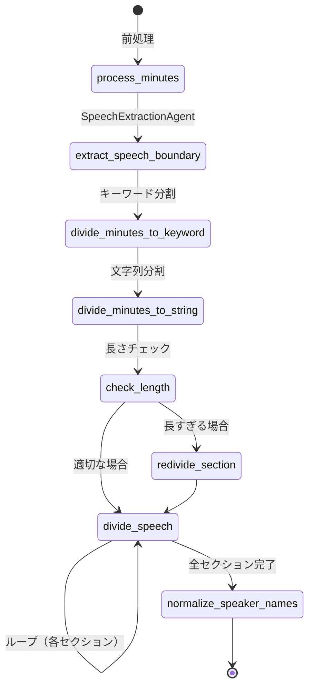

---
tags:
  - LLM処理
  - BAML
  - LangGraph
---

# 議事録分割処理

議事録（Minutes）テキストを解析し、出席者情報の抽出・発言の分割・発言者名の正規化を行う多段パイプラインです。

Sagebase内で最も複雑なLLM処理であり、6つのBAML関数とLangGraphステートマシンで構成されています。

## 処理フロー

## BAML関数一覧

### 1. DetectBoundary - 境界検出

議事録テキストから、出席者情報と発言部分の境界を検出します。

| 項目 | 内容 |
|------|------|
| ファイル | `baml_src/minutes_divider.baml` |
| モデル | Gemini 2.5 Flash |
| 入力 | 議事録テキスト全文 |
| 出力 | `MinutesBoundary` |

**出力の型定義:**

| フィールド | 型 | 説明 |
|-----------|-----|------|
| boundary_found | bool | 境界が見つかったか |
| boundary_text | string? | 境界前後のテキスト（`｜境界｜`でマーク） |
| boundary_type | string | 境界の種類: `separator_line`, `speech_start`, `time_marker`, `none` |
| confidence | float | 信頼度（0.0-1.0） |
| reason | string | 判定理由 |

**処理の詳細:**

- 出席者リストや役員名簿と、実際の発言内容の境界を検出
- 境界の種類として、区切り線（`---`、`===`など）、発言開始パターン（`○`、`◆`など）、時刻表記を識別
- 境界前後20文字を`｜境界｜`でマークして返却

### 2. ExtractAttendees - 出席者情報抽出

出席者テキストから、役職と人名のマッピングを抽出します。

| 項目 | 内容 |
|------|------|
| ファイル | `baml_src/minutes_divider.baml` |
| モデル | Gemini 2.5 Flash |
| 入力 | 出席者テキスト（境界検出で分離された前半部分） |
| 出力 | `AttendeesMapping` |

**出力の型定義:**

| フィールド | 型 | 説明 |
|-----------|-----|------|
| attendees_mapping | map\<string, string?\>? | 役職から人名へのマッピング |
| regular_attendees | string[] | 出席者の人名リスト |
| confidence | float | 抽出の信頼度（0.0-1.0） |

**処理の詳細:**

- 役職と人名の対応関係を抽出（例: `"議長" -> "山田太郎"`）
- 敬称（議員、氏、さん、様、先生など）を除外
- 抽出した出席者マッピングは、後続の発言者名正規化処理で参照される

### 3. DivideMinutesToKeywords - キーワード分割

議事録を意味のあるセクション（章）に分割し、各セクションの先頭キーワードを抽出します。

| 項目 | 内容 |
|------|------|
| ファイル | `baml_src/minutes_divider.baml` |
| モデル | Gemini 2.5 Flash |
| 入力 | 議事録テキスト（発言部分） |
| 出力 | `SectionInfo[]` |

**出力の型定義:**

| フィールド | 型 | 説明 |
|-----------|-----|------|
| chapter_number | int | 章番号（1から連番） |
| keyword | string | セクション先頭30文字のキーワード |

**処理の詳細:**

- 発言者の変更や議題の変更を境界としてセクションを分割
- 視覚的な区切り線（波線、ダッシュ、罫線など）はセクション境界として扱わない
- 目安として5〜30セクションに分割
- キーワードは元テキストから正確に30文字を抽出（改変なし）

### 4. RedivideSection - セクション再分割

長すぎるセクションを指定した数に再分割します。

| 項目 | 内容 |
|------|------|
| ファイル | `baml_src/minutes_divider.baml` |
| モデル | Gemini 2.5 Flash |
| 入力 | セクションテキスト + 分割数 + 元インデックス |
| 出力 | `SectionInfo[]` |

**処理の詳細:**

- LangGraphのステートマシンで長さチェック後、閾値を超えたセクションに対して呼び出される
- 意味のある区切り（発言者変更、議題変更）で分割

### 5. DivideSpeech - 発言分割

各セクションテキストから、発言者と発言内容を抽出します。

| 項目 | 内容 |
|------|------|
| ファイル | `baml_src/minutes_divider.baml` |
| モデル | Gemini 2.5 Flash |
| 入力 | セクションテキスト |
| 出力 | `SpeakerAndSpeechContent[]` |

**出力の型定義:**

| フィールド | 型 | 説明 |
|-----------|-----|------|
| speaker | string | 発言者名 |
| speech_content | string | 発言内容 |
| chapter_number | int | 章番号 |
| sub_chapter_number | int | 節番号 |
| speech_order | int | 発言順 |

**処理の詳細:**

- 議事録の一般的なフォーマット（`○議長（名前）`、`◆議員（名前）`、`◎市長（名前）`など）を認識
- 発言者を特定できないテキスト、括弧で囲まれた文書要素（`（表）`、`（図）`など）はスキップ
- 議事進行の説明文やト書きも抽出対象外

### 6. NormalizeSpeakerNames - 発言者名正規化

発言者名を正規化し、人名のみを抽出します。

| 項目 | 内容 |
|------|------|
| ファイル | `baml_src/minutes_divider.baml` |
| モデル | Gemini 2.5 Flash |
| 入力 | 発言者名リスト + 役職-人名マッピング（ExtractAttendeesの結果） |
| 出力 | `NormalizedSpeaker[]` |

**出力の型定義:**

| フィールド | 型 | 説明 |
|-----------|-----|------|
| original_speaker | string | 元の発言者名 |
| normalized_name | string | 正規化された人名 |
| is_valid | bool | 有効な人名か |
| extraction_method | string | 抽出方法: `pattern`, `mapping`, `as_is`, `skipped` |

**正規化ルール（優先順）:**

1. **括弧内の人名抽出**（最優先）: `"市長（松井一郎）"` → `"松井一郎"`
2. **マッピング参照**: 役職名のみの場合、出席者マッピングから人名を取得
3. **スキップ**: 役職名のみでマッピングなし → `is_valid: false`
4. **そのまま使用**: 人名と判断できる場合はそのまま

## 実装ファイル

| ファイル | 役割 |
|--------|------|
| `baml_src/minutes_divider.baml` | BAML関数定義（6関数） |
| `src/infrastructure/external/minutes_divider/baml_minutes_divider.py` | BAML実装ラッパー |
| `src/minutes_divide_processor/minutes_process_agent.py` | LangGraphステートマシン |
| `src/infrastructure/external/minutes_processing_service.py` | サービスラッパー |

## LangGraphステートマシン

処理全体はLangGraphのステートマシンとして制御されます。

### 発言抽出エージェント（SpeechExtractionAgent）

境界検出処理は、ReActエージェントとして実装されたサブグラフで行われます。

| ツール名 | 処理内容 | LLM使用 |
|---------|---------|--------|
| `validate_boundary_candidate` | 境界候補の妥当性を検証（BAMLの`DetectBoundary`を内部呼び出し） | あり |
| `analyze_context` | 境界周辺のコンテキストをパターン分析 | なし（ルールベース） |
| `verify_boundary` | 最終的な境界検証を統合実行 | あり |

**関連ファイル:**

| ファイル | 役割 |
|--------|------|
| `src/infrastructure/external/langgraph_speech_extraction_agent.py` | ReActエージェント定義 |
| `src/infrastructure/external/langgraph_tools/speech_extraction_tools.py` | ツール3種の実装 |
