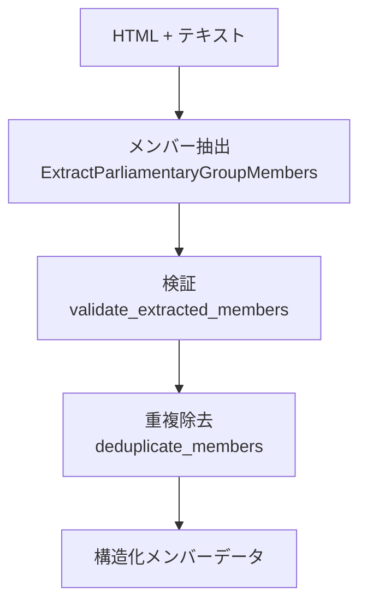

---
tags:
  - LLM処理
  - BAML
  - LangGraph
---

# 会派メンバー抽出

議員団（会派）のWebページのHTMLから、所属する議員のメンバー情報を抽出するLLM処理です。

## 概要

議員団（会派）のWebサイトに掲載されたメンバー一覧ページから、議員名・役職・所属政党・選挙区などの情報を構造化データとして抽出します。[会議体メンバー抽出](conference-member-extraction.md)と同様の3ステップ構造ですが、会派特有のフィールド（選挙区など）にも対応しています。

## 処理フロー

## BAML関数

### ExtractParliamentaryGroupMembers

| 項目 | 内容 |
|------|------|
| ファイル | `baml_src/parliamentary_group_member_extractor.baml` |
| モデル | Gemini 2.5 Flash |
| 入力 | HTML + テキストコンテンツ |
| 出力 | `ParliamentaryGroupMember[]` |

**入力パラメータ:**

| パラメータ | 型 | 説明 |
|-----------|-----|------|
| html | string | ページのHTML（構造の参考用） |
| text_content | string | ページのテキストコンテンツ |

**出力の型定義:**

| フィールド | 型 | 説明 |
|-----------|-----|------|
| name | string | 議員名（フルネーム） |
| role | string? | 役職（団長、幹事長、政調会長など） |
| party_name | string? | 所属政党名 |
| district | string? | 選挙区 |
| additional_info | string? | その他の情報 |

## 会議体メンバー抽出との違い

| 項目 | 会議体メンバー抽出 | 会派メンバー抽出 |
|------|-------------------|----------------|
| 対象 | 議会・委員会のメンバー | 議員団（会派）のメンバー |
| 入力 | HTML + 会議体名 | HTML + テキストコンテンツ |
| 選挙区 | なし | あり |
| 役職の例 | 議長、委員長、委員 | 団長、幹事長、政調会長 |

## 抽出ルール

- 役職者だけでなく、一般メンバーも含めて全員を抽出
- 名前の表記は元のページの表記を維持
- 敬称（議員、氏、さん、様、先生など）は除外
- 議員団名と政党名は区別（例:「○○会派」と「△△党」）

## 実装ファイル

| ファイル | 役割 |
|--------|------|
| `baml_src/parliamentary_group_member_extractor.baml` | BAML関数定義 |
| `src/infrastructure/external/langgraph_parliamentary_group_member_extraction_agent.py` | LangGraphエージェント |
| `src/infrastructure/external/langgraph_tools/parliamentary_group_member_extraction_tools.py` | ツール実装 |
