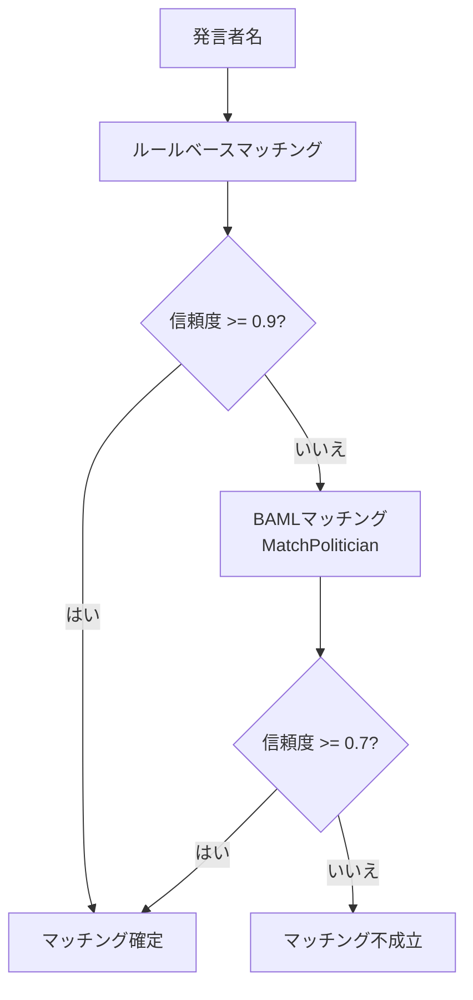
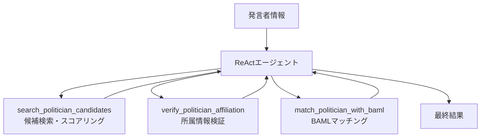

---
tags:
  - LLM処理
  - BAML
  - LangGraph
---

# 政治家マッチング

議事録から抽出した発言者名と、データベース上の政治家レコードをマッチングするLLM処理です。ルールベースとLLMのハイブリッド方式を採用しています。

## 概要

発言データの発言者（Speaker）を既知の政治家（Politician）に紐付ける処理です。まずルールベースで高速にマッチングを試み、信頼度が不十分な場合にLLM（BAML）を使って判定します。さらに、ReActエージェントによる高度なマッチングも可能です。

## 処理フロー

## ルールベースマッチング（高速パス）

LLMを呼び出す前に、以下のルールで高速マッチングを試みます:

1. **完全一致**: 発言者名と政治家名が完全に一致
2. **名前のみ一致**: 姓名のうち名前部分が一致
3. **敬称除去後一致**: 敬称を除去した後に一致

信頼度が0.9以上の場合はLLM呼び出しをスキップし、ルールベースの結果を採用します。

## BAML関数

### MatchPolitician

| 項目 | 内容 |
|------|------|
| ファイル | `baml_src/politician_matching.baml` |
| モデル | Gemini 2.5 Flash |
| 入力 | 発言者情報 + 候補政治家リスト |
| 出力 | `PoliticianMatch` |

**入力パラメータ:**

| パラメータ | 型 | 説明 |
|-----------|-----|------|
| speaker_name | string | 発言者名 |
| speaker_type | string | 発言者の種別 |
| speaker_party | string | 所属政党 |
| available_politicians | string | 候補となる政治家リスト（テキスト形式） |

**出力の型定義:**

| フィールド | 型 | 説明 |
|-----------|-----|------|
| matched | bool | マッチング成功か |
| politician_id | int? | マッチした政治家のID |
| politician_name | string? | マッチした政治家の名前 |
| political_party_name | string? | 所属政党名 |
| confidence | float | 信頼度（0.0-1.0） |
| reason | string | 判定理由 |

## マッチング基準

LLMは以下の基準でマッチングを判定します:

| 信頼度 | 条件 |
|--------|------|
| 0.9以上 | 氏名と政党が完全一致 |
| 0.7-0.9 | 氏名は一致するが政党が不明または部分一致 |
| 0.5-0.7 | 氏名に表記ゆれがあるが政党は一致 |
| 0.5未満 | マッチング不可（`matched: false`を返す） |

**特殊ケース:**

- 役職名のみの入力（例:「委員長」「副議長」）は個人を特定できないため、`matched: false`を返す
- 表記ゆれ（例:「斉藤」と「齊藤」）を考慮
- 同姓同名の場合は政党や役職で判断

## ReActエージェント

より高度なマッチングが必要な場合、ReActエージェントを使用します。

| ツール名 | 処理内容 | LLM使用 |
|---------|---------|--------|
| `search_politician_candidates` | 政治家候補を検索しスコアリング | なし（ルールベース） |
| `verify_politician_affiliation` | 政治家の所属情報をDBから検証 | なし（DB参照） |
| `match_politician_with_baml` | BAMLで最終マッチング判定 | あり |

## 実装ファイル

| ファイル | 役割 |
|--------|------|
| `baml_src/politician_matching.baml` | BAML関数定義 |
| `src/infrastructure/external/politician_matching/baml_politician_matching_service.py` | BAML実装ラッパー |
| `src/infrastructure/external/langgraph_politician_matching_agent.py` | ReActエージェント |
| `src/infrastructure/external/langgraph_tools/politician_matching_tools.py` | ツール実装（3種） |
