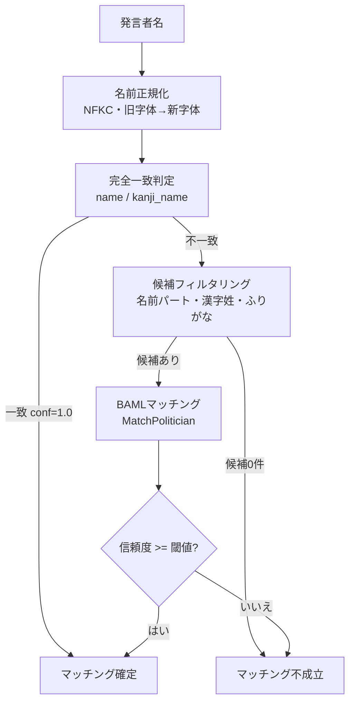
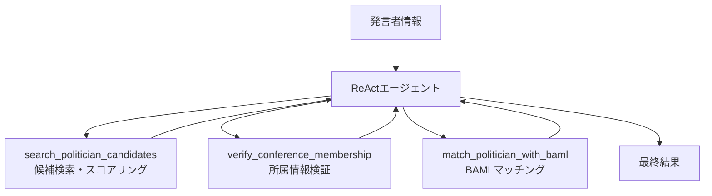

---
tags:
  - LLM処理
  - BAML
  - LangGraph
---

# 政治家マッチング

議事録から抽出した発言者名と、データベース上の政治家レコードをマッチングするLLM処理です。ルールベースとLLMのハイブリッド方式を採用しています。

## 概要

発言データの発言者（Speaker）を既知の政治家（Politician）に紐付ける処理です。**完全一致 → 候補フィルタ → LLM判定**の3段階方式を採用しています。ドメイン層のルールベースマッチングで高速に確定し、確定できない場合にのみLLM（BAML）で判定します。

## 処理フロー

```mermaid
graph TD
    A[発言者名] --> B[名前正規化<br/>NFKC・旧字体→新字体]
    B --> C[完全一致判定<br/>name / kanji_name]
    C -->|一致 conf=1.0| D[マッチング確定]
    C -->|不一致| E[候補フィルタリング<br/>名前パート・漢字姓・ふりがな]
    E -->|候補0件| F[マッチング不成立]
    E -->|候補あり| G[BAMLマッチング<br/>MatchPolitician]
    G --> H{信頼度 >= 閾値?}
    H -->|はい| D
    H -->|いいえ| F
```

## ルールベースマッチング（高速パス）

ドメイン層の `SpeakerPoliticianMatchingService.match()` で、正規化後の完全一致のみを判定します。従来の中間ルール（ふりがな・漢字姓・姓のみマッチ）は廃止され、LLM判定に委譲されました。

1. **名前正規化**: NFKC正規化、旧字体→新字体変換、敬称除去、スペース除去
2. **完全一致判定**: 正規化後のSpeaker名と候補の `name` / `kanji_name` を比較
3. **一致時**: `confidence=1.0, match_method=EXACT_NAME` で即確定

インフラ層の `BAMLPoliticianMatchingService` では、追加のルールベース判定（政党フィルタ付き完全一致、名前のみ一致、敬称除去後一致）も行い、`confidence>=0.9` ならLLM呼び出しをスキップします。

## 候補フィルタリング

完全一致しなかった場合、LLMに渡す候補を絞り込みます。`filter_candidates_for_llm()` が以下の3基準（OR条件）でフィルタリングします：

| 基準 | 内容 |
|------|------|
| 名前パート部分一致 | 候補名をスペース分割し、各パート（2文字以上）がSpeaker名に含まれるか |
| 漢字姓一致（双方向） | 候補側/Speaker側の漢字姓（2文字以上）が相手の名前に含まれるか |
| ふりがなプレフィックス一致 | 共通プレフィックス長3文字以上 |

フィルタ後0件ならマッチング不成立。候補があればBAML呼び出しに進みます。

## BAML関数

### MatchPolitician

| 項目 | 内容 |
|------|------|
| ファイル | `baml_src/politician_matching.baml` |
| モデル | Gemini 2.5 Flash |
| 入力 | 発言者情報 + 候補政治家リスト |
| 出力 | `PoliticianMatch` |

**入力パラメータ:**

| パラメータ | 型 | 説明 |
|-----------|-----|------|
| speaker_name | string | 発言者名 |
| speaker_type | string | 発言者の種別 |
| speaker_party | string | 所属政党 |
| speaker_name_yomi | string | 発言者の読み仮名（国会APIの`nameYomi`由来） |
| available_politicians | string | 候補となる政治家リスト（テキスト形式。`kanji_name`があれば併記） |

**出力の型定義:**

| フィールド | 型 | 説明 |
|-----------|-----|------|
| matched | bool | マッチング成功か |
| politician_id | int? | マッチした政治家のID |
| politician_name | string? | マッチした政治家の名前 |
| political_party_name | string? | 所属政党名 |
| confidence | float | 信頼度（0.0-1.0） |
| reason | string | 判定理由 |

## マッチング基準

LLMは以下の基準でマッチングを判定します:

| 信頼度 | 条件 |
|--------|------|
| 0.9以上 | 氏名+政党完全一致、またはふりがな完全一致 |
| 0.7-0.9 | 氏名は一致するが政党が不明、またはふりがなで高類似 |
| 0.5-0.7 | 氏名に表記ゆれがあるが政党は一致 |
| 0.5未満 | マッチング不可（`matched: false`を返す） |

**特殊ケース:**

- 役職名のみの入力（例:「委員長」「副議長」）は `role_name_mappings` で実名解決を試み、失敗時は `matched: false` を返す
- 表記ゆれ（例:「斉藤」と「齊藤」）は名前正規化で事前に解消
- 同姓同名の場合は政党や役職で判断
- ひらがな混じり名（例:「武村　のぶひで」）は `kanji_name`（漢字表記）も提供して判定

## ReActエージェント

より高度なマッチングが必要な場合、ReActエージェントを使用します。

```mermaid
graph TD
    A[発言者情報] --> B[ReActエージェント]
    B --> C[search_politician_candidates<br/>候補検索・スコアリング]
    B --> D[verify_conference_membership<br/>所属情報検証]
    B --> E[match_politician_with_baml<br/>BAMLマッチング]
    C --> B
    D --> B
    E --> B
    B --> F[最終結果]
```

| ツール名 | 処理内容 | LLM使用 |
|---------|---------|--------|
| `search_politician_candidates` | 政治家候補を検索しスコアリング | なし（ルールベース） |
| `verify_conference_membership` | 政治家の会議体メンバー情報をDBから検証 | なし（DB参照） |
| `match_politician_with_baml` | BAMLで最終マッチング判定 | あり |

## 実装ファイル

| ファイル | 役割 |
|--------|------|
| `baml_src/politician_matching.baml` | BAML関数定義 |
| `src/infrastructure/external/politician_matching/baml_politician_matching_service.py` | BAML実装ラッパー |
| `src/infrastructure/external/langgraph_politician_matching_agent.py` | ReActエージェント |
| `src/infrastructure/external/langgraph_tools/politician_matching_tools.py` | ツール実装（3種） |
