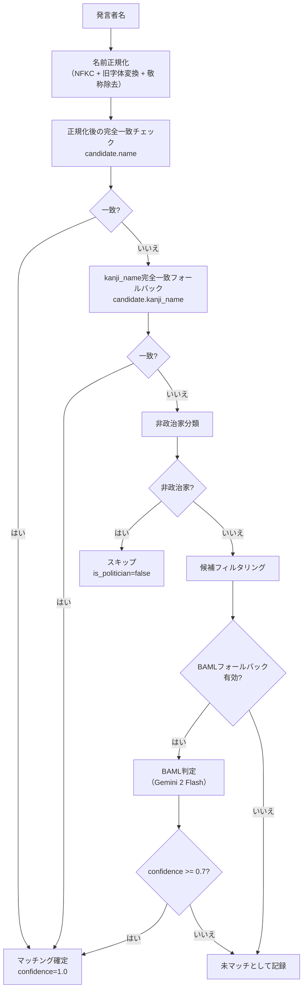

---
tags:
  - LLM処理
  - BAML
---

# 政治家マッチング

議事録から抽出した発言者名と、データベース上の政治家レコードをマッチングする処理です。ルールベースの完全一致を第一段階とし、未マッチ分にLLM（BAML）をフォールバックとして適用するハイブリッド方式を採用しています。

## 概要

発言データの発言者（Speaker）を既知の政治家（Politician）に紐付ける処理です。以下の順序で処理されます:

1. **名前正規化 + 完全一致**（ルールベース、高速）
2. **非政治家分類**（パターンマッチ）
3. **候補フィルタリング**（LLM判定のための前処理）
4. **BAML判定**（LLMフォールバック、オプション）

パイプライン全体のフローや実行コマンドについては[発言者-政治家紐付け](../data-creation/relations/speaker-politician.md)を参照してください。

## 処理フロー

```mermaid
graph TD
    A[発言者名] --> B["名前正規化<br/>（NFKC + 旧字体変換 + 敬称除去）"]
    B --> C[正規化後の完全一致チェック<br/>candidate.name]
    C --> D{一致?}
    D -->|はい| E["マッチング確定<br/>confidence=1.0"]
    D -->|いいえ| F["kanji_name完全一致フォールバック<br/>candidate.kanji_name"]
    F --> G{一致?}
    G -->|はい| E
    G -->|いいえ| H[非政治家分類]
    H --> I{非政治家?}
    I -->|はい| J["スキップ<br/>is_politician=false"]
    I -->|いいえ| K[候補フィルタリング]
    K --> L{BAMLフォールバック<br/>有効?}
    L -->|はい| M["BAML判定<br/>（Gemini 2 Flash）"]
    L -->|いいえ| N[未マッチとして記録]
    M --> O{confidence >= 0.7?}
    O -->|はい| E
    O -->|いいえ| N
```

## ルールベースマッチング（高速パス）

LLMを呼び出す前に、名前の正規化と完全一致で高速マッチングを試みます。

### 名前正規化（NameNormalizer）

発言者名・政治家名の双方に以下の正規化を適用します:

| 処理 | 内容 | 例 |
|------|------|-----|
| NFKC正規化 | 全角英数→半角、異体字統合 | `Ａ→A` |
| 旧字体→新字体変換 | 約120文字の変換テーブル | `齋→斎`、`澤→沢`、`櫻→桜`、`稻→稲`、`淺→浅` |
| スペース除去 | 全角・半角スペースを削除 | `田中 角栄→田中角栄` |
| 敬称除去 | 末尾の敬称を除去 | `田中角栄君→田中角栄` |

??? note "旧字体変換テーブル"

    約120文字を収録。人名で出現頻度の高い文字を優先的に登録しています。

    **主な変換例:**
    `櫻→桜`、`齋→斎`、`齊→斉`、`髙→高`、`邊→辺`、`澤→沢`、`濱→浜`、`廣→広`、`國→国`、`實→実`、`壽→寿`、`德→徳`、`榮→栄`、`龍→竜`、`鐵→鉄`、`藏→蔵`、`條→条`、`總→総`、`豐→豊`、`彌→弥`、`巖→巌`、`穗→穂`、`稻→稲`、`淺→浅`、`瀧→滝`、`眞→真`、`寬→寛`、`鹽→塩` 等

    除去される敬称:
    `委員長`、`副委員長`、`議長`、`副議長`、`議員`、`君`、`さん`、`くん`、`氏`、`先生`、`様`、`殿`、`市長`、`副市長`、`知事`、`副知事`

### 完全一致判定

正規化後の名前で2段階の完全一致判定を行います:

1. **`candidate.name` 完全一致**: 正規化後のSpeaker名とPolitician `name` を比較
2. **`candidate.kanji_name` 完全一致フォールバック**: 1で不一致の場合、Politician `kanji_name`（Wikidata由来の漢字別名）と比較

いずれの場合もconfidence=1.0が付与されます。完全一致しないケースはLLM判定（BAML）に委譲する設計で、中間的なルール（姓のみ一致、ふりがな一致等）はルールベースでは行いません。

| match_method | 条件 | confidence |
|-------------|------|------------|
| `exact_name` | 正規化後の `name` 完全一致 | 1.0 |
| `exact_kanji_name` | 正規化後の `kanji_name` 完全一致 | 1.0 |
| `BAML` | LLMによる判定 | 0.0〜1.0（LLM出力） |
| `NONE` | マッチなし | 0.0 |

## 非政治家分類

完全一致しなかったSpeakerに対して、名前パターンで非政治家を除外します（`classify_speaker_skip_reason`）。

| SkipReason | 完全一致の例 | プレフィックスマッチの例 |
|-----------|------------|----------------------|
| `ROLE_ONLY` | 委員長、議長、副議長 | - |
| `REFERENCE_PERSON` | 参考人、証人、公述人 | `参考人（`、`証人（` |
| `GOVERNMENT_OFFICIAL` | 政府参考人、政府委員、説明員 | `政府参考人（`、`政府委員（` |
| `OTHER_NON_POLITICIAN` | 事務総長、法制局長、書記 | `事務総長（`、`法制局長（` |
| `HOMONYM` | -（同姓候補が複数存在し特定不能な場合に設定） | - |

## LLM候補フィルタリング

BAMLに渡す候補を事前に絞り込みます（`filter_candidates_for_llm`）。全Politicianを渡すとトークン数が膨大になるため、以下のいずれかに該当する候補のみを残します:

| フィルタ基準 | 内容 |
|-------------|------|
| 名前パート部分一致 | Politician名をスペース分割し、各パート（2文字以上）がSpeaker名に含まれるか |
| 漢字姓一致（双方向） | 先頭の連続漢字部分（姓）が相互に含まれるか |
| ふりがなプレフィックス一致 | name_yomiとfuriganaの先頭3文字以上が一致するか |

## BAML関数

### MatchPolitician

| 項目 | 内容 |
|------|------|
| ファイル | `baml_src/politician_matching.baml` |
| モデル | Gemini 2 Flash |
| 入力 | 発言者情報 + フィルタ済み候補政治家リスト |
| 出力 | `PoliticianMatch` |

**入力パラメータ:**

| パラメータ | 型 | 説明 |
|-----------|-----|------|
| speaker_name | string | 発言者名 |
| speaker_type | string | 発言者の種別 |
| speaker_party | string | 所属政党 |
| speaker_name_yomi | string | ふりがな（読み） |
| available_politicians | string | フィルタ済み候補政治家リスト（テキスト形式） |

**出力の型定義:**

| フィールド | 型 | 説明 |
|-----------|-----|------|
| matched | bool | マッチング成功か |
| politician_id | int? | マッチした政治家のID |
| politician_name | string? | マッチした政治家の名前 |
| political_party_name | string? | 所属政党名 |
| confidence | float | 信頼度（0.0-1.0） |
| reason | string | 判定理由 |

**LLM側の信頼度基準（プロンプト指示）:**

| 信頼度 | 条件 |
|--------|------|
| 0.9以上 | 氏名と政党が完全一致、またはふりがなが完全一致 |
| 0.7-0.9 | 氏名は一致するが政党が不明、またはふりがなで高い類似性 |
| 0.5-0.7 | 氏名に表記ゆれがあるが政党は一致 |
| 0.5未満 | マッチング不可（`matched: false`を返す） |

**特殊ケースの指示:**

- 役職名のみの入力（例:「委員長」「副議長」）は個人を特定できないため、`matched: false` を返す
- 漢字名とひらがな名の不整合を考慮（例: 「たちばな慶一郎」と「橘慶一郎」は同一人物の可能性が高い）
- 姓のみ一致で名が異なる場合は別人と判定（例: 「上野宏史」と「上野みちこ」は別人）
- 同姓同名の場合は政党や役職で判断

## 実装ファイル

| ファイル | 役割 |
|--------|------|
| `src/domain/services/speaker_politician_matching_service.py` | ルールベースマッチング（完全一致 + LLM候補フィルタ） |
| `src/domain/services/name_normalizer.py` | 名前正規化（旧字体変換、敬称除去等） |
| `src/domain/services/speaker_classifier.py` | 非政治家分類（SkipReason判定） |
| `src/application/usecases/wide_match_speakers_usecase.py` | 広域マッチングユースケース（3段階方式） |
| `baml_src/politician_matching.baml` | BAML関数定義 |
| `src/infrastructure/external/politician_matching/baml_politician_matching_service.py` | BAML実装ラッパー |
