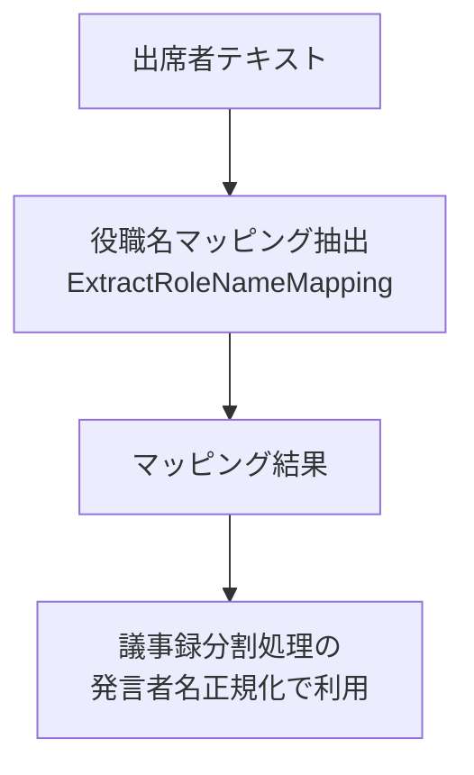

---
tags:
  - LLM処理
  - BAML
---

# 役職名マッピング

議事録の出席者情報から、役職と人名の対応関係を抽出するLLM処理です。

## 概要

議事録に記載された出席者セクションから、役職名と人名のマッピングを抽出します。この情報は[議事録分割処理](minutes-division.md)の発言者名正規化（NormalizeSpeakerNames）で、役職名のみの発言者を人名に変換する際に参照されます。

## 処理フロー



## BAML関数

### ExtractRoleNameMapping

| 項目 | 内容 |
|------|------|
| ファイル | `baml_src/role_name_mapping.baml` |
| モデル | Gemini 2.5 Flash |
| 入力 | 出席者テキスト |
| 出力 | `RoleNameMappingResult` |

**入力パラメータ:**

| パラメータ | 型 | 説明 |
|-----------|-----|------|
| attendee_text | string | 議事録の出席者情報テキスト |

**出力の型定義:**

`RoleNameMappingResult`:

| フィールド | 型 | 説明 |
|-----------|-----|------|
| mappings | RoleNameMapping[] | 役職と人名のマッピングリスト |
| attendee_section_found | bool | 出席者セクションが見つかったか |
| confidence | float | 抽出の信頼度（0.0-1.0） |

`RoleNameMapping`:

| フィールド | 型 | 説明 |
|-----------|-----|------|
| role | string | 役職名（例: 議長、副議長、知事） |
| name | string | 人名（敬称除外） |
| member_number | string? | 議員番号（あれば） |

## 抽出ルール

- 役職が明記されている人のみを抽出（一般出席者は含めない）
- 人名は姓名を正確に抽出し、敬称（議員、氏、さん、様、先生、君など）は除外
- 同じ人物が複数の役職を持つ場合は、両方のマッピングを作成

## 信頼度の基準

| 信頼度 | 条件 |
|--------|------|
| 0.9以上 | 明確な役職-人名の対応が複数見つかった |
| 0.7-0.9 | 役職-人名の対応が見つかったが、一部不明確 |
| 0.5-0.7 | 出席者情報は見つかったが、役職の対応が不明確 |
| 0.5未満 | 出席者情報がほとんど見つからない |

## 出力例

```json
{
  "mappings": [
    {"role": "議長", "name": "伊藤条一", "member_number": "100番"},
    {"role": "副議長", "name": "梶谷大志", "member_number": "82番"},
    {"role": "知事", "name": "鈴木直道", "member_number": null}
  ],
  "attendee_section_found": true,
  "confidence": 0.95
}
```

## 実装ファイル

| ファイル | 役割 |
|--------|------|
| `baml_src/role_name_mapping.baml` | BAML関数定義 |
| `src/infrastructure/external/role_name_mapping/baml_role_name_mapping_service.py` | サービス実装 |
